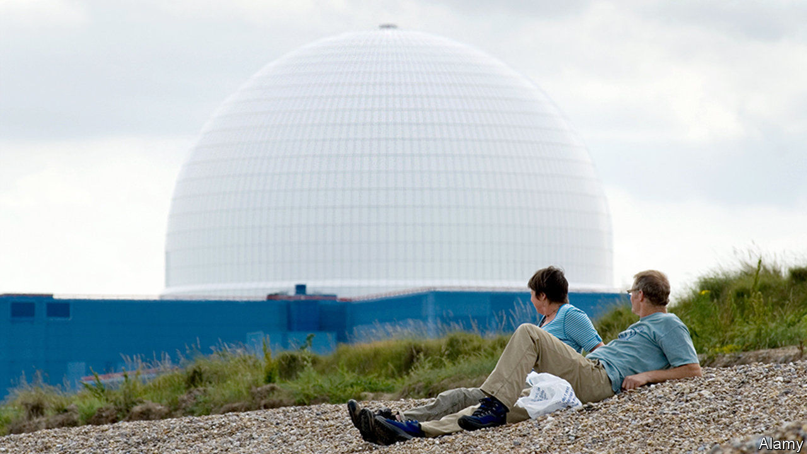
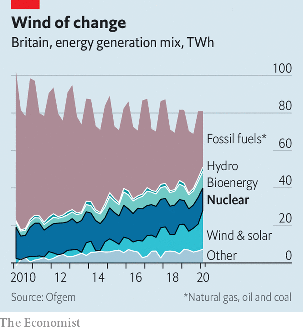

###### Chain reaction

# Britain’s nuclear industry faces a do-or-die moment 

##### Boris Johnson weighs up whether to throw his support behind a new power station 

 

> Nov 14th 2020 

THE VILLAGE of Sizewell, on the east coast of England, has hosted nuclear power stations since 1966. The first is closed. The second, Sizewell B, started feeding power into the grid in 1995. The government is considering whether to back the construction of a third. It would be a replica of the Hinkley C plant that is under construction in Somerset, the first new nuclear power station built in Britain in 25 years. Sizewell C, if it is built, will be the second. The decision is crucial for the future of Britain’s nuclear industry.

Climate change has made the politics of nuclear power even more complex than it used to be. Public concerns about radiation and the disruption caused by construction must now be balanced against the capability of nuclear power to generate large amounts of electricity without the emission of carbon dioxide, which warms the atmosphere.


Unlike the two fast-growing mainstays of zero-carbon electricity generation, wind and solar power, nuclear power’s output is stable, and does not fluctuate with the weather. This makes it valuable to any country attempting to decarbonise. Most of the mathematical models which stay within the confines of the Paris Agreement, which aims to constrain the temperature increase on the planet to less than 2°C, have nuclear power playing a significant role.

Yet the West is abysmal at building new nuclear power stations. Olkiluoto 3, in Finland, is running 12 years behind schedule. Flamanville 3, which is being built in France, is about ten years behind and €10bn ($12bn) over budget. Both use European Pressure Reactors (EPR) from a French company, Areva, which is owned by the French state utility Electricité de France (EDF). Hinkley C and Sizewell C are also being built by EDF. Each contains two EPRs.

Critics of large nuclear-power stations cite EDF’s overruns as reasons why Britain should pull back from its nuclear ambitions. Instead, some say, Britain should focus on offshore wind turbines, diverting the money it will take to build plants like Sizewell C. In just the past few years, the proportion of electricity generated by wind has jumped dramatically (see chart).

 


Since Hinkley C is under construction, Sizewell C is the project around which the current debate is playing out. EDF argues that the situation in Britain is different to that in Finland and France, and that its British reactors stand to benefit from cost reductions as it builds more copies of the same design in a way that its European reactors have not. This summer Julia Pyke, an EDF director, said that the second EPR to be used in Hinkley C has had 45% more steel installed than the first unit over the same timeframe, and that the reactor’s cooling components had been installed 50% faster. Sizewell C would benefit from the same dynamic, as well as lower regulatory costs, since the Office for Nuclear Regulation has approved its progenitor.

Even if Boris Johnson announces his support for Sizewell C, additional barriers remain. EDF won’t complete the government’s planning process until 2022 at the earliest. Its approval will also take time. A method of financing the plant’s construction must still be worked out and private investors found.

The risk of overruns is considerable, but the risks of failing to decarbonise are much greater. If Sizewell C does not go ahead, Britain will lose any hope of reducing the cost of nuclear power, and thereby the realistic option of including it in the grid. Its existing nuclear fleet is scheduled for decommissing within the decade. Wind power is cheap and getting cheaper; nuclear power is yet to start moving in the right direction. But it may; and given the danger of global warming, there is an argument for keeping the nuclear option open. ■

