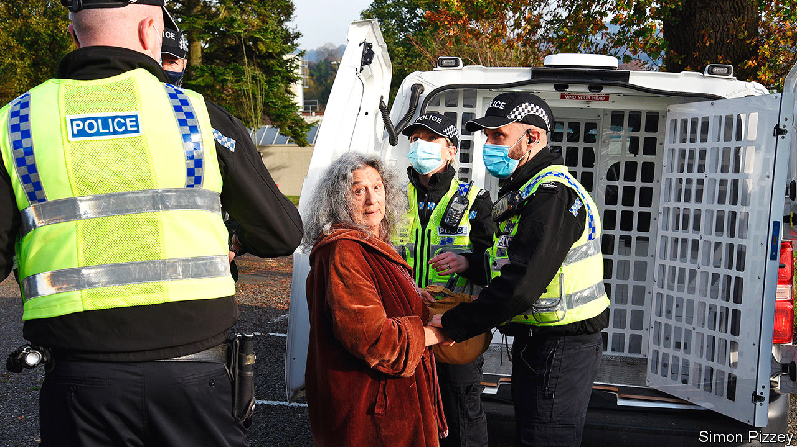
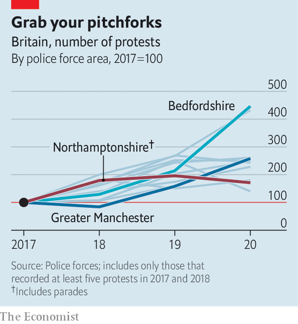

###### Activism

# Protest is spreading to the provinces 

##### Small-town revolutions 

 

> Nov 14th 2020 

IF THE UNITED NATIONS staffers who drafted Agenda 21 in 1992 had been present at the protest on November 7th in a park in Stroud, a market town carved into the Cotswold hills, they would have been bemused by the vitriol poured on their work. But to those in the know, this non-binding resolution to promote sustainable development conceals a plan for “the Great Reset”, which will change society beyond recognition. Covid-19 has been faked to soften the world up for it and allow a vaccination programme that will render humanity infertile. “I’ve heard this has been planned for 60 years,” says a protester. “Longer than that,” says another. “It’s been planned since Babylonian times.” A third dismisses the conspiracy theories as “bullshit”. He is protesting against “not being able to go to the pub”.

The 200-odd people brought together by the Stroud Freedom Group were an unlikely marriage of cranks and conservatives. Among them, said Bruce Fenton, a local author, were “members of the Green, Labour, Conservative and Brexit parties, XR activists and members of the local Rudolf Steiner community.”


The speeches were fiery, but swiftly disrupted by police. A few arrests were made. An organiser was fined £10,000 ($13,000). Similar scenes played out in 26 other towns that day. Further protests are planned each Saturday until lockdown ends.

These gatherings are a sign not just of the rise of weird ideas during the pandemic, but also of the changing pattern of protest. The route from Marble Arch to Parliament Square is no longer the only venue for people wanting to make a point. The scene in Stroud is increasingly common, as data from police forces show (see chart).

 


The failure of big marches calling for a second referendum to shift the dial may have encouraged organisers to try other options. For much of this year, huge marches have been out of the question. And current protest movements are local affairs, not top-down operations run from the capital. Extinction Rebellion (XR), for instance, was founded in Stroud and is organised on what it calls a “holacratic” basis, in which local groups operate as loosely regulated franchises. Those who marched for Black Lives Matter (BLM) this year belong to a variety of distinct regional groups. The Democratic Football Lads Alliance (DFLA), whose followers protected statues threatened by activists this summer, is a coalition of football-supporters’ groups.

The anti-lockdown movement includes people with varying motivations—opponents of big government, covid-19 deniers, raging conspiracy theorists and far-right activists—and different competences. StandUpX is better at street activism; Save Our Rights focuses on legislation. Science deniers congregate in Stop New Normal; Piers Corbyn, its figurehead, is a climate-change sceptic whose brother Jeremy is the former Labour leader. The most rapid conspiracies abound in Collective Action Against Bill Gates. And there are adherents of QAnon, a theory that the world is run by a cabal of Satanist paedophiles, blending at protests with the other strands.

The demographics of protest have changed, too. Last year Boris Johnson described XR activists as “nose-ringed…crusties” living in “hemp-smelling bivouacs”. But today’s protest movements have diverse followings, from construction workers to civil servants. A protester is just as likely to resemble Mr Johnson—well-educated, middle-aged and overweight—as an anarchist student from central casting.

Regional tendencies shape protest in different parts of the country. In Cornwall, rural conservatism has rubbed off on the area’s revolutionaries. Black Voices Cornwall, a group set up after the summer’s BLM protests, has abandoned its progenitor’s socialism and doesn’t support police defunding. Devon and Cornwall’s assistant chief constable, Jim Colwell, will be on the assurance board that the organisation is setting up.

The internet’s role in campaigning has changed. Online petitions are out of favour, because politicians pay no attention. Instead people huddle in densely populated chat channels on Telegram, an instant-messaging platform, which is used for organising real-life protest. Patriotic Alternative, a nationalist group with around 15,000 members, now mostly works offline. “Forming ‘in real life’ communities is much better than operating only online,” says Laura Towler, its deputy leader. “The relationships you form are more authentic and long lasting.”

Digital communication encourages proliferation. When a messaging group gets too big to manage, it spawns new groups. XR Kettering was first part of XR Northampton, but numbers swelled and it seceded. That process of localisation ensures that there are battalions ready to respond to a local incident, says Paul Mason, a writer who tracks protest movements. “It’s not like they have to assemble the network from scratch; it’s already there.”

Despite the lockdown, the pandemic has accelerated these trends. Michelle McDonald, a StandUpX organiser in Brighton, says that it motivated her to find out the disturbing truths behind the new world order. “We’re waking up to all the darkness that’s going on… I feel like I’m living under a mix of communism and the Taliban.”

The provincial protesters have not yet changed the world. XR’s target of making Britain carbon neutral by 2030 has had no more uptake than BLM’s call to defund the police. Yet both have, arguably, shifted the way people think about the climate and about Britain’s culpability in the slave trade. The anti-lockdown protests may, similarly, have contributed to the finding of a recent research study, that a quarter of Britons think covid-19 was manufactured in a Wuhan laboratory and an eighth think it is a plot to vaccinate humanity.

Whether or not these protests change policy, they change people’s lives. Those involved now belong to vast social networks, formed by, and reliant on, protest. For some, that is part of the appeal. “I feel quite on my own with my neighbours locally, who don’t see the agenda for what it is,” says Dominic Graville, a Stroud protester whose acting work dried up during the pandemic. “It’s a way to form new bonds and connections: we’re stronger together.” The campaign to roll out a covid-19 vaccine is likely to bind them tighter.■

