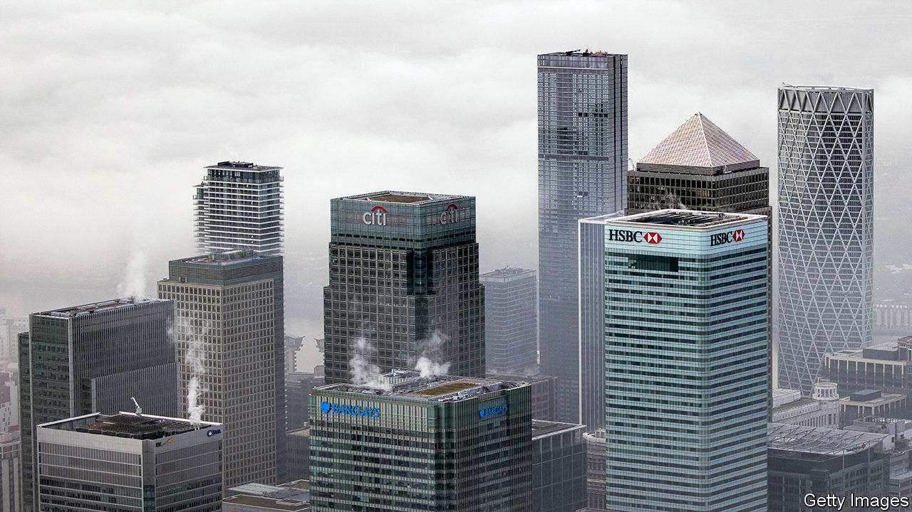
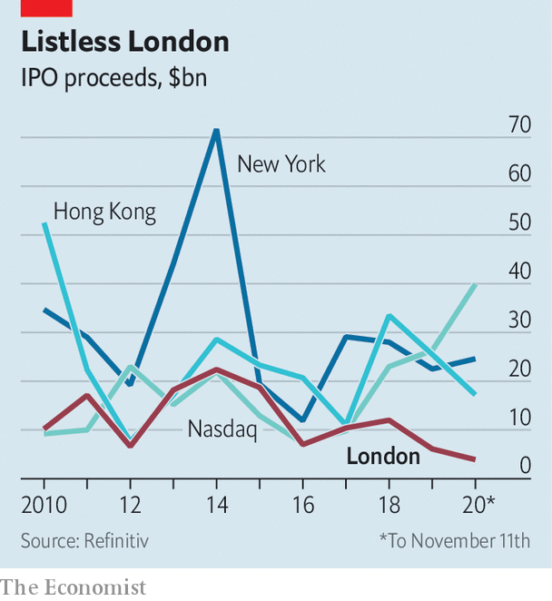

###### London calling, at last

# Rishi Sunak pitches the City to the world 

##### The Treasury finally lavishes attention on the unloved, but important, square mile 

 

> Nov 12th 2020 

EVEN BEFORE covid-19 sent its workers home and deprived its soulless restaurants of any remaining souls, the City of London was in a funk. In its negotiations with Brussels, the government lavished attention on fishermen but hardly seemed to be putting up a fight for financial services, which account for 7% of Britain’s GDP and 10% of its tax receipts. No wonder, then, that British-registered firms–which at the end of the year will lose “passporting rights” that enable them to sell funds, debt or advice across the EU–were shipping thousands of workers and billions of pounds of financial assets to the continent.

Two developments on November 9th brought a rare smile. The first was a stock-market rally, prompted by promising news on a covid-19 vaccine and Joe Biden’s victory in the American election. The second was a statement by Rishi Sunak, the chancellor, on his ambitions for post-Brexit financial services. City bosses were cheered by his vow to renew Britain’s position as “the world’s pre-eminent financial centre”.


At last, the conversation moved beyond the fiendish business of untangling links with the EU. Mr Sunak spoke of two avenues for growth: climate change and digitisation. Britain will issue its first green bond in 2021, he announced, to fund infrastructure investment. He also proposed to regulate privately-issued digital currencies and blessed efforts to study whether the central bank should mint virtual money.

This is hardly radical stuff. Other countries already issue green bonds and financial watchdogs have been fretting about digital currencies since Facebook said it would launch one last year. But the announcements signalled that the Treasury has its fingers on the pulse and wants to retain Britain’s financial-technology crown.

 


Also significant is his pledge to keep Britain’s international markets open and governed by objective and predictable rules. That is more than a platitude. He promised to grant “equivalence” to a bunch of EU rules, a status that recognises them as valid in Britain, without waiting for the bloc to reciprocate. That will provide clarity to firms on both sides of the Channel and make it easier for foreign firms to operate in Britain. He hinted, too, that Britain’s rules could be tweaked to make the City more attractive. Notably, the government wants to make it easier for innovative companies to list in London—it has lagged behind peers in recent years (see chart)—and for funds to get domiciled there.

That is a clever move. Mr Sunak’s approach stands in flattering contrast to the EU’s own position on access to its market by outsiders, which is looking increasingly unreliable and politicised, says Denzil Davidson, a former adviser to Theresa May now at Global Counsel, an advisory firm. And his promise of a simplified, tailored rulebook seeks to show there are advantages to being outside the bloc. The business the City has lost to the continent will not be recovered. But this statement, however aspirational, is an important first step in making the case for global firms to stay in London. Better late than never. ■

