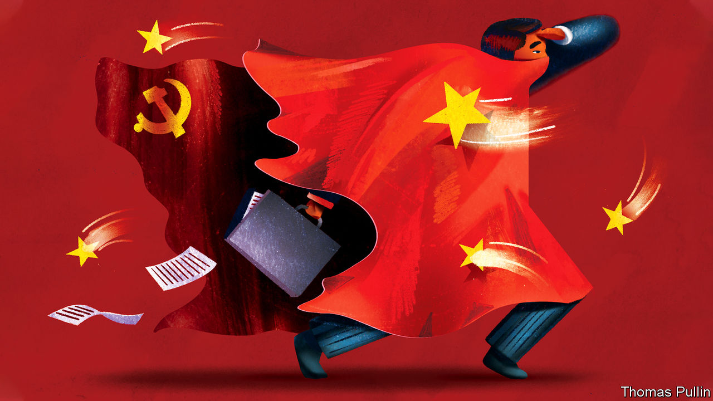
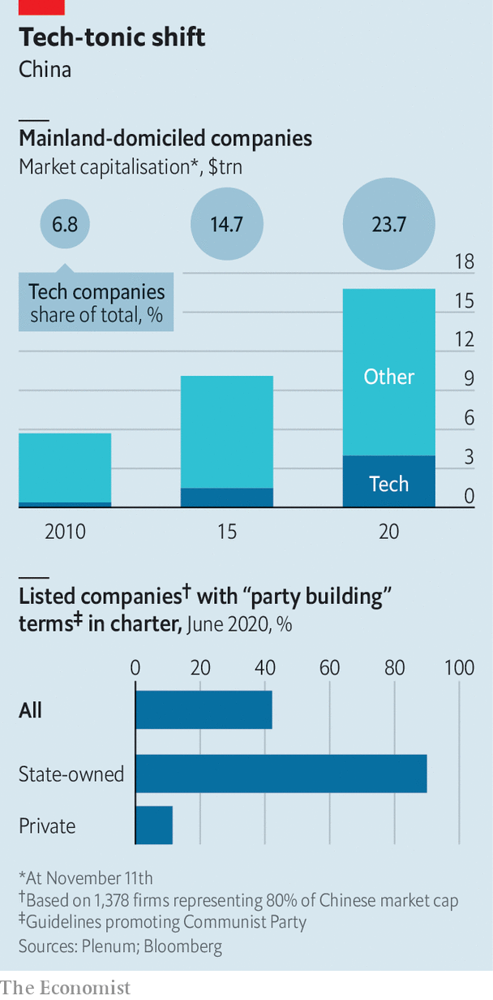

###### Blown off course

# China takes aim at its entrepreneurs 

##### Private enterprise faces formidable new obstacles 

 

> Nov 14th 2020 

AT A SUMMIT with China’s richest entrepreneurs in late 2018 Xi Jinping sought to allay concerns that the state had declared war on the country’s private sector. Although officials in Beijing had spent the previous year bringing to heel unruly tycoons, China’s president insisted that rumours of a forceful push for party influence in the private sector were untrue. He exhorted the business leaders to “take a pill of reassurance”.

The medicine has been hard to swallow. Since then the Communist Party has sought a more active hand in recruitment and business decisions. And after subduing a band of headstrong bosses at overextended financial conglomerates, the state is now taking aim at China’s tech billionaires, making it clear that outspoken critics will not be tolerated.


Mr Xi’s preoccupation has always been maintaining China’s social and financial stability. Keeping big business in check is part of that plan. It should come as no surprise that the state is now homing in on tech, which has expanded rapidly (see chart). Six of China’s 20 most valuable listed companies are tech firms and with billions of users they touch the lives and wallets of almost all citizens.

 


A reckoning for the sector began with what looked like a shot across the bows of China’s largest financial-technology group. The suspension by regulators on November 5th of Ant Financial’s $37bn initial public offering with less than 48 hours’ notice was at first interpreted merely as a warning to its founder, Jack Ma, who had previously criticised China’s state-owned banks. But on November 10th the publication of an extensive draft of new rules for technology groups laid bare the state’s ambitions to bring to heel not just Ant, but the whole of China’s tech industry.

Mr Xi’s relationship with China’s tycoons has always been troubled. When he became president in 2013, he inherited a corporate system replete with fraud, patchy regulation and surging debt. After the success of an anti-corruption campaign that mostly targeted officials, Mr Xi took aim at a group of businessmen who were ploughing huge sums into risky overseas investments. Purchases included SeaWorld, an American amusement-park group, and the Waldorf Astoria, a swish hotel in New York. Officials argued that many of these acquisitions were thinly disguised means to divert capital out of China. 

Many of the businessmen who once fancied themselves as a Chinese Warren Buffett are in prison or worse. Wu Xiaohui, the chairman of Anbang, which bought the Waldorf among other assets, was handed an 18-year prison sentence in 2018 for financial crimes. Ye Jianming, who attempted to buy a $9bn stake in Rosneft, a Russian oil producer, was detained in early 2018. His whereabouts is still unknown. Xiao Jianhua, a broker for China’s political elite who once controlled Baoshang Bank, was kidnapped by Chinese agents from his flat at the Four Seasons Hotel in Hong Kong in 2017 and is thought to be co-operating with authorities in the unwinding of his financial conglomerate.

The crackdown has put an abrupt end to a boom in global spending by Chinese firms: in 2016 there were $200bn-worth of overseas mergers and acquisitions, the figure in 2019 was less than a fifth of that. And under government pressure private groups have divested assets worth billions of dollars. HNA, an airlines and logistics group that bought a large stake in Deutsche Bank and Hilton Worldwide, a hotel group, has sold assets worth over $20bn in recent years. Anbang Insurance was nationalised, putting the Waldorf under the ownership of China’s Ministry of Finance. Baoshang was taken over by the state and allowed to file for bankruptcy in August. Acquisitions of European football clubs by Chinese groups have all but ended.

Analysts have praised the way in which systemic risks posed by companies such as Anbang and HNA appear to have been reduced on Mr Xi’s watch. Within China few dare to criticise him for his failings. Those who have done so have been dealt with severely. Ren Zhiqiang, a senior member of the Communist Party who once ran a state-owned property firm, penned a missive to friends earlier this year in which he referred to Mr Xi as a “naked clown”. He was sentenced to 18 years in prison in September for bribery and embezzlement.

The party has also been increasing its influence over private firms in more subtle ways. Under a strategy referred to as “party building”, firms have been asked to launch party committees, which can opine on whether a corporate decision is in line with government policy. The number of committees in publicly traded but privately controlled companies is still low. According to a survey of 1,378 Chinese listed firms by Plenum, a consultancy, of the 61% that were privately controlled only 11.5% had party-building clauses in their charters compared with 90% of state-owned firms.

Party invitation

Yet the prevalence of such committees looks likely to grow. In September Mr Xi asked for the private sector to “unite around the party”. A day later Ye Qing, vice-chairman of the All-China Federation of Industry and Commerce, a powerful organisation controlled by the Communist Party, issued a more detailed list of demands. He called for private groups to establish human-resources departments led by the party and monitoring units that would allow the party to audit company managers.

This might not affect all firms equally. “For big companies, there’s no negotiation. The party approaches you and you say yes,” says Joe Zhang, a business consultant who has sat on the boards of Chinese private and state corporations. However, he also argues that for most smaller firms, less visible and not as economically important, party cells are little more than a rubber stamp as profits will trump state influence on decision-making. Their influence may not necessarily be unwelcome either. One executive, whose company has a party committee, argues that by growing closer to the thinking of the party leadership, “we can steer the company accordingly”. This heads off potential clashes with the state.

So far there is little evidence to suggest that party committees have hurt profitability, says Huang Tianlei of the Peterson Institute for International Economics, a think-tank. But increased party influence could inhibit some operations. “Innovation may be suppressed. More red tape can emerge. A firm can turn from profit-driven to goal-driven, sacrificing profitability,” says Mr Huang.

It is possible that party committees may soon play a larger role in tech firms. A raft of new regulations presents a more immediate threat. Ant is connected to hundreds of millions of people through its payments and lending platforms. Like other Chinese tech giants it holds precious data on customers as well as controlling a pipeline through which hundreds of billions of dollars are lent and spent. That such power lies in private hands is a source of tension between the party and entrepreneurs.

“These resources need to be tightly controlled and the political loyalty of the firms and entrepreneurs, not only to the regime but also to individual political leaders, needs to be strictly maintained,” says Sun Xin, an academic at King’s College London. “The case of Ant is just one manifestation of this underlying logic.”

The halting of Ant’s IPO was triggered by new draft regulations aimed at online micro lending. For Ant, the rules can only be interpreted as an attack on the firm’s lending platform, its biggest source of revenue. Mr Ma may regret comparing China’s banks to pawnshops in a speech in October. The comments infuriated senior officials and played a part in the hasty suspension of Ant’s IPO. But Mr Ma is not to blame for the latest onslaught of antitrust rules, although he may have sped up their arrival.

vie-ing for influence

The new rules, under consideration for some while, will for the first time explicitly apply monopoly controls on internet and e-commerce firms. For many years China’s antitrust laws have not exempted the groups but they have also not been targeted in monopoly cases. This has allowed a few companies to control large swathes of the digital economy. They also take aim at the structures that have allowed Chinese tech firms to raise capital overseas. Barred from allowing foreign investors to take direct stakes, for two decades virtually all capital-hungry tech groups have skirted the rules by using a “variable-interest entity” (VIE) to link foreign cash to the Chinese market. The structure creates an offshore holding company into which foreigners invest. That company has a contractual agreement with an onshore firm to receive the economic benefits of the underlying assets.

The VIE structure has long been tolerated by Chinese authorities, but without full legal recognition. Foreigners have virtually no recourse in China to claim rights to the assets they have invested in. Foreign funds have long been wary of the framework but most Chinese tech companies still use it to structure their overseas listings. The new antitrust rules could require companies to seek approval for such arrangements, calling into question whether VIEs will be permitted in the future and so the way that foreign capital will reach Chinese tech firms. The threat of withdrawing tacit approval for a VIE is another way the state can intimidate firms and their owners.

Perhaps the new rules will humble the outspoken Mr Ma. He has not spoken publicly on the matter, but Ant has bent the knee and agreed to embrace the new regulations. Mr Xi has made clear that no company is too big, and no IPO too valuable, to be allowed to challenge the state.■

