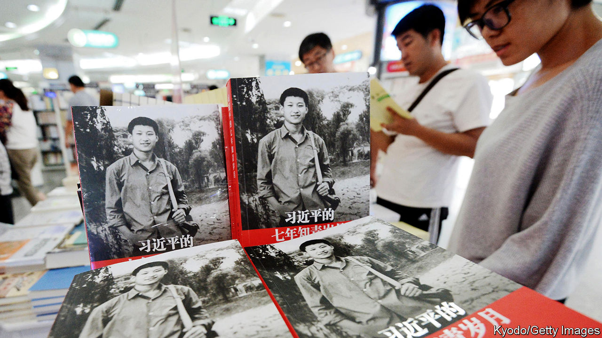

###### Highly effective people’s republic

# Why self-help books are so popular in China 

##### To cope with rapid change, some people crave pointers 

 

> Nov 14th 2020 

BOOKSHOPS IN CHINA are replete with works offering advice on self-betterment. Topics range from coping with shyness (“How to Make Friends with Strangers in One Minute”) to succeeding in business (“Financial Management in Seven Minutes”). The title of one recent bestseller urges: “Don’t Opt for Comfort at the Stage of Life that is Meant to be Difficult”. Their popularity and contents reflect the stresses of a society in rapid flux—one in which paths to wealth are opening up in ways barely imaginable a generation ago and competition is fierce (see ).

Reliable statistics on China’s book market are hard to find. But according to a study by Eric Hendriks-Kim, a sociologist at the University of Bonn, self-help books may account for almost one-third of China’s printed-book market. In America they make up only 6% of adult non-fiction print sales, reckons NPD Group, a research firm.


Although China’s leaders keep stressing the need for China to be “self-reliant”, seekers of advice on how to succeed often turn to American books for guidance. In China last year the top ten self-help sellers included translations of several American works, such as “How to Win Friends and Influence People”, “Peak: Secrets from the New Science of Expertise” and “The Seven Habits of Highly Effective People”.

Chinese readers appear more eager for such imports than people in many other countries that are culturally closer to America. That may be because both China and America are “hyper-competitive and materialistic regimes”, argues Mr Hendriks-Kim, who has described this in his book “Life Advice from Below: the Public Role of Self-Help Coaches in Germany and China”. In the early 2000s a Chinese translation of “Who Moved My Cheese?”, a motivational book by an American, Dr Spencer Johnson, became so popular that a play based on it toured theatres and the Chinese word for cheese acquired a new meaning: one’s own self-interest. Books proliferated in China with cheese in their titles.

China has a long tradition of reading for practical purposes. In 2018 fiction accounted for 7% of sales, compared with more than 30% in Germany. “One of the most striking features of China’s market for books is its absolute and passionate relevance to life,” said a report in 2006 by Arts Council England. The exam-focused education system leaves little time to develop interpersonal skills, so people, desperate for advice on how to sell themselves, turn to self-help books instead.

That may suit the Communist Party, eager as it is to promote “positive energy”. But the party would prefer native-born role models. State media have touted a book by President Xi Jinping, “Seven Years as an Educated Youth”, as the kind of tome people should study (see picture). It describes Mr Xi’s hard life in the countryside during the Cultural Revolution of the 1960s and 1970s. “Is there really any self-help book better than Xi’s?” asked one headline.

Mr Xi is also fond of the classics, some of which are being repurposed for self-improvement purposes. Yu Dan, perhaps China’s best-known pop philosopher, has sold 11m legal copies (millions more may have been peddled in photocopied form) of “Confucius from the Heart”. Some Chinese have mocked it for making the sage sound “much like the masters of American self-help”, says Mr Hendriks-Kim.

Perhaps the self-help industry has come full circle. After all, China’s 6th-century-BC masterpiece for would-be generals, “The Art of War” by Sun Tzu, was arguably the self-help prototype. Its title has been echoed, consciously or otherwise, in the names of countless other books of the genre. One such is Donald Trump’s “The Art of the Deal”. Its fifth and most recent translation in China was published in 2016 by the Communist Youth League. ■

