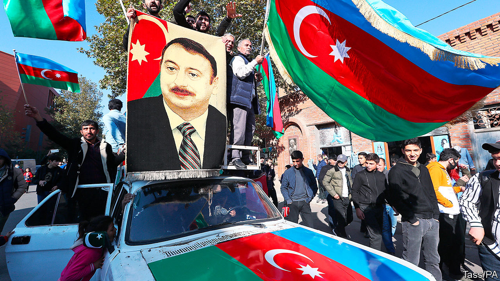
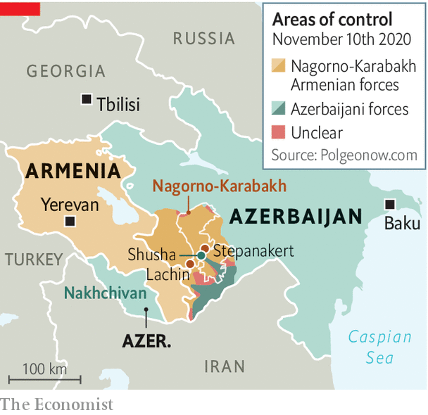

###### Peace, for now

# A peace deal ends a bloody war over Nagorno-Karabakh 

##### Azerbaijan wins some land, while Turkey and Russia carve out spheres of influence 

 

> Nov 14th 2020 

THE TWO capitals erupted at roughly the same time. On November 9th, known as the national flag day in Azerbaijan, Baku burst into jubilation. Crowds swarmed the city and flocked to the Alley of Martyrs, a memorial to fallen soldiers. They wrapped themselves in Azerbaijani and Turkish flags, sang the national anthem and praised their victorious leader, Ilham Aliyev. On the same day in Yerevan, the capital of Armenia, angry crowds stormed the parliament building, cursing Nikol Pashinyan, their prime minister.

The cause of both scenes was the announcement of a peace deal. Brokered by Russia and Turkey, it ended a six-week war over Nagorno-Karabakh. This is an enclave in Azerbaijan, mostly populated by ethnic Armenians but of cultural and historical significance to both sides. A day earlier, Azerbaijan had raised its flag over Shusha, a strategic hilltop citadel inside Nagorno-Karabakh and a cradle of Azerbaijani culture. Within hours Armenia’s exhausted and demoralised forces surrendered, a humiliation for which Mr Pashinyan had done nothing to prepare his country.


The peace deal marks one of the biggest shake-ups in a turbulent region at the crossroads of Europe, Asia and the Middle East since the collapse of the Soviet empire, which also began in Nagorno-Karabakh. In February 1988 a few hundred Armenians came out onto Lenin Square in Stepanakert, the enclave’s capital, demanding to be united with Soviet Armenia. They started a chain of events that catalysed the break-up of the Soviet Union and later led to a two-year war between Armenia and Azerbaijan.

 


That war ended with the victory of the Armenians, partly because of Russian military support. Armenia captured Nagorno-Karabakh and occupied seven adjacent districts that belonged to Azerbaijan. The conflict was (mostly) frozen but never resolved, leaving Azerbaijan with a sense of trauma and the border between Turkey and Armenia shut.

On September 27th, after 25 years of waiting for the return of its territory, Azerbaijan went back to war. It was aided by Turkey, which provided drones and training. It recaptured most of its lost territory.

The war was all but inevitable. Azerbaijan, a petro-state, had grown richer, more confident and more frustrated at the lack of progress in talks with Armenia. However, three other factors played a role.

One was the growing assertiveness of Turkey. It has shown its willingness to use force and provide military backing to Azerbaijan, in the form of planners and Syrian mercenaries.

The second was Russia acquiescing to Azerbaijan’s advance and to Turkey’s involvement. In the past Azerbaijan had been afraid to launch an all-out offensive because of Russia’s commitment to defend Armenia. But as Azerbaijan correctly guessed, Vladimir Putin cared more about his anti-Western alliance with Turkey and was no longer inclined to side with Armenia’s government after a largely peaceful “colour” revolution in 2018 swept the populist Mr Pashinyan to power. Russia’s president does not recognise the legitimacy of leaders brought to power by uprisings. Mr Pashinyan further angered Mr Putin by imprisoning a friend of his, Robert Kocharian, a former Armenian president. Mr Putin was not allowed to see him during a visit to Yerevan last year.

The third factor has been the gradual disengagement of America from the region, which has accelerated under President Donald Trump. So the autocratic leaders of Russia and Turkey were left alone to hammer out their deal. Under it, Armenia is to withdraw from the remaining districts around Nagorno-Karabakh. Russia will deploy a 2,000-strong peacekeeping force in Nagorno-Karabakh, for the next five and possibly ten years. There was no mention of the status of Nagorno-Karabakh, which in the past had been promised autonomy within Azerbaijan. Tens of thousands of ethnic Armenians fled their homes in Stepanakert during the fighting as Azerbaijan’s army closed in.

Within hours of the announcement, Russia moved in its troops, establishing its long-craved presence in the Lachin corridor linking Armenia to Nagorno-Karabakh. Mr Aliyev had for years resisted this. Having closely observed the use of Russian peacekeepers in the war unleashed by Moscow against neighbouring Georgia in 2008, he had no desire to see Russian troops in Nagorno-Karabakh. Yet he had little choice. Going any further in the war risked a direct confrontation with Russian forces.

Turkey probably helped persuade Azerbaijan to accept the deal. Though not mentioned in the trilateral agreement signed between the two belligerents and Russia, Turkey is a big beneficiary of it. It is to get access to a transport corridor through Armenian territory from the Azerbaijani enclave of Nakhchivan, which borders Turkey, to the main bit of Azerbaijan and the Caspian Sea, thus linking Turkey to Central Asia and China’s Belt and Road Initiative.

Russia will control the road itself, but Turkish and Chinese goods will travel along it, and all parties stand to benefit economically. “This trade route could transform the entire region and become the main staple of a peace settlement,” says Mikayil Jabbarov, Azerbaijan’s American-educated economy minister. Perhaps it is the prospect of this geopolitical transformation that has enticed Mike Pompeo, the American secretary of state, to visit the region in the next few days. After four years of Mr Trump’s presidential neglect, he is very late to the party, and there are many pitfalls ahead. ■

