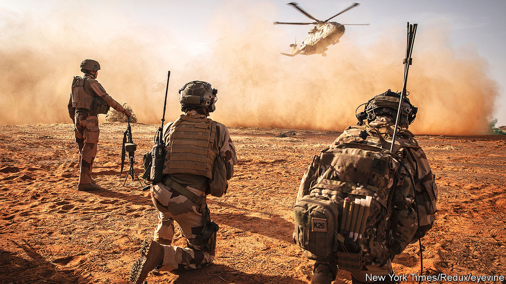
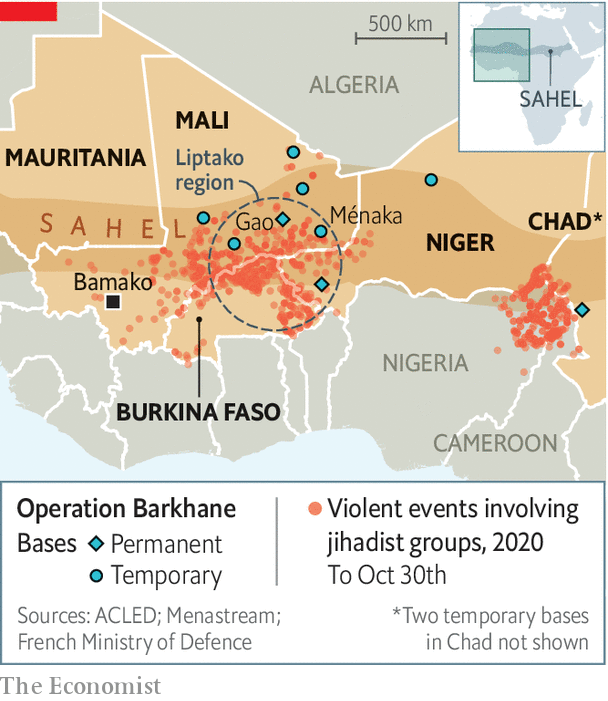

###### Mission impossible but necessary

# France’s thankless war against jihadists in the Sahel 

##### Unwinnable but still valuable 

 

> Nov 12th 2020 

THE TWIN-ENGINE French army helicopter swoops at high speed and low altitude over the arid plains of the Sahel, its side-mounted machineguns trained on the ground. A vast expanse spreads out in each direction, interrupted only by acacia trees and the occasional herd of goats sent scampering by the helicopter’s roar. It is en route from the French military base in Gao, central Mali, to Ménaka, at the heart of a zone where a jihadist insurgency last year killed some 4,800 people.

Arising from the rust-coloured sand, the French forward base at Ménaka is a compound of newly built tents and converted containers. Under a searing sun on a November morning, parachutists and commandos line up to brief Florence Parly, the French defence minister, who is visiting from Paris. The soldiers have just conducted an operation code-named Bourrasque against jihadists from Islamic State in the Greater Sahara (ISGS) in the plains and valleys of the Liptako region.


For a month, troops from France, Niger and Mali, backed by special forces and acting on French and American intelligence, tracked jihadists. Temperatures inside armoured vehicles were at times sweltering. Tyres often blew out, and sand snarled up the mechanics. They killed several dozen insurgents and seized weapons, motorbikes, fuel and food supplies. It was “intense”, says a unit captain, with “violent encounters” at close range on the ground, often at night. “We slept when we could.”

The French government first dispatched troops in 2013 to halt a jihadist advance on Mali’s capital, Bamako. Today it keeps 5,100 soldiers in the Sahel, as part of a counter-terrorism mission called Operation Barkhane, which President Emmanuel Macron this year reinforced. No other European country contributes anything like this number to military activities in the Sahel, even to a parallel United Nations peacekeeping operation. The UN has 13,600 soldiers, among them some 350 Germans, soon to be joined by 250 British.

 


Most combat operations, though, fall to the French-led forces. These campaigns, amid the heat and billowing sand, are gruelling and risky. Last year, described by Mr Macron as “cruel and painful”, was the region’s deadliest for years. The French lost 13 elite soldiers in a single night-time helicopter crash in the “three frontiers” zone between Mali, Niger and Burkina Faso. The French base in Gao, Barkhane’s biggest, was attacked with a car-bomb. The armies of Niger and Mali lost scores of soldiers in terrorist attacks. Across the Sahel, an estimated 4m people have fled their homes.

In January Mr Macron hosted a summit in the French town of Pau with the leaders of the five Sahel countries (Burkina Faso, Chad, Mali, Mauritania and Niger). Amid accusations of neo-colonialism, France’s president partly sought confirmation from regional leaders that they actually wanted French troops to stay, which they gave. But the idea was also to share out the security burden, both by recruiting fellow Europeans to help and getting regional armies to do a better job themselves.

This has brought some successes. In Ménaka and Gao, Estonian special forces took part in operation Bourrasque alongside French commandos, as part of a new joint task-force, Takuba. They worked well together, says an Estonian commando. Czech and Swedish special forces are due to arrive soon. Such forces, explains a French commando, operate discreetly alongside Malian regulars, so that villagers can see their own country’s troops on the job. This is part of a broader plan to improve local confidence and security. The British and Danes help to provide air-lift. During Bourrasque, French soldiers worked with units from Niger and Mali, a form of on-the-job training that went better than expected, a French officer says.

Certainly the mood in Gao, where one recent morning French officers could be found in the canopied mess discussing Nigerian and Malian novelists over croissants, is more upbeat. General Marc Conruyt, who commands Barkhane, declares himself very satisfied with recent operations. The French sense they have dealt a real blow to ISGS. “They certainly haven’t disappeared,” says the general. “But they don’t have the same capacity to cause trouble in this zone that they did at the end of 2019.” The French now consider rival groups affiliated to al-Qaeda to be the greater threat. On October 30th Barkhane killed at least 50 jihadists linked to al-Qaeda in an assault on a night-time convoy.

For all these encouraging signs, however, the French are stuck in an unwinnable war. On motorbikes and pick-up trucks, insurgents are mobile and nomadic. They support themselves by trafficking guns and drugs, and have a talent for disappearing into the bush. Across the north of Mali, they still hold sway. Tactical successes in one zone can push jihadists into another. The operational aim, says General Conruyt, is to harass and weaken them so as to “tip the balance in favour of our allies”. France, suggests Michael Shurkin of RAND, a think-tank in Washington, in a recent paper, “does not aspire to…defeat the jihadists.”

Rocky local politics do not help. As it is, Sahelian armies have themselves been accused of atrocities, which can help jihadists recruit. In August Malian officers ousted the president in a coup. The new leaders have promised elections, and say they want France to stay, even if its mission is unpopular. But they dismayed French observers by freeing 200 jihadists as part of a hostage-liberation deal last month. The new rulers now want to negotiate with armed jihadist groups. France disapproves.

Ms Parly stresses that “France is no longer alone.” Yet the Sahel is nobody else’s priority, despite France’s efforts to persuade its friends that the region’s stability directly affects Europe’s. The French will not be thanked for staying, but nor would they be for packing up. Under Joe Biden, America will still be under pressure to withdraw personnel from Africa. “The bottom line is that the French are actually out there on the ground,” says Charles Kupchan of the Council on Foreign Relations in Washington. “When the US is looking to lighten the load, having a partner ready to step up to the plate is a big deal.”

Next month Mr Macron, who has now put soldiers on anti-terrorist patrol on the streets in France, will take stock. He could decide to bring some troops home. “The objective”, says Ms Parly, “is progressively to be more in a support role than on the front line.” But for now, like it or not, France is stuck there. As Ms Parly says, “This is a long-term job.” ■

