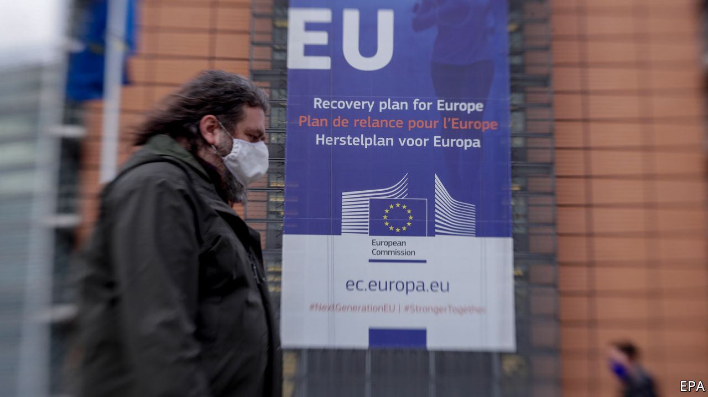
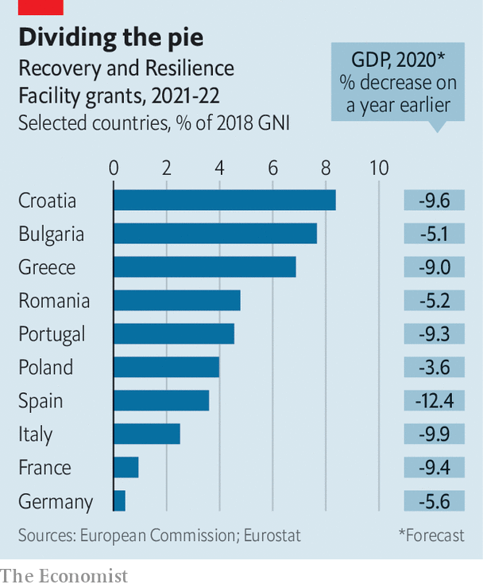

###### Turn on the spigot

# The EU’s €750bn recovery plan comes one step closer 

##### It’s part of an overall €1.8trn package 

 

> Nov 14th 2020 

THE PUFF of white smoke came on November 10th. After months of ill-tempered talks between governments and the European Parliament—one French MEP even went on hunger strike to protest against cuts—the two sides at last agreed on a seven-year budget for the European Union. Some hurdles remain. Rules must be thrashed out for running the Recovery and Resilience Facility (RRF), the centrepiece of the covid-19 recovery plan agreed by EU leaders in July. (This, along with the regular budget, makes up an overall €1.8trn package.) Viktor Orban, Hungary’s prime minister, is threatening to veto the whole thing because of rule-of-law conditions attached to the budget. But officials are cautiously optimistic that an end is in sight.

The deal in July empowered the European Commission to borrow €750bn ($886bn) from capital markets and distribute the proceeds, in grants and loans, to EU governments over six years according to specific economic criteria. The plan (see chart) emerged from a fear that the divergent effects of covid-19 could drive a permanent wedge between governments. Its scale sparked talk of a “Hamiltonian moment”—a watershed for EU integration. In truth, it may do more than pessimists had feared, and less than the optimists hoped.


It has slowly dawned on governments that the recovery fund—Next Generation EU (NGEU), to give it its full title—is not there to prop up short-run demand. Real money will not start flowing until the second half of 2021 at best, by when the recovery should be in full swing. The bulk of the grants will not be dished out until 2024. Instead the commission hopes to use NGEU to promote its own vision for long-term reform. The recovery plans governments must submit to Brussels next year will have to identify projects in line with European priorities. Fully 37% of the spending in the RRF, for example, should go on climate-friendly schemes, such as insulating old buildings, and 20% on digital projects. A second, related aim is to promote structural reform in member states to lift long-term growth rates. The commission is quietly helping governments knock their recovery plans into shape, and some are struggling. So far, says an official, they are doing better on the investment part than on reform.

 


But Brussels will have its work cut out. Governments have their own priorities, and face competing claims on any available cash. Some, such as Italy, have a less than stellar record of investing for the long term. Eastern European countries often have trouble absorbing EU funds as it is. The commission itself will face serious technical and capacity constraints, and there will be pressure to get the scheme up and running soon. “You need strong governments to implement the changes the RRF demands, and you don’t have that in Italy and Spain,” says Mujtaba Rahman of the Eurasia Group, a consultancy.

While they wait for the process to grind on, governments must keep economies afloat themselves. Europe has avoided the mistakes of the early 2010s, when premature fiscal and monetary tightening triggered a needless double-dip recession. Funding furlough schemes and other demands could cause average deficits across the EU to swell to 9% of GDP this year, helped by a suspension of the EU’s fiscal rules and the European Central Bank’s ultra-loose monetary policy. Yet some worry lest governments withdraw stimulus too soon. Shahin Vallée at the German Council on Foreign Relations reckons that, stripped of accounting tricks, the French and German draft budgets for 2021 reveal, at best, a neutral fiscal stance, even as a second covid wave portends a deeper recession and a spate of corporate bankruptcies looms. With the outcome of a suspended fiscal-rules debate unknown, some governments may fear racking up debts too quickly.

As for the Hamiltonian moment, in the long run that will depend in part on whether talks on EU-wide taxes—“own resources”, in the jargon—on matters like financial transactions get anywhere. (A “roadmap” approved this week does not commit governments to anything.) A more pressing question is whether the recovery fund can be made to work in the first place. The commission says NGEU could boost EU output by up to 2% at its peak. But if governments pour money into pensions and public-sector wages rather than electric cars and 5G networks, sceptics in Germany will be reluctant to see the experiment repeated. Success is far from assured, and Brussels is nervous. But at least MEPs should be able to start eating again. ■

