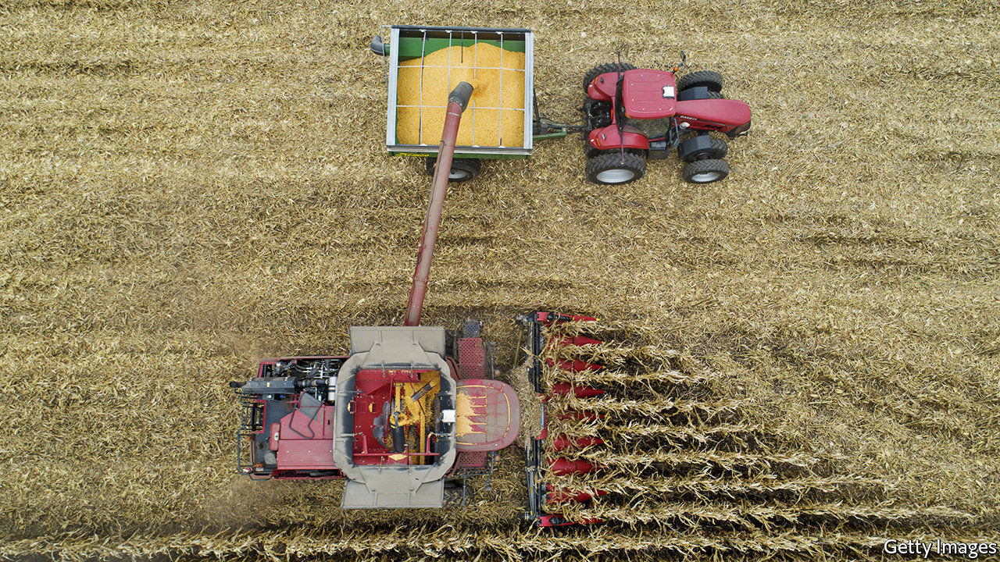

###### Amber wave

# Demand for American grain is surging 

##### China’s keen appetite is part of the explanation 

 

> Nov 12th 2020 

THE HARVEST rush in America’s heartland is subsiding. More than 90% of the country’s corn and soyabeans had been picked by November 8th. Crops moved from cart to trailer to grain elevator. Now a different kind of frenzy is taking hold.

Exports of American corn are poised to reach a record of 67.3m tonnes for the marketing year that began in September, according to forecasts by the United States Departure of Agriculture (USDA) published on November 10th. Demand for corn and soyabeans may push American stocks to their lowest levels in seven years. By the time markets closed after the USDA’s report, the most actively traded corn and soyabean futures contracts had jumped to $4.23 and $11.46 a bushel, respectively, with corn up by more than a third since early August and soyabeans at their highest price in over four years. They may rise higher still.


The surge in prices follows years of turmoil for American farmers. Gripes include: the government’s limit on the ethanol that can be blended in petrol; President Donald Trump’s trade war with China; and the coronavirus, which depressed demand for oil and therefore the biofuels mixed with it.

Prices are climbing, in part, due to bad weather. Wet conditions prompted some American farmers to forgo planting and collect government crop insurance instead, notes Dan Basse of AgResource, a research firm. Other farms suffered a dry August. A derecho, or wind storm, blasted across the Midwest, with gusts of more than 100 miles per hour. Farmers elsewhere have also experienced dismal conditions. Usually fertile fields near the Black Sea are producing less corn than expected. Production in Ukraine is expected to fall by more than 20% compared with last year.

Meanwhile demand from China has soared. In the first phase of Mr Trump’s trade deal, announced in January, China agreed to buy an additional $200bn-worth of American goods in 2020-21. Even without the deal, Chinese demand for crops would probably have been robust. The country is keen to expand its herds of hogs, decimated last year by African swine fever. That is raising demand for animal feed, such as soyabeans. Anxiety about food security means the government is refilling stockpiles, too. The USDA expects Chinese wheat imports to reach the highest level in 25 years, with total imports of corn and other coarse grains setting a new record.

Little surprise, then, that export prices for American corn and soyabeans have sailed above $220 and $470 a tonne, respectively, up by about 60% and 50% from their 52-week lows. But bulls should not be too confident. China’s buying may ebb if it seeks a different trade deal with America’s president-elect, Joe Biden. Agricultural commodities move in much quicker cycles than, say, metals, points out Aakash Doshi of Citigroup, a bank. It is simpler to plant extra beans than it is to start mining for bauxite. Higher prices now may prompt farmers to plant more later; a spell of good weather could boost supply further.

Still, prices may hold up in the short term, for better or worse. In America, says Mr Doshi, “demand is improving well from the covid-19 trough in the second quarter.” Dry weather from La Niña is interfering with planting in Brazil. A spat may prompt China to ban imports of several Australian crops (see ). Russia’s government is mulling a quota on wheat exports. For the more than 100m people who have sunk into poverty this year, that is worrying. An index of food prices, published by the United Nations, rose in October for the fifth straight month. The index is now 6% above its level a year ago. ■

