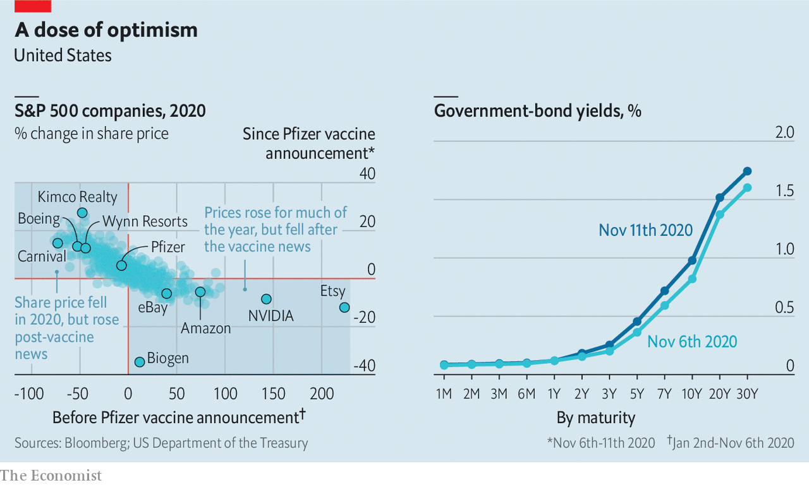

###### Booster shot

# News of an effective vaccine injects optimism into markets 

##### Share prices and Treasury yields rose on Pfizer’s announcement 

 

> Nov 14th 2020 

 


AFTER NEWS of an efficacious vaccine broke on November 9th, investors bet on a partial return to economic normality. Cruise and casino stocks leapt, and e-commerce firms skidded. The yield on ten-year Treasuries climbed to almost 1%.■

