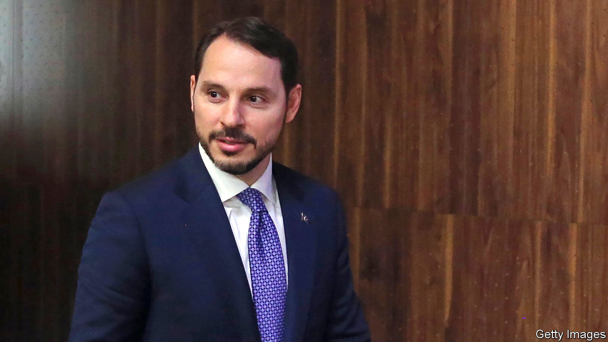
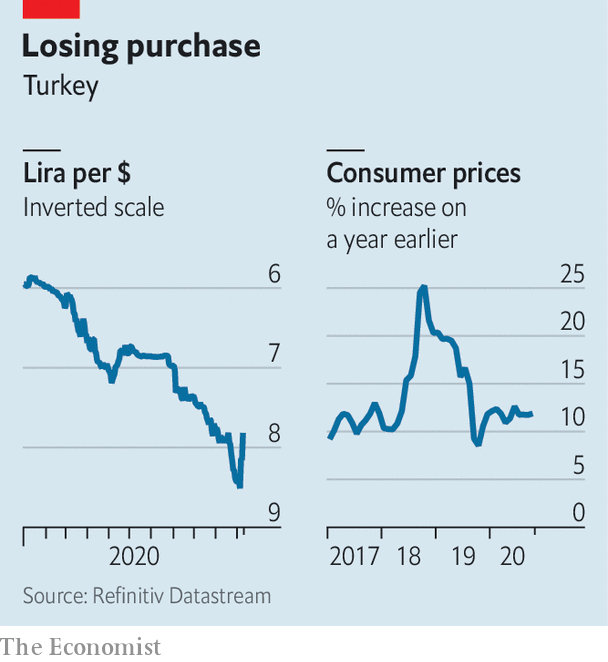

###### Comings and goings

# Will Turkey’s new economic officials win over investors? 

##### The new central-bank boss is making changes. But President Erdogan still calls the shots 

 

> Nov 14th 2020 

FOR SOMEONE thought to be the second-most-powerful person in Turkey and a possible successor to President Recep Tayyip Erdogan, it was an unseemly exit. In a statement posted on Instagram on November 8th and riddled with grammatical mistakes, Berat Albayrak, the president’s son-in-law, said he was stepping down as finance minister and leaving politics. It took Mr Erdogan and his officials over a day to digest and confirm the news. It took another day to name Lutfi Elvan, a former deputy prime minister, as his replacement.

Mr Albayrak, popularly referred to as the damat (son-in-law), said he was leaving for health reasons. But insiders blame a feud with the new central-bank governor, Naci Agbal, who had criticised the minister’s record. Mr Agbal had been appointed only a couple of days earlier, after Mr Erdogan ousted his predecessor, Murat Uysal, without giving an explanation. (Mr Uysal is the second head of the central bank to be sacked in as many years.) Mr Albayrak was reportedly not briefed on the decision.


Mr Albayrak’s management of the economy was even worse than his grammar. As the minister and his father-in-law leaned on both the central bank and commercial lenders to keep borrowing rates low, the lira set one record low after another. Between the damat’s surprise appointment in 2018 and his shock resignation, the currency lost 46% of its dollar value, eating away at Turks’ buying power. Instead of raising interest rates the central bank sold dollar reserves to relieve pressure on the lira. It threw in the towel this summer, but only after squandering more than $100bn, and had begun to use a byzantine system of multiple interest rates to tighten the money supply indirectly. For his part, Mr Albayrak laughed off concerns about the currency collapse. “For me, the exchange rates are not important at all,” he told reporters in September. “I don’t look at that.”

Investors hope for a return to more orthodox policies. In its first few days of trading since the shakeup, the lira had risen by over 7% against the dollar, reversing a long decline (see chart). Both Mr Elvan and Mr Agbal, who preceded the damat as finance minister, are staunch allies of Mr Erdogan, but experienced technocrats. Both say they will prioritise fighting inflation, which in October approached 12%, almost two percentage points higher than the policy interest rate. Mr Agbal is said to have already begun removing Mr Albayrak’s surrogates from top posts at the central bank and promised to improve communication. In another encouraging move, on November 11th the banking regulator eased restrictions on lira trading by foreigners. The curbs had been imposed to stop outsiders short-selling the currency.

 


Still, for all of Mr Albayrak’s foibles, the damat only did what all ministers are now used to doing: follow Mr Erdogan’s lead. And the president gives no sign of being ready to loosen his grip on the finance ministry and the central bank, or to dispense with his bizarre economic views, such as that high interest rates cause inflation. “There’s this narrative building that pins all the bad things that happened since 2018 on Mr Albayrak,” says Erik Meyersson of Handelsbanken. “Maybe it was his strategy to start selling foreign reserves, but the reason they resorted to this stupid measure was because they had this stupid directive [from Mr Erdogan] not to increase rates.”

The central bank’s monetary-policy committee convenes on November 19th. It “needs to meet expectations by hiking rates and simplifying the policy framework”, says Hakan Kara, a former chief economist at the bank. If not, the change at the top will have been window-dressing. ■

