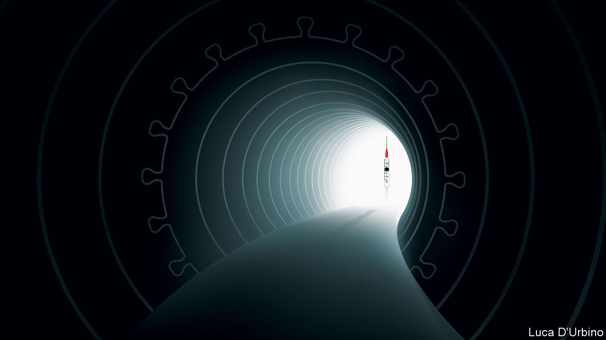

###### Suddenly, hope

# The promise of the new covid-19 vaccine is immense 

##### But don’t underestimate the challenge of getting people vaccinated 

 

> Nov 14th 2020 

Editor’s note: Some of our covid-19 coverage is free for readers of The Economist Today, our daily . For more stories and our pandemic tracker, see our 

NINE LONG years elapsed between the isolation of the measles virus in 1954 and the licensing of a vaccine. The world waited for 20 years between early trials of a polio vaccine and the first American licence in 1955. Marvel, then, at how the world’s scientists are on course to produce a working vaccine against SARS-CoV-2, the virus that causes covid-19, within a single year.

And not just any vaccine. The early data from a final-stage trial unveiled this week by Pfizer and BioNTech, two pharma companies, suggests that vaccination cuts your chances of suffering symptoms by more than 90%. That is almost as good as for measles and better than the flu jab, with an efficacy of just 40-60% (see a). Suddenly, in a dark winter, there is hope.


Not surprisingly, Pfizer’s news on November 9th roused the markets’ bulls. Investors dumped shares in Clorox, Peloton and tech firms, which have all benefited from the coronavirus, and instead switched into firms like Disney, Carnival and International Consolidated Airlines Group, which will do well when the sun shines again (see ). The OECD, a club of mainly rich countries, reckons that global growth in 2021 with an early vaccine will be 7%, two percentage points higher than without.

There is indeed much to celebrate. Pfizer’s result suggests that other vaccines will work, too. Over 320 are in development, several in advanced trials. Most, like Pfizer’s, focus on the spike protein with which SARS-CoV-2 gains entry to cells. If one vaccine has used this strategy to stimulate immunity, others probably can, too.

Pfizer’s vaccine is also the first using a promising new technology. Many vaccines prime the immune system by introducing inert fragments of viral protein. This one gets the body to make the viral protein itself by inserting genetic instructions contained in a form of RNA. Because you can edit RNA, the vaccine can be tweaked should the spike protein mutate, as it may have recently in mink. This platform can be used with other viruses and other diseases, possibly including cancer, BioNTech’s original focus.


Listen on:  |  |  |  | 

So celebrate how far biology has come and how fruitfully it can manipulate biochemical machinery for the good of humanity (there will be time later to worry about how that power might also be abused). And celebrate the potency of science as a global endeavour. Drawing on contributions from across the world, a small German firm founded by first-generation Turkish immigrants has successfully worked with an American multinational company headed by a Greek chief executive.

Yet despite the good news, two big questions stand out, about the characteristics of the vaccine and how fast it can be distributed. These are early results, based on 94 symptomatic cases of covid-19 from among the 44,000 volunteers. Further answers must wait until the trial has gathered more data. It is, therefore, not clear whether the vaccine stops severe cases or mild ones, or whether it protects the elderly, whose immune systems are weaker. Nor is it known whether inoculated people can still cause potentially fatal infections in those yet to receive jabs. And it is too soon to be sure how long the beneficial effects will last.

Clarity will take time. In the next few weeks the trial should be declared safe, though further monitoring of the vaccine will be needed. The companies predict that immunity will last for at least a year. The 90%-plus efficacy is so high that this vaccine may offer at least some protection to all age groups.

While the world waits for data, it will have to grapple with distribution. Vaccine will be in short supply for most of next year. Although RNA jabs may prove easier to make at scale than those based on proteins, Pfizer’s requires two doses. The company has said that it will be able to produce up to 50m doses in 2020 and 1.3bn next year. That sounds a lot, but America alone has over 20m first responders, medical staff, care-home workers and active-duty troops. Perhaps a fifth of the world’s 7.8bn people, including two-thirds of those over 70, risk severe covid-19. Nobody has ever tried to vaccinate an entire planet at once. As the effort mounts, syringes, medical glass and staff could run short.

Worse, Pfizer’s shots need to be stored at temperatures of -70°C or even colder, far beyond the scope of your local chemist. The company is building an ultra-cold chain, but the logistics will still be hard. The vaccine comes in batches of at least 975 doses, so you need to assemble that many people for their first shot, and the same crowd again 21 days later for a booster. Nobody knows how many doses will be wasted.

So long as there is too little vaccine to go around, priorities must be set by governments. A lot depends on them getting it right, within countries and between them. Modelling suggests that if 50 rich countries were to administer 2bn doses of a vaccine that is 80% effective, they would prevent a third of deaths globally; if the vaccine were supplied according to rich and poor countries’ population, that share would almost double. The details will depend on the vaccine. Poor countries may find ultra-cold chains too costly.

The domestic answer to these problems is national committees to allocate vaccine optimally. The global answer is COVAX, an initiative to encourage countries’ equal access to supplies. Ultimately, though, the solution will be continued work on more vaccines. Some might survive in commercial refrigerators, others will work better on the elderly, still others might confer longer protection, require a single shot, or stop infections as well as symptoms. All those that work will help increase supply.

Only when there is enough to go around will anti-vaxxers become an obstacle. Early reports suggest the jab causes fevers and aches, which may also put some people off. The good news is that an efficacy of 90% makes vaccination more attractive.

The tunnel ahead

The next few months will be hard. Global recorded death rates have surged past their April peak. Governments will struggle with the logistics of vaccination. America is rich and it has world-class medicine. But it risks falling short because the virus is raging there and because the transition between administrations could lead to needless chaos and delays. Squandering lives when a vaccine is at hand would be especially cruel. Science has done its bit to see off the virus. Now comes the test for society. ■

