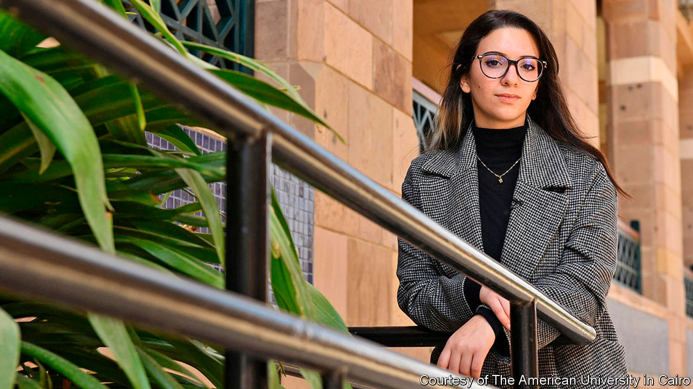

###### Rebelling against rape

# Egyptian women speak up about sex crimes 

##### They are fed up of state media that call a gang-rape a “group sex party” 

 

> Nov 14th 2020 

WHEN NADEEN ASHRAF was walking through a wealthy part of Cairo last month, she was not surprised to hear sexual comments aimed her way. Most women in Egypt have experienced sexual harassment or violence. But her catcaller was surprised when the 22-year-old philosophy student jumped into the taxi he was driving. “I had an hour-long conversation with him,” she recalls. “It was so foreign to him that this was sexual harassment.”

For much of this year Egypt has wrestled with the problem of sexual violence and the issue of women’s rights. Men there have long policed women’s behaviour, using antiquated notions of morality, while tolerating crimes by men against women. But lately young women like Ms Ashraf (pictured) have been challenging the country’s conservative, male-dominated culture, using social media to amplify their voices. It has not always gone well.


The reckoning began in June, when a student at the American University in Cairo (AUC) posted a warning on Facebook about a former student, Ahmed Bassam Zaki, whom she accused of sexually harassing and blackmailing women. Days later, after that post disappeared, Ms Ashraf launched an account on Instagram called Assault Police, which repeated the allegations against Mr Zaki—and listed more. He was soon arrested. Assault Police was born out of anger, says Ms Ashraf, who also attends AUC. “I was very frustrated that women’s voices were not being taken seriously.”

Around the time of Mr Zaki’s arrest, other cases began making headlines. A woman alleged that a group of wealthy young men drugged and gang-raped her at a five-star hotel in Cairo in 2014. Another woman, called Aya Khamees, accused a man of rape—and accused the police of ignoring her claims. It seemed as if Egypt was having a #MeToo moment. The National Council for Women, a government body, urged other victims of sexual violence to come forward. Parliament approved a law guaranteeing them anonymity. Assault Police now has over 200,000 followers.

But the progress was largely illusory. Take the alleged gang rape, which was reportedly recorded by the attackers. It took weeks of campaigning by activists before the Public Prosecution Office moved, allowing some of the suspects to flee the country. Five men have since been arrested; at least two suspects are still at large. Three of the men arrested have been charged with rape, which they deny. Absurdly, the authorities also charged four people who came forward as witnesses (and two of their acquaintances) with violating laws on “morality” and “debauchery”. The media have characterised the incident as a “group sex party”, smearing all involved, including the alleged victim. This has had a chilling effect: once-vocal women have gone into hiding.

After Ms Khamees was turned away by the police, she broadcast her accusations on TikTok, an app for sharing short videos, where she had more than 100,000 followers. Days after the video went viral, the police picked up the entire group who had been partying with her that night. The authorities seemed as concerned with their use of hash and the mixing of unmarried men and women, as with Ms Khamees’s claim that a man had held a razor to her face and raped her. Her attackers (she accused a group of people of facilitating the rape) were charged with rape and other offences. But Ms Khamees was also charged—with prostitution, drug use and “violating family values”. Only after she completed a programme to “correct her concepts” were the charges against her dropped.

These cases are indicative. Egypt has laws against sexual violence and harassment (the latter enacted only in 2014), but victims keep quiet for fear they will be blamed and shamed. The authorities have been known to subject women to so-called “virginity tests” and to ask about their sexual history, often using the information to muddy a case. The law is vague and, anyway, “it is just what you write on a piece of paper,” says Salma El Tarzi, a film-maker who focuses on sexual violence. The real problem is the attitude of Egyptian men.

Most of Egypt’s judges and prosecutors are men. They decide what violates Egyptian values. Lately they have been using a cyber-crime law to crack down on women dancing and clowning around on TikTok. Since April the authorities have arrested ten female TikTok influencers on charges of violating family values and inciting “indecency” and “debauchery”. Six have been sentenced to two years each in prison; two have received three-year sentences. Part of what panics the old arbiters of morality is how the internet has empowered young, often lower-class women.

The country as a whole, though, remains deeply conservative. Many Egyptians supported the arrests of the TikTok stars. A survey released in 2017 by the UN and Promundo, an advocacy group, showed that 64% of Egyptian men (and 60% of women) believe that a woman should marry her rapist. Almost three-quarters of men (and 84% of women) said women who dress provocatively deserve to be harassed. Only in Egypt are the views of young men as conservative as those of older men when it comes to gender, says Amel Fahmy, who worked on the survey.

“There are millions of men in Egypt who have no clue about their sexuality and the ideas of boundaries and consent,” says Ms Ashraf. She grew more disillusioned after talking to her catcalling cab driver. He ultimately apologised, she says, but then claimed he would never get married. Asked why, he responded, “Because you told me I shouldn’t compliment girls.” ■

