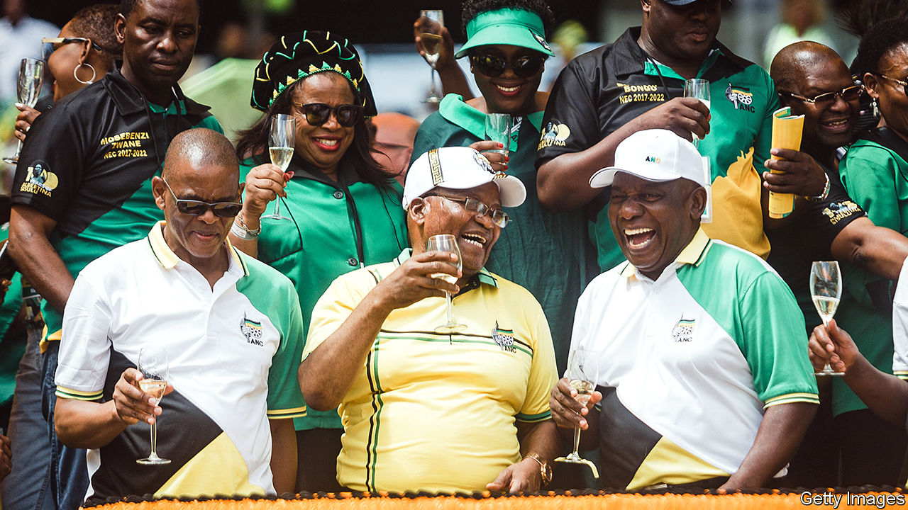

###### Ace in the hole

# The arrest of Ace Magashule is good news for South Africa 

##### A ruling-party bigwig who stood in the way of graft-busting reform 

 

> Nov 14th 2020 

THE RESIDENTS of the township in Bloemfontein call it Dark City. The area was one of many segregated neighbourhoods built during apartheid. Today it is a microcosm of the failures of the ruling African National Congress (ANC): pockmarked roads, sporadic electricity, erratic rubbish collection and house after house of people unable to find work. And, on the top of most, roofs made of asbestos.

These should be long gone. In 2014 the regional government awarded a contract worth 255m rand ($23.5m) to survey and remove the health hazards. But in Dark City, as in most of Free State province, there is nothing to show for it. Geelbooi Mzaza, who has lived in the area since 1995, says that nurses have told him that asbestos is worsening his tuberculosis. “They said I had to move, but I have nowhere to go.”


Corrupt procurement deals are ubiquitous in South Africa. So much so that the country coined the term “tenderpreneur” to describe politically connected winners of public contracts. Under Jacob Zuma (pictured, centre), president from 2009 to 2018, the corruption reached such kleptocratic levels it became known as “state capture”.

One of the former president’s closest allies was Ace Magashule (pictured, left). Today Mr Magashule is the secretary-general of the ANC, one of the most powerful people in the party and the locus of internal resistance to Mr Zuma’s successor, Cyril Ramaphosa (pictured, right). For several years there has been speculation that Mr Magashule would be brought to book for corruption in Free State, where he was premier during the Zuma presidency. On November 10th he was issued with a warrant for his arrest on corruption charges related to the asbestos case. (He denies any wrongdoing.) The move by the country’s National Prosecuting Authority (NPA) and the Hawks, a police unit, may therefore prove good news not just for people like Mr Mzaza, but also for Mr Ramaphosa.

Mr Magashule’s alleged role in the asbestos deal was described in “Gangster State” by Pieter-Louis Myburgh, a journalist. The book, published in 2019, drew on leaked documents and a spreadsheet used by Igo Mpambani, one of two businessmen given the contract (and who was murdered in his Bentley in broad daylight in 2017). Last month the other businessman, Edwin Sodi, was arrested. “Gangster State” alleged that Mpambani shared the proceeds of the tender with various insiders, including Mr Magashule, whom Mr Myburgh placed close to the businessman soon after the latter made large withdrawals of cash. The author later estimated that just 3% of the funds went to the clean-up.

The case is one of many scandals from Mr Magashule’s time as premier. Others include a taxpayer-funded trip to Cuba for him and fellow “comrades”, and shoddily completed contracts for low-cost housing that involved Thoko Malembe, his daughter. Then there is the other major case being aggressively pursued by the NPA: a state-subsidised dairy costing hundreds of millions of rand linked to Mr Zuma’s close allies, the Gupta brothers, for whom Mr Magashule’s son, Tshepiso, worked.

That much is known about state capture is testament to many of South Africa’s institutions. Investigative journalists, NGOs, civil servants such as Thuli Madonsela, the former public protector, and dogged opposition politicians, especially from the Democratic Alliance, have all helped reveal the extent of the graft. But whether anyone goes to jail will depend on a criminal-justice system eviscerated in the Zuma era.

Upon taking office, Mr Ramaphosa pledged to revive organisations like the NPA, the Hawks and the South African Revenue Service. He has replaced party hacks with competent leaders and let them get on with their jobs. South Africans are understandably impatient. But prosecutors are finally racking up arrests. And if the state wins its case against Mr Magashule, it would be the clearest sign yet that the president’s anti-corruption drive is serious.

History suggests that a successful prosecution will not be easy. No ANC politician has so far been convicted for taking part in state capture. For 15 years Mr Zuma has been in and mostly out of court for his alleged part in a corrupt arms deal dating back to the late 1990s. Mr Magashule may try to copy the mix of denial and delay that has served the former president well. And although the relevant law defines corruption fairly broadly, it may be hard to prove Mr Magashule’s involvement; his former colleagues note that he had a habit of using other people’s mobile phones.

Mr Ramaphosa should benefit from having his rival occupied, even if Mr Magashule refuses to step down from his post while he is facing charges. Since Mr Ramaphosa took office his (over)cautious reformism has been hobbled by internal opponents. Though these include more than just allies of Mr Magashule, the secretary-general’s arrest should give the president greater power in negotiations with party factions and trade unions, for example concerning his efforts to slow the growth of the public wage bill.

Mr Ramaphosa nevertheless has much to do to convince increasingly sceptical South Africans that the ANC can change. State capture was about more than just individuals, however powerful. It was about an entire system of corruption, deployment of party members and patronage.

Back in Dark City, the residents’ mood is also sombre. Most scoff at the notion that arrests would signal a change in their fortunes. The best some people hope for is to be next in line for the spoils of a rotten system. Approaching your correspondent, a young man calls out: “Write it down—we want the next tender!” ■

