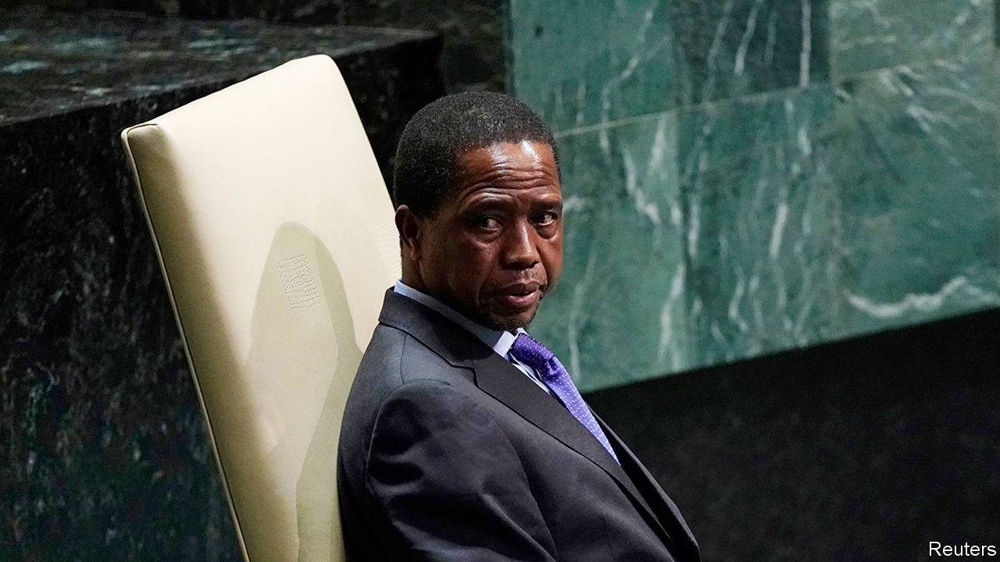
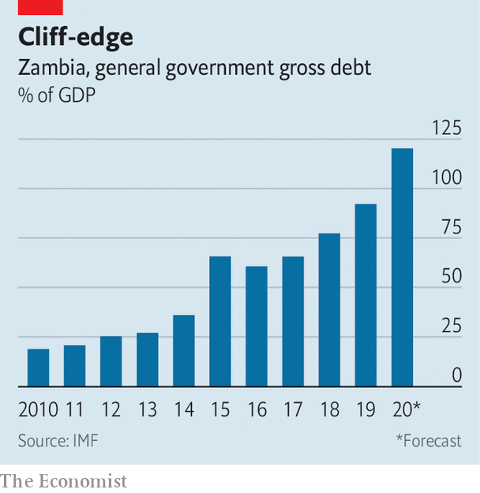

###### The wheels come off

# Zambia is starting to look like Zimbabwe, the failure next door 

##### The government blames covid-19. It should look in the mirror 

 

> Nov 14th 2020 

IN HIS STUDIO Fumba Chama gets ready to play his new song. Unlike in most Zambian workplaces there is no photograph on the wall of Edgar Lungu, the president since 2015. Looking down instead is a young Kenneth Kaunda, who led Zambia for 27 years after independence from Britain in 1964.

If that is a silent protest, then out of the speakers comes a louder one. In “Coward of the County” Mr Chama raps laconically about Mr Lungu’s failings over—why not?—a sample of the song of the same name by the late Kenny Rogers, a bearded American country star. It is his latest track about how the ruling Patriotic Front (PF) has crushed civic freedoms and crashed the economy. As if to prove his point, the authorities have repeatedly arrested and intimidated Mr Chama, whose stage name is PilAto. “People say I have no fear,” he says, “but I’m scared.”


Mr Chama is not alone. Unless it pays an overdue $42.5m coupon, or bondholders give it more time, on November 13th Zambia will officially default on its debt. Though it would be the first African state to do so since the start of the pandemic, covid-19 is not the root cause of its troubles. More important is the PF’s misrule, which will worsen ahead of elections in August 2021. “We are heading in the same direction as Zimbabwe,” says Laura Miti of Alliance for Community Action (ACA), an NGO.

Any such comparison to the failing state on its southern border is cause for alarm. Since 1991, when Mr Kaunda eventually made way for multiparty democracy, the country has held regular, if flawed, elections. In the 2000s GDP grew by an average of 7% per year, thanks in part to a soaring price for copper, which accounts for four-fifths of exports.

After it took office in 2011 the PF was not helped by droughts and a fall in the copper price. Yet it made matters worse by ramping up borrowing. Government debt as a share of GDP has risen from 21% to 120% (see chart). External debt has increased seven-fold, as Zambia borrowed in dollars from Western bondholders and Chinese state banks. It now spends four times as much on external debt as on health care.

 


Much of the money has been wasted. A dual carriageway north from Lusaka estimated to have cost $1.2bn stops on the outskirts of the capital. Other roads have been commissioned at inflated prices (roughly twice the African average per kilometre), suggesting ample opportunities for the well-connected to take a cut. An order for fire engines and a cash-transfer scheme for the poor are among many fishy tenders. The Financial Intelligence Centre, an official watchdog, found $520m worth of money-laundering or suspicious transactions in 2018, up from $382m in 2017. Institutions meant to oversee borrowing—the finance ministry and parliament—have been bypassed as departments and agencies within the presidency have racked up debts.

Ordinary Zambians are paying the price. Annualised inflation was 16% in October, versus 11% a year ago. The local currency, the kwacha, has lost almost a third of its value against the dollar this year. Civil servants are not paid on time. Graduates struggle to find jobs; such is the plight of teacher-training graduates that the Unemployed Teachers Association of Zambia represents tens of thousands of people.

Zambia has asked the IMF for a cheap loan to tide it over. An IMF programme would also reassure creditors who worry that any relief they provide will only bolster the PF’s election war chest or the accounts of Chinese lenders. Yet the antics of the Lungu regime have done little to convince creditors that it can be trusted.

In August Mr Lungu fired Denny Kalyalya, the governor of the central bank, and replaced him with Christopher Mvunga, a political ally. Mr Kalyalya was dismissed partly because he rebuffed efforts to have the central bank print money, according to people familiar with the decision. Mr Mvunga “does not have the power to resist”, says a former senior central banker.

Zambia’s latest budget, passed on September 25th, also raised eyebrows. It included 5.7bn kwacha ($275m) for farm inputs, such as fertiliser—a 300% increase on the previous year. It may win over some of the 56% of Zambians who live in the countryside. Another crafty tactic is cancelling the voter roll and replacing it with a new one. Zambians have been given just 30 days to sign up. Many fear it will be harder to register in opposition strongholds. “Lungu hopes to disenfranchise as many opposition supporters as possible,” argues Sishuwa Sishuwa of the University of Zambia.

Mr Lungu has not had it all his own way. On October 29th parliament rejected a bill that would have removed constraints on the president and made it easier for him to win re-election. The defeat suggests that he does not have an iron grip on his party, especially among its Bemba-speaking elites hailing mainly from the north-east.

But weak “strongmen” are often the most dangerous. After the bill’s demise, a further anti-democratic backlash may occur, fears Ms Miti. The ruling party has shown itself willing to throttle freedoms. It has put allies of Mr Lungu on the constitutional court, which in 2018 ruled that he could stand a third time for president, contrary to the views of many Zambian jurists. Authorities have shut Zambia’s main independent newspaper and a television station. PF thugs harass journalists and opposition campaigners.

And musicians. In his studio Mr Chama points out that many of his friends are paid to play by the PF, or have received money from a youth “empowerment” fund, announced in August. Though he worries about what will happen next, he would never take the cash. “Better to be dead than alive in a dead country,” he says. ■

