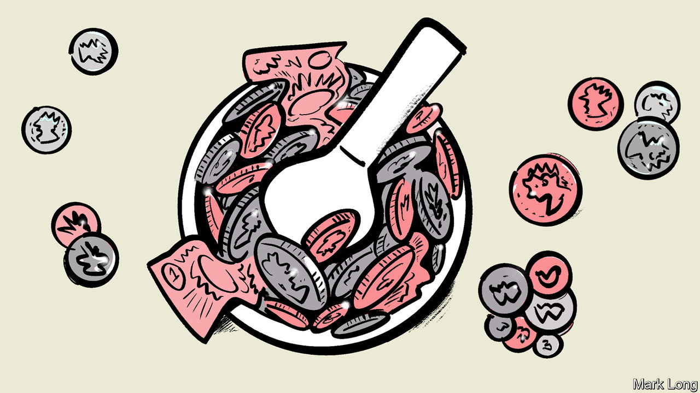
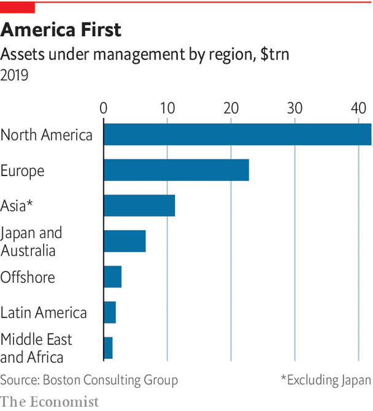

###### China

# The Shanghai Open 

##### The future of finance is Chinese. But what will it look like? 

 

> Nov 12th 2020 

ASSET MANAGEMENT is mostly a rich-world affair. North America, Europe, Australia and Japan between them account for around three-quarters of assets under professional management. The United States is far and away the single most important market. America sets the tone for capital markets everywhere else. Global trading starts when New York opens.

Yet just as London gave way to New York after economic supremacy passed from Britain to America, so it is not hard to imagine a future when the global trading day will begin in Shanghai. China already has the world’s second-largest economy. Its heft in global finance lags, but it is putting much effort into catching up. It has opened its mainland markets to foreign investors in shares and bonds. It is relaxing regulations to allow foreign asset managers to operate more freely. Asset management is growing faster in Asia than in the West. The industry’s balance of power is shifting inexorably. Time, size and momentum are on China’s side.


What is not clear is precisely how asset management will develop in China. No asset manager can offer a global service unless it has a footprint in China and across Asia. If you are selling Chinese equity or bond mutual funds to Western investors, you need people on the ground in China. The same business logic applies to selling global assets to Chinese investors, once outgoing capital controls are relaxed. The big prize—and the big unknown—is “local to local” ie, selling Chinese mutual funds to Chinese investors. And the competition for this prize looks wide open.

China’s financial markets are immature. Much household wealth is on deposit in banks or tied up in homes. The commonest kinds of pooled investments resemble bank deposits: either money-market funds or “wealth-management products”, higher-yielding alternatives to bank deposits, which have a fixed term of a few months but are often used to finance long-term property projects. Stockmarket trading is dominated by retail investors, who trade directly in individual shares via brokerages. Only around a tenth of listed shares are owned through domestic mutual funds.

China’s stockmarket has a very high churn rate. But the market is becoming more institutionalised. Mostly this reflects buying by foreigners, following the inclusion of a selection of shares and bonds listed on China’s mainland markets in the benchmark indices compiled by MSCI and Bloomberg Barclays. The hope is that China’s domestic market will also come under the stabilising sway of asset managers.

If it does, it is an enticing fee pool. As China gets richer, households are likely to change their mix of wealth: less in bank deposits and wealth-management products (which regulators are keen to kill off for reasons of financial stability); more in traded securities, such as shares and bonds. More of those securities, it is hoped, will be held in diversified mutual funds, managed by professionals for a fee. Pension funds will mushroom. GDP is likely to continue to grow faster than in rich countries. A bigger economy implies more savings to be deployed—and more securities to be issued, by both companies and the government.

In short, managed assets will continue to grow faster in China. For active asset managers, it is a dream. Their concern is that fee revenue in America and Europe is diminishing, or at least cannot grow much further. China offers a new frontier. “These are very big and liquid markets that are also inefficient,” says the boss of one European fund. Many of the same conditions are found in other parts of emerging Asia. A secular fall in inflation in India, the other Asian giant, has encouraged the well-off out of inflation hedges like gold and property into the stockmarket.

China appears to want to graduate from a rickety system in which state-backed banks decide who gets capital. Its regulators plan to establish a professional class of asset allocators. They see foreign involvement as a means to this goal. Since 2018 foreign firms have been allowed to take majority stakes in asset-management joint ventures with domestic banks. From April this year, they have been permitted to set up wholly owned subsidiaries in China. Within days of this rule change, JP Morgan Asset Management paid $1bn to buy out its minority partner. Others are moving to take advantage of China’s opening up. Still, most Chinese asset managers have foreign partners. The foreigners bring with them expertise in building portfolios, trading, research, investment process, record-keeping and the management of highly skilled teams. Their partners bring customers and local know-how.

 


Everyone thinks that China will be a big deal. But industry bosses are not confident about how things will shake out in practice. There are broadly three areas of uncertainty. The first is how to acquire customers. Some of the world’s biggest asset managers became that way partly from having a captive market. They are often offshoots of insurance companies, retail banks or investment banks. A foreign asset manager with no brand in China needs to find another way to build the business. For some a tie-up with a local bank is a good fit. Amundi is an offshoot of two European banks, Crédit Agricole and Société Générale, from whose customer base they have built a formidable market share in France. It has a joint venture with Agricultural Bank of China and another with Bank of China. These are lenders with hundreds of millions of customers. It also has a joint venture with State Bank of India, the country’s largest commercial bank. From such strongholds, Amundi has accumulated an asset base of €300bn across Asia.

But banks are not the only money doctors in China. Some rich-world equity funds have emerged out of life-insurance businesses. They essentially sold equity risk under the guise of an insurance product. Something similar might yet happen in China. China Life, for instance, has a sales force of 1.8m. The two tech giants, Alibaba and Tencent, have mobile-payment platforms that are widely used and trusted. These are potential launching pads for asset-management businesses.

Very big, China

In 2013 Ant Group, an offshoot of Alibaba, created a fund for its customers to invest the cash piling up in their Alipay mobile-payment accounts. Within a few years it was the world’s largest money-market fund. Vanguard now has a joint venture with Ant Group to offer investment advice. It signed up 200,000 clients in its first 100 days. The choice of distribution channel hinges on whom Chinese investors will ultimately trust. It is not mostly a matter of technology. “People make a distinction between tech platforms and bank networks,” says Yves Perrier, chief executive of Amundi. “But it is a false distinction because the way we bank in France is both human and digital.”

A second uncertainty is how the industry in China will evolve. The bet is that it will become more like America, a market in which mutual funds have the muscle. But there is no guarantee of this. Indeed, in recent months America’s stockmarket has looked a lot like China’s: retail-led, noisy and informed by social-media fads and a gambling mentality. China’s market might stay that way. Or the market for pooled investments might be swiftly captured by index and other kinds of low-cost products.

A third source of uncertainty is policy in China. It is friendly now, but might not always be. “With distribution-driven JVs, sometimes you lose control of the factory,” warns one industry bigwig. That is not the only risk. The prospect of selling rich-world securities to Chinese investors depends on China allowing capital to flow freely outwards. It has been loth to do this because it would mean ceding greater control of the yuan to market forces. China may balk at further opening up. A bigger question lies behind this. One industry executive puts it bluntly: “How serious is it about allowing people to make money?”

Perhaps the trade-and-technology wars will make China inhospitable to American asset managers. Perhaps Europe has an advantage. If Shanghai is to follow London and New York, the yuan must become freely convertible. China has to be open. But economic and financial hegemony may be expressed differently. “Will we make money? We haven’t a clue,” says the executive. But like many of his peers, he sees China as a low-stakes bet with a potentially large payoff. “We still need to be there,” he says. “So we are there.”■

