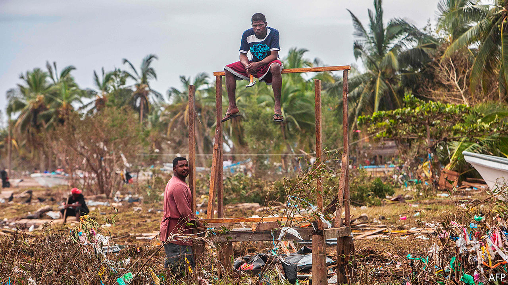
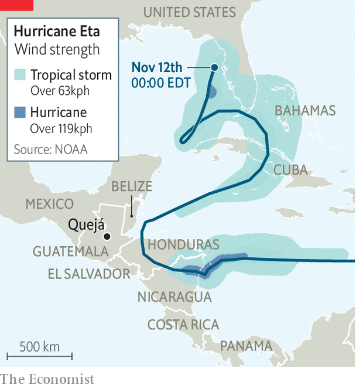

###### Greek tragedy

# The toll of Hurricane Eta in Central America and the Caribbean 

##### The biggest storm of a record-breaking season could lead to a rise in covid-19 cases 

 

> Nov 12th 2020 

IN ONLY ONE previous year, 2005, have meteorologists resorted to the Greek alphabet to name Atlantic storms. They had run through the 21 names starting with the letters of the Roman alphabet (five uncommon letters are not used). With Hurricane Eta this month the storm-namers have reached further into the Greek-letter sequence than ever before. The strongest storm of this year’s season, Eta made landfall on November 3rd in Nicaragua as a category-four hurricane, with gusts of up to 240km (150 miles) per hour. It proceeded to cause havoc across Central America and the Caribbean (see map).

The winds weakened after landfall, but torrential rain caused floods and landslides in Honduras, Guatemala and Cuba. Scores of Central Americans are confirmed dead and many are missing or injured. Countries on the edge of the storm’s path, including Mexico and Panama, suffered deaths and damage. Flooding disrupted an election in Belize on November 11th. Across the region, perhaps 300,000 people left their homes to seek shelter in community centres or with family and friends.


The death toll in Guatemala—with 18m people Central America’s most populous country—will probably be the highest. So far, 44 people are confirmed dead and nearly 100 are missing. Mudslides engulfed houses in central Guatemala, which bore the brunt of the storm in that country. In Quejá a villager lost 22 members of her family, Reuters reported. In Honduras 1.7m of the country’s 10m people have been affected in some way, says the Red Cross. Hondurans criticised the government for failing to prepare for the storm. Nicaragua had just two deaths but lots of damage to roads and houses. Thirty thousand people were evacuated and 25,000 households have no electricity.

 


Eta is far less devastating than many past disasters, such as Hurricane Mitch, which in 1998 killed more than 11,000 people in Central America. But it comes at a worse time. Eta adds to the misery caused by the pandemic and makes it more dangerous. Central America appears to have contained the number of cases and deaths from covid-19 better than Brazil, Ecuador, Mexico and Peru. Guatemala’s reported death toll from covid-19 is a fifth of Peru’s as a share of population. Nicaragua is an outlier. It barely attempted to curb the spread of the disease. Its reported death toll is among the lowest in Latin America, though that may be because the government is simply refusing to disclose accurate information. In all the countries battered by Eta doctors and aid workers fear that infections will rise. Thousands of people are crammed into shelters, where the virus can easily spread. In some places that are still habitable water supplies have been cut, so people cannot wash their hands. 

The storm has hit livelihoods, especially in farming. In Honduras, where agriculture accounts for a tenth of GDP and nearly a third of employment, coffee and banana estates have been devastated. Food may become scarce. Rebuilding will be even slower than after past disasters. Government finances are stretched by recession and by extra spending to control the pandemic. Guatemala’s budget deficit is forecast to be 6% of GDP, nearly triple what it was last year. The World Bank expects 1m more Guatemalans will fall below its poverty line of $1.90 of income a day.

The combination of Donald Trump and covid-19 had largely stopped the flow of migrants heading from Central America to the United States. It could be restarted by Eta, plus the belief that Joe Biden, the American president-elect, will be friendlier to immigration. Tropical Storm Theta, which has formed in the middle of the Atlantic, seems to be heading away from the Americas. But the hurricane season runs to the end of November, and there are 16 letters to go in the Greek alphabet.■

