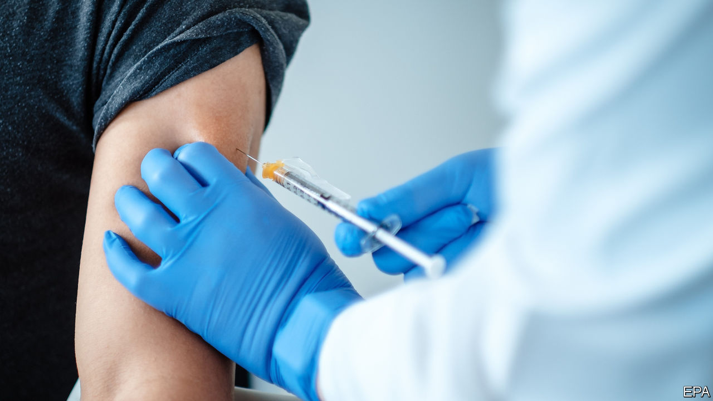

###### 

# Business this week 

#####  

 

> Nov 12th 2020 

Pfizer and BioNTech, two pharmaceutical firms, announced that their vaccine against covid-19 is more than 90% effective, according to early results from trials. The high success rate raised hopes of a quicker return to normality than previously expected. Other pharmaceutical firms are also working on vaccines and are expected to make announcements in the coming weeks. Current projections suggest 50m doses of the Pfizer-BioNTech vaccine will be available in 2020, rising to 1.3bn the following year. On the day of the announcement, Pfizer’s and BioNTech’s share prices surged 8% and 14%, respectively. See .


The news excited stockmarkets. In America the Dow Jones Industrial Average jumped by 2.9% on Monday. The S&amp;P 500 rose sharply when it opened, before ending the day up 1.2%. The STOXX Europe 600 climbed 4%. Oil prices increased to $45 per barrel. By contrast, many technology firms that have been buoyed by the pandemic faced a sell-off, including Zoom, a video-conferencing firm, Ocado, a grocery delivery company, and Peloton, a maker of exercise bikes. See .

Regulators continued to take aim at technology firms on antitrust grounds. The European Union brought charges against Amazon. After an investigation, the European Commission claimed that the tech giant uses data gathered from vendors to give its own products and services an unfair advantage. Amazon said that it disagrees with the commission’s findings.

Meanwhile, India’s competition watchdog has ordered a probe into Google’s app store. It fears that a requirement that consumers buy apps using the firm’s payment service smothers competition. In China regulators have drafted new antitrust rules aimed at technology firms. They will target a range of practices, including treating customers differently based on their spending behaviour and data. The move follows the suspension of the initial public offering of Ant Group, a fintech firm, days before its flotation in Hong Kong and Shanghai. See .

Out with the old 

 


In a surprise shakeup Recep Tayyip Erdogan, Turkey’s president, fired the country’s central-bank governor, only 16 months after sacking his predecessor. One day later the Turkish finance minister, Mr Erdogan’s son-in-law, resigned supposedly because of a feud with the new central-bank governor. After the reshuffle, the banking regulator said it would curb restrictions on foreigners trading the Turkish lira, which were imposed last year. Investors seemed to welcome the changes. The lira rose by more than 7% against the dollar in the past week, reversing a long decline. See .

Following two quarters of contraction, Britain’s GDP grew by 15.5% between July and September. The economy is still 8.2% smaller than it was before the virus struck and is likely to shrink again in the last three months of the year because of a second lockdown. Unemployment over the same period rose to 4.8%, up from 4.5%. Redundancies surged to a record high, as firms were forced to contribute more to the cost of furloughed workers. 

Unemployment figures from America were better than expected. Non-farm employment rose by 638,000 in October. The unemployment rate fell by one percentage point to 6.9% in the same month.

China’s consumer-price index dropped to 0.5% in October, its lowest level in over a decade. That reflects low food prices, particularly of pork, supplies of which were hit by African swine fever but are now recovering thanks to record imports. Sluggish consumer demand is another factor.

SoftBank Group announced profits of $6.1bn in the three months to the end of September. The Japanese firm booked losses of $3.7bn with its foray into investing in publicly listed technology companies in America. But that was offset by an improved performance by its Vision Fund, which is now worth $1.4bn more than the costs of it 83 investments. SoftBank also removed several executives from its board, following investors’ concerns about governance.

McDonald’s reported revenues of $5.4bn in the latest quarter, down 2% from the same period last year but beating analysts’ expectations. It performed well in America where same-store sales grew by 4.6% from the previous quarter. See .

Beyond Meat, an alternative protein provider, reported losses of $19.3m in the third quarter, compared with profits of $4.1m in the same period last year. An easing of covid-induced consumer stockpiling and falling sales to restaurants were blamed.

What goes around

Singaporean holiday-makers itching for escape can now take a “cruise to nowhere”. Passengers undergo covid-19 tests before boarding and are required to carry contact-tracing devices. The ship idles in the waters off the city state for two days before returning to port.

