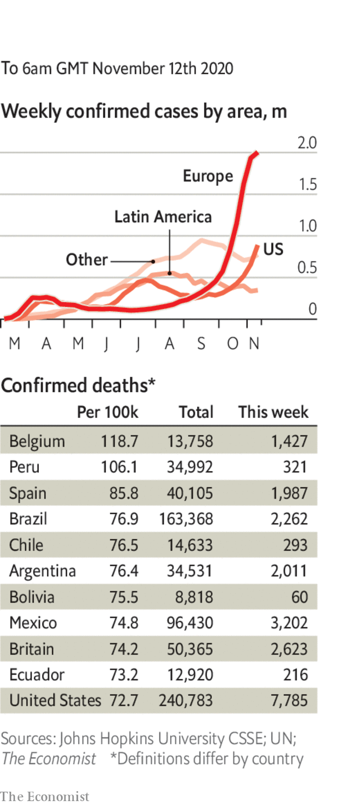

###### 

# Politics this week 

#####  

 

> Nov 12th 2020 

Donald Trump refused to concede defeat in America’s election, despite Joe Biden’s passing the required 270 electoral-college votes. The president is pursuing several legal challenges to states’ results. None is expected to succeed. Mr Biden’s transition team is considering suing to obtain federal funds and information usually granted to incoming administrations. See .

World leaders queued up to congratulate Mr Biden. Among the strongmen who have so far demurred are Vladimir Putin of Russia, Xi Jinping of China and Jair Bolsonaro of Brazil. Mr Bolsonaro railed against Mr Biden’s proposals to punish Brazil for not protecting the Amazon rainforest, saying, “Diplomacy alone won’t work. Once the saliva runs out, you have to have gunpowder.”


Joe Biden announced a covid-19 advisory board to deal with the pandemic. He said his response would be led “by science and by experts”. See .

Donald Trump tweeted that he had “terminated” his defence secretary, Mark Esper. In June Mr Esper publicly disagreed with the president about the use of troops to quash protests. See .

Peru’s Congress removed from office the president, Martín Vizcarra. He has been accused of taking bribes when he was a governor, which he denies. The legislature’s speaker, Manuel Merino, succeeded Mr Vizcarra as president. See .

Luis Arce was sworn in as Bolivia’s president. He was the candidate of the Movement to Socialism, founded by Evo Morales, who was forced into exile last year after protests against his re-election. After Mr Arce took office Mr Morales returned overland to Bolivia from Argentina. See .

Eta, this year’s strongest hurricane, killed at least 130 people in Central America. Perhaps 300,000 lost their homes. Eta broke a record set in 2005 for the number of named storms in a season. See .

Britain’s House of Lords voted to amend a bill that would allow the government to rewrite parts of its European Union withdrawal treaty, including provisions about Northern Ireland. The government says it will override the changes. Joe Biden warned Boris Johnson, Britain’s prime minister, not to imperil peace in Ireland. See .

After weeks of fighting over Nagorno-Karabakh, Armenia and Azerbaijan agreed to a peace deal. Armenia surrendered the districts surrounding the enclave, though a corridor linking Armenia and Nagorno-Karabakh will be placed under Russian control. Protesters demanded the resignation of Armenia’s prime minister, Nikol Pashinyan. See .

The European Parliament reached an agreement with EU member states over the creation of a €1.8trn ($2.1trn) spending package for the next seven years, including a €750bn recovery fund which will be raised on the capital markets by the EU itself, not by individual countries. See .

Bihar, one of the poorest parts of India, voted for an alliance led by the party of Narendra Modi, the prime minister, in state elections. It was the first big state poll since covid-19 swept the country and induced a deep recession. Voters in Bihar, at least, do not seem to blame Mr Modi. See .

The National League for Democracy, led by Aung San Suu Kyi, retained power in Myanmar’s election. Despite failing to end the country’s simmering civil wars, Ms Suu Kyi remains popular, especially among the ethnic-Bamar majority. See . 

China authorised Hong Kong’s government to disbar legislators deemed to oppose Chinese rule in the territory or to threaten national security. The local government promptly dismissed four pro-democracy lawmakers. Fifteen others said they would resign. See .

America removed the East Turkestan Islamic Movement from its list of terrorist organisations. It said there was no credible evidence that the group, allegedly founded by Uyghur separatists, still existed. China reacted angrily, saying the organisation was a threat not only to China but to the world.

Several people were injured by a bomb at an Armistice Day ceremony in Jeddah, in Saudi Arabia. The event was attended by representatives of foreign consulates, including that of France. Emmanuel Macron, France’s president, has angered some Muslims by defending the right to publish caricatures of religious figures, including the Prophet Muhammad.

Saeb Erekat, a veteran Palestinian diplomat who was involved in three decades of negotiations with Israel, died after contracting covid-19. He was 65. See .

Prince Khalifa bin Salman al-Khalifa, the hardline prime minister of Bahrain, also died. He had held the post since independence in 1971. Prince Khalifa was 84.

Hundreds of people were killed in fighting between Ethiopian government troops and forces loyal to the province of Tigray. Abiy Ahmed, the prime minister, ordered the army into Tigray after its leaders held regional elections in defiance of the federal government. See .

Police in Mozambique said jihadists had beheaded more than 50 people in Cabo Delgado, a province in the north.

Coronavirus briefs

 


The European Commission agreed to buy up to 300m doses of the vaccine developed by Pfizer and BioNTech.

Russia’s claims that its homegrown “Sputnik V” vaccine is 92% effective in preventing infection, a similar success rate to Pfizer’s, were met with scepticism.

The number of people in hospital with covid-19 in America reached 65,000, a new record. Europe’s death toll from the virus passed 300,000.

Lebanon announced a new lockdown that will last until the end of November. Authorities in Tehran ordered restaurants and shops to close early amid rising cases.

Denmark’s government admitted it could not force mink farmers to cull livestock but recommended they do so, after new strains of covid-19 jumped from the animals to people. See .

