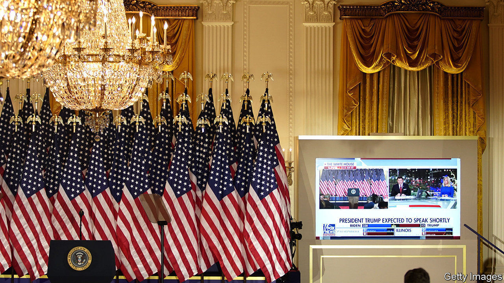
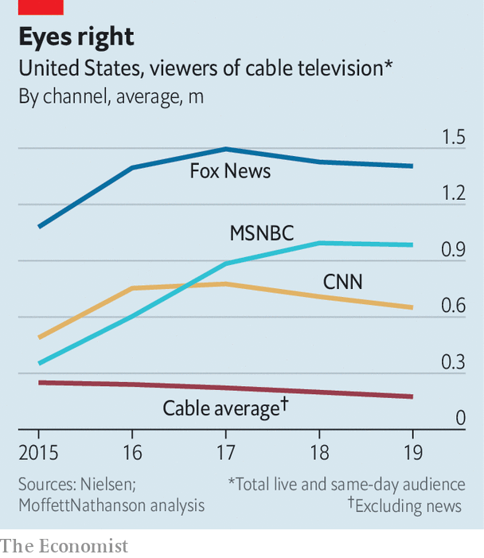

###### Fallen star

# As the Trump show is cancelled, what next for Fox News? 

##### The conservative cable network prepares for a spell in opposition 

 

> Nov 14th 2020 

WITH FLORIDA in the bag, at 11.20pm on election night the party at the White House was in full swing. Then Fox News, playing on large television screens around the building, punctured the mood, calling Arizona for the Democrats—the first time a network had projected a Republican state to flip. Despite a complaint from the White House to Rupert Murdoch, Fox’s boss and one-time friend of the president, the Fox decision desk did not budge.

Fox has been the most reliable mainstream-media ally of Donald Trump’s administration. Its hosts have given the president unchallenged airtime and amplified pro-Trump conspiracy theories from the internet. The relationship has been mutually beneficial: since 2015 the network’s ratings have risen by one-third (see chart), and in the latest financial year Fox News and Business generated 80% of Fox Corp’s gross operating profit. Now, with the credits ready to roll on the Trump show, the network must figure out how to deal with the exit—and wrath—of its star.


Fox has influence like no other news outlet. About 60% of Republicans watch it weekly, double the share of any other network. When the Pew Research Centre asked in September whether mail-in ballot fraud was a “major problem”, 61% of Republicans who got their TV news from Fox agreed, compared with 23% of Republicans who got their news elsewhere. Mr Trump, a Fox addict, hired its producers into the White House and sent staff in the other direction.

 


But the lost election has broken the relationship. Prime-time hosts have largely stuck to the White House’s script, Sean Hannity declaring that “it will be impossible to ever know the true, fair, accurate election results.” But Fox’s news anchors have got gutsier. On November 9th Neil Cavuto abruptly cut away from footage in which the White House press secretary was claiming fraud. After the election was called, Fox’s website’s headline read: “Americans take to streets in celebration after Biden projected to win White House”.

Other Murdoch-owned outlets, including the New York Post and Wall Street Journal, have taken a similar line. Mr Murdoch’s friendship with Mr Trump, like most of his alliances, appears pragmatic. In 2015, ahead of the Republican primaries, he tweeted: “When is Donald Trump going to stop embarrassing his friends, let alone the whole country?” When his British newspapers switched their support from the Conservatives to Labour in 1997, he described it as “like two porcupines making love: very slowly and very carefully”.

Fox is already having a prickly time. Outside one Arizona vote-counting centre, Trump fans chanted, “Fox News sucks!”. Despite reporting strong earnings on November 3rd, Fox Corp’s share price dipped. “There appears to be something below the surface that is torpedoing the stock,” wrote Michael Nathanson, a media analyst. “That something might be the potential launch of a new Trump News Network.”

Rival conservative channels that could form the basis of such a venture are gleeful. “Fox News viewers have been writing us and expressing frustration with the fundamental shift…to a more liberal slant,” says Charles Herring, head of One America News, whose website has a story entitled: “Trump Won, Fox News Admitted Its Leftist Agenda”. “We’ve arrived at Waterloo, and the battle is about ready to take place,” declares Chris Ruddy, head of Newsmax. Mr Ruddy says revenues from advertising—for hearing aids, testosterone pills, hats that prevent hair-loss, and so on—have doubled in the past six months.

Yet Fox looks buoyant. Even if Mr Trump became the star of another network, the damage would be to advertising, which makes up only about 30% of Fox News’s revenue. The rest comes from the fees cable companies pay to carry it, and 90% of those deals are locked down for at least two years.

The Trump presidency has been a gift to all news media. “It may not be good for America, but it’s damn good for CBS,” Leslie Moonves, its then-boss, remarked in 2016. But if anything it has been better for the liberal rebels. MSNBC has seen its ratings almost treble since 2015. The New York Times, leader of the resistance in print, has seen subscriptions soar. Fox’s ratings under Mr Trump have been sky high, but its share of the total was greater in the Obama years. The outrage business works better when you’re not in power. ■

Dig deeper:For the latest on the election, see our , read the  and then sign up for Checks and Balance, our  and  on American politics.

