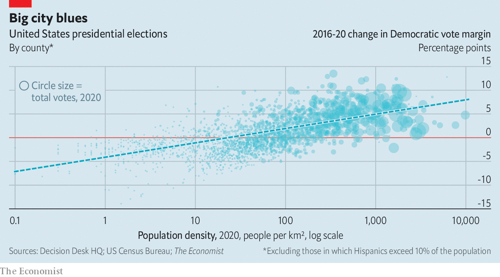

###### The city and the hills

# Our analysis of the election results suggests that 2020 accelerated a long-running trend 

##### American politics is even more split along urban-rural lines than it was four years ago 

 

> Nov 14th 2020 

FOR A MOMENT, it looked as if voters were starting to find some common ground. In the weeks leading up to the elections on November 3rd, polls showed that many of the fault lines dividing Democrats and Republicans—including age, race and education—were beginning to narrow. Even the gap between city dwellers and rural folk seemed to be shrinking. According to a poll conducted by YouGov between October 31st and November 2nd, voters in rural areas favoured President Donald Trump over Joe Biden, his Democratic opponent, by a margin of ten percentage points. Four years ago, this gap was 20 points.

But an analysis of the election results by The Economist suggests that the partisan divide between America’s cities and open spaces is greater than ever. Preliminary results supplied by Decision Desk HQ, a data-provider, show that voters in the least urbanised counties voted for Mr Trump by a margin of 33 points, up from 32 points in 2016. (Specifically these are the bottom 20% of counties by population density. Counties which are more than 10% Hispanics, which shifted right for reasons unrelated to density, have been excluded.) Meanwhile, voters in the most urbanised counties—the top 20%—plumped for Mr Biden by 29 points, up from Hillary Clinton’s 25-point margin in 2016. More broadly, the greater the population density, the bigger the swing to the Democratic candidate (see chart). Even after controlling for other relevant demographic factors, such as the proportion of whites without college degrees or Hispanics in each county, the data suggest that urban and rural voters are more divided today than they were in 2016.


Preliminary results also show that Mr Biden gained most ground in counties that swung hardest toward Democrats between Barack Obama’s re-election in 2012 and Hillary Clinton’s failed bid for the White House in 2016. One possible explanation for this trend is the tendency for Democrats and Republicans to live among their own kind. Americans are still sorting themselves into politically like-minded communities, a movement noted by Bill Bishop in “The Big Sort” published in 2008. For liberals, this means diverse, densely populated cities; for conservatives it is places that are mostly white, working-class and where the neighbours are a .22 round away.

 


Such sorting has two major consequences. Jonathan Rodden, a professor at Stanford University and author of “Why Cities Lose”, a book about geographic polarisation, says that the partitioning of America by density has led to an underrepresentation of Democratic votes. Because the seats in the House of Representatives and the Senate are awarded on a winner-take-all basis, rather than in proportion to the popular vote, they can end up skewing the allocation of legislative seats away from the party whose voters are crammed into just a few states or congressional districts. As Democrats cluster in cities, the system reduces their political clout. It can be thought of as a natural gerrymander.

Geographic polarisation also hurts Democrats’ chances in the electoral college, America’s system of choosing its president. In this year’s election, for example, Mr Biden will win the national popular vote by about five percentage points. But his margin in the “tipping-point” state that ultimately gave him enough votes to win the election, Wisconsin, will be less than one point. That four-point advantage for the Republicans is the biggest in at least four decades. So long as Democrats continue to be the party of the cities, and Republicans the party of small-town and rural America, those biases will persist.■

Dig deeper:For the latest on the election, see our , read the  and then sign up for Checks and Balance, our  and  on American politics.

