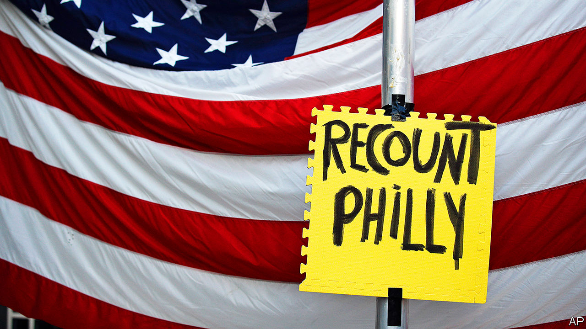

###### Nothing to see here

# The Republican Party and Donald Trump’s alternative election fantasy 

##### Four fifths of Trump voters think Joe Biden’s win was illegitimate 

 

> Nov 14th 2020 

AMONG REPUBLICANS’ favourite grievances over the past four years is a claim that Democrats never accepted the results of the 2016 election. In fact, nine hours after the Associated Press called the election for Donald Trump, Hillary Clinton took to a much smaller stage than she had hoped to command to say that she had “congratulated Donald Trump, and offered to work with him on behalf of our country.” Soon afterward, then-President Barack Obama said he would “make sure that this is a successful transition...we are now all rooting for [Mr Trump’s] success in uniting and leading the country.” Democrats may not have liked the result, but they did nothing to prevent Mr Trump from taking office.

Things have gone differently this time. The Associated Press called the election for Joe Biden on November 7th. Mr Trump has spent the time since insisting that he won and tweeting evidence-free conspiracy theories. His campaign has filed lawsuits in five states that Mr Biden won, and his administration has refused to co-operate with Mr Biden’s transition team. And although four Republican senators have congratulated Mr Biden and his running-mate, Kamala Harris, most elected Republicans have remained quiet or supported Mr Trump’s effort to challenge the result, an effort which looks doomed to failure.


Typically, the head of the General Services Administration (GSA), the federal government’s non-partisan procurement agency, issues an “ascertainment” letter, which gives the incoming president’s transition team access to federal funds and space, within 24 hours of an election being called. Emily Murphy, whom Mr Trump appointed GSA head in 2017, has yet to do so. White House officials note precedent from 2000, in which a disputed election delayed the start of a transition until December.

Then the election hinged on just 537 votes in a single state, Florida. Of the five states where the Trump campaign has filed post-election lawsuits—Nevada, Arizona, Michigan, Georgia and Pennsylvania—Mr Biden’s smallest margin of victory is over 11,000 votes (in Arizona). His lead in Michigan is nearly 150,000 votes. His campaign has produced no evidence of fraud or irregularities large enough to shift tens of thousands of votes in multiple states.

A few prominent Republicans, notably senators Mitt Romney, Susan Collins, Lisa Murkowski and Ben Sasse, have acknowledged Mr Biden’s victory. Other senators have implicitly done so. Roy Blunt noted that Mr Trump’s legal challenges will probably fail. Marco Rubio has urged the GSA to begin its transition process.

Most have fallen back on, in the words of Mitch McConnell, the Senate majority leader, defending Mr Trump’s “rights to look into allegations...and weigh his legal options”. Some Republican Senate staffers explain this reticence by saying that allowing the courts to rule in these cases will build trust in the result. Larry Hogan, Maryland’s anti-Trump Republican governor, calls his party’s response “a train wreck,” but says that behind the scenes, a growing number of Republicans have “had some pretty frank conversations with him, and he doesn’t seem to be listening.”

So far, Mr Trump’s lawsuits have fared poorly. But as long as he keeps fighting, most Republicans see more political risk in accepting Mr Biden’s victory—and thus inviting the wrath of Mr Trump—than in humouring him. Another goal of his lawsuits may be to raise just enough doubt about the outcome in key states to pressure Republican-held state legislatures to put forth their own sets of electors, substituting their will for the voters’.

And continuing to fight keeps the pressure on other Republicans. Brad Raffensperger, Georgia’s secretary of state, has acceded to the Trump campaign’s demand for a hand recount, to be conducted by all of Georgia’s 159 counties at taxpayer expense. Recounts rarely change more than a few hundred votes, but Georgia’s will be difficult to complete before the state’s certification deadline of November 20th—particularly for the state’s larger and more Biden-friendly counties. That, in turn, raises the risk of the state legislature appointing a Trump-friendly slate of electors.

Mr Trump’s administration has also backed him. Asked about transition plans at a briefing on November 10th, Mike Pompeo, the secretary of state, made what seemed to be a joke about “a smooth transition to a second Trump administration”. One day earlier Mr Barr, who previously compared line prosecutors to preschoolers, authorised them to investigate allegations of electoral irregularities.

Mr Trump is fundraising on the back of his refusal to concede. His campaign sends out several texts each day, warning that “the Left will try to STEAL this election”, and urging recipients to “step up &amp; FIGHT BACK” by sending cash—most of which will go to a Trump’s political action committee.

Going along with it makes some sense for elected Republicans, at least in the short term. Most of their voters like Mr Trump more than they like their congressman or senator. In the medium term, though, if the party wants to get back into the business of winning over a majority of Americans it needs to move past him. This will become harder if Republican elites send their voters a signal that he is the rightful president, rather than Joe Biden.

Republican timidity risks long-term damage. Mr Pompeo’s hilarious gags may hamper American diplomats’ work on transitions of power in younger democracies abroad. At home, Mr Trump’s doubt-sowing about the election has damaged Americans’ faith in their own institutions. The most recent Economist/YouGov poll shows that 86% of Mr Trump’s voters believe Mr Biden’s victory to be illegitimate. Mr Trump will leave office on January 20th, but the distrust he has sowed will not.■

Dig deeper:For the latest on the election, see our , read the  and then sign up for Checks and Balance, our  and  on American politics.

