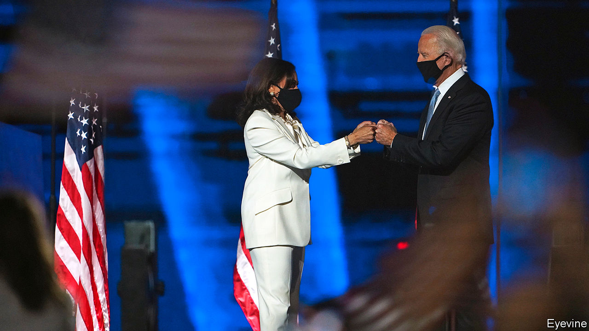

###### Transmission and the transition

# What the Biden administration would do differently on covid-19 

##### And how much difference it would make 

 

> Nov 11th 2020 

PARTISANSHIP HAS long coloured American perceptions of covid-19. Even so, the contrast between the top echelons of the main parties was striking on November 9th, the day the country passed 10m recorded cases of the disease. On that day the White House of outgoing President Donald Trump was dealing with reports that it may have hosted a second superspreading event in the span of a month—this one for an election-night party that may have sickened Ben Carson, the housing secretary, among others. The same day, President-elect Joe Biden announced the members of the coronavirus advisory board for his transition, staffed by the sort of public-health experts the president likes to mock.

While national attention was otherwise diverted, an extraordinary third surge in covid-19 infections began in the weeks before the presidential election. There are now 1,000 new deaths reported each day along with 120,000 new infections. Even though testing has been ramped up to nearly 1.5m per day, the test-positivity rate is approaching 10%—suggesting that even now, many infections are being missed. In all but a handful of states, there seems to be uncontrolled transmission, limiting the efficacy of contact-tracing. Hospitalisations had been declining up until the end of September, when they bottomed out under 30,000. Now they have doubled to over 60,000—higher than the previous peak in April. In North Dakota, the location of the worst outbreak in the country, nearly every intensive-care bed is occupied.


The argument that Mr Trump has handled the epidemic uniquely terribly may just have cost him the election. However, this most recent surge is not an America First phenomenon. It has roughly coincided with a second wave in Europe which, measured both by deaths and by cases per person, is even more severe. European countries have reimposed harsh lockdown measures, whereas the president and America’s governors have been less draconian. France’s intensive-care wards look almost as strained as those of North Dakota. But whereas President Emmanuel Macron has declared a second national lockdown, Governor Doug Burgum, a Republican, recently declined to impose even a mask mandate in his state.

Forecasting the course of the disease has proved supremely difficult. It is therefore unclear how bad a situation a newly inaugurated President Biden would inherit on January 20th 2021. But current signs do not augur well. Ashish Jha, dean of the Brown University School of Public Health, reckons that there may be 100,000 new deaths between now and then. The Economist’s best estimate of total deaths in America, including those we think are missed by official reporting, is nearly 300,000. After nine long months of living with the virus, Americans and their elected officials seem tired of restrictions on movement and businesses. With no new curbs, exponential growth could continue for weeks. Cold weather may push more people to move their gatherings indoors, where transmission is much more likely. Many Americans will travel for Thanksgiving and Christmas; no politicians will want to take the blame for cancelling the holidays.

Federal action on the economy does not seem imminent either. Democrats and Republicans in Congress have been deadlocked over a new economic stimulus since many supports expired in July. The stalemate has not yet been broken. Nancy Pelosi, the Democratic leader in the House of Representatives, may wish to hold out for the larger package her party could achieve if Democrats win two run-off Senate elections in Georgia, thus flipping control of the chamber. Mitch McConnell, the Republican leader in the Senate, may not want to concede a pre-emptive victory to the Biden administration.

A virus spreading fast with no compensating stimulus would be a brutal starting position for a Biden administration. Even with expedited approval and distribution, getting a vaccine to every American who needs it would take months (see Briefing). Mr Biden has announced plans to take more serious federal action. He has named Ron Klain, who co-ordinated Obama White House’s response to an Ebola outbreak in 2014, as chief-of-staff. Mr Biden would use his executive authority to create a Rooseveltian Pandemic Testing Board to compel companies to produce more tests, laboratory materials and personal protective equipment. He probably lacks the authority to impose a mask mandate nationwide, but would push states to do so.

Most Republican governors are already wary about implementing public-health measures. They might see the chance to defy Mr Biden’s recommendations as an additional incentive to stay that course. Democratic ones seem averse to a European-style response too. The ban announced by Phil Murphy, the Democratic governor of New Jersey, on indoor dining in restaurants between 10pm and 5am, typifies the urge to do something, but not too much.

In her vice-presidential debate with Mike Pence, Kamala Harris expressed some distrust in the imminent vaccine Mr Trump had been hyping ahead of the election. “If the doctors tell us we should take it, I’ll be the first in line to take it. Absolutely. But if Donald Trump tells us to take it, I’m not taking it,” she said. Republican voters offered a new vaccine by President Biden might be similarly sceptical. Already, 33% of Republicans tell pollsters that they would not take a coronavirus vaccine when it becomes available, compared with 18% of Democrats and 31% of independents.

While campaigning, Mr Trump liked to talk about covid-19 as though it were almost over. “It is disappearing” he said on October 10th, shortly after contracting it himself. “We are rounding the corner,” he argued on October 22nd. The assessment of Mr Biden’s transition team is more in tune with reality, which is a good start. “Our country is facing an unprecedented time with covid-19 cases accelerating nationwide,” says Marcella Nunez-Smith, a Yale epidemiologist who is co-chairing Mr Biden’s advisory board. Anyone who hopes the virus will go away once America installs a president who follows scientific advice is likely to be disappointed.■

Editor’s note: Some of our covid-19 coverage is free for readers of The Economist Today, our daily . For more stories and our pandemic tracker, see our . For analysis of the presidential transition, explore our 

