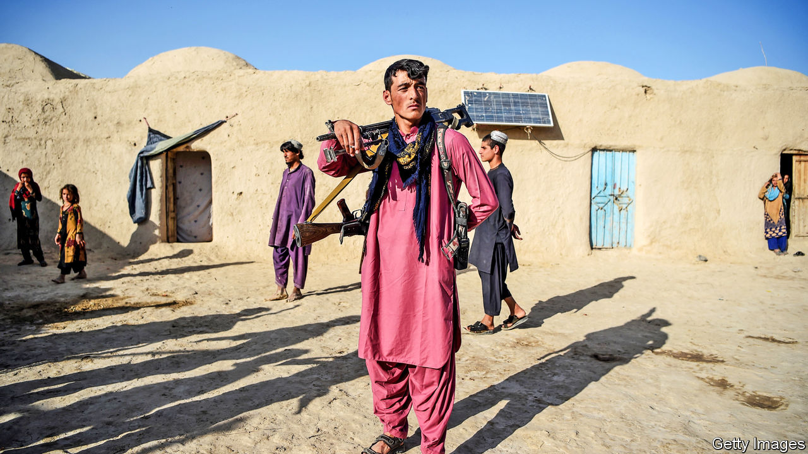

###### Guns and poses

# As America pulls out of Afghanistan the Taliban fight on 

##### Negotiations are not making much headway, but the insurgency is 

 

> Nov 18th 2020 

TO REACH THE front line in Afghanistan’s civil war, you do not need to go far from the capital, Kabul. At a police outpost in Wardak province, about 20km outside the city on the main highway leading south, the Taliban’s encroachment is evident. The outpost is little more than a ring of concrete blast walls perched on a hill overlooking the road. Around a dozen men, mostly dressed not in fatigues but in shalwar kameez and trainers, stand around. Some hold guns; most do not. A few look like teenagers. The 25-year-old in charge, Omedullah Khanjar, who commands six outposts along the highway, explains that, by day, things are mostly quiet. But at night, he says, the local Taliban shoot at the post from a nearby ridge. Unlike the cops, they have night-vision goggles and laser sights.

Not everything goes the insurgents’ way, says Mr Khanjar. Recently they tried to blow up another outpost along the road, but the police got wind of the plan in advance. They retreated and then ambushed the fighters. On his phone, Mr Khanjar shows your correspondent a picture of the unexploded bomb and the phone the Taliban would have used to detonate it. But such victories are rare. The local Taliban live in the villages nearby, which they run as fiefs, unmolested by the troops. Mr Khanjar complains that the locals protect them, but he understands why. “There is so much unemployment,” he says. “The government here provides no opportunities.”


In September negotiations started in Doha, the capital of Qatar, between the Taliban’s political leadership, envoys from the Afghan government and leaders of civil society. The talks have been years in the making. They followed the conclusion in February of an agreement between the United States and the Taliban, under which America was to withdraw its forces from Afghanistan provided the Taliban cut all ties with international terrorists and started a sincere dialogue with the government on a ceasefire and a political settlement. The Afghan government did its part by releasing 5,000 Taliban prisoners.

The sight of bearded, turbaned insurgents at a negotiating table sparked hope that 40 years of conflict might be coming to an end. But progress has been slow. The two sides are still arguing over the agenda and format of the talks. Big questions, such as what form of government Afghanistan should have, have not yet been broached.

Meanwhile, the number of American soldiers has fallen by more than half over the past year, from over 9,000 to around 4,500 now. Although the agreement foresaw a complete withdrawal only by June of next year, and only if the Taliban kept its side of the bargain, President Donald Trump is in a hurry. In October he said he wanted all American troops “home by Christmas”. This week the Pentagon announced plans to cut the American force to 2,500 by the end of Mr Trump’s term, in mid-January, over the objections of NATO. Air strikes, which in 2019 reached the highest level in the two decades of the American intervention, have since been limited.

 


Yet instead of stepping back to foster dialogue, the Taliban have seized the opportunity to strengthen their position militarily. On October 27th the United Nations announced that civilian casualties have not fallen since the start of talks. In some parts of the country violence has escalated. In recent weeks the Taliban have launched attacks to try to take control of districts such as Panjwai, near the city of Kandahar (see map). On October 12th insurgents attacked Lashkar Gah, the capital of Helmand province, the first big assault on a city in over a year. The Afghan army retreated en masse, and the Taliban were eventually beaten back only by American air strikes—the first in months. Several hundred Afghan soldiers have died just in the past month (and probably a similar number of Taliban). The Taliban have also been assassinating more government officials.

Death and taxes

The sense of siege comes from more than the violence. The Taliban first took power in the 1990s, when Kandahari merchants paid them to provide security on the roads, for which they charged less than the warlords of the day. They seem to be applying that method again. At the edge of Kabul, the boss of a company that imports cooking gas says the security of his tankers has actually improved over the past year, because the Taliban control more roads. They charge 35,000 afghanis ($455) for every lorry travelling from Herat, on the Iranian border, to Kabul. “In the past there were no Taliban taxes,” he says. “But they used to shoot us with RPGs [rocket-propelled grenades]. So we are happy with the taxes.”

In Taliban territory there is a shadow government. Per Muhammad, a 38-year-old farmer who lives in Zabul province, in the south-east, says that the 134 families in his village each pay a flat tax of 2,500 Pakistani rupees ($15) to the Taliban annually, as well as zakat, which is proportional to wealth. In exchange, they get access to the Taliban’s brutal but efficient justice. Local Taliban leaders solve most disputes. Bigger ones—over land, say—go to the district chief. He does not have an office, says Mr Muhammad, but can be reached easily by phone. “He is always with five mullahs and some armed Taliban.” They hear both sides’ claims and make a decision immediately. “Nobody can reject a ruling,” he says, because it is enforced by armed men.

In Taliban-held territory, government-funded schools and clinics often continue to operate, says Ashley Jackson, a researcher at the Overseas Development Institute, a British think-tank, especially if local residents are keen on it. In some areas the Taliban insist that teachers, who are paid by the government, actually turn up to work. Some NGOs operate in Taliban territory quite happily, working with “NGO co-ordinators” appointed by the local commander. “It is the government we are afraid of,” says one employee of an aid agency. “With the Taliban, we can co-ordinate.”

This ambiguous arrangement means that boys, at least, can still get an education and the sick can receive health care in areas occupied by the Taliban. But it also helps to legitimise the insurgents, who take credit for providing services paid for by foreign donors. On October 14th Britain’s Foreign Office had to remind NGOs not to pay taxes to the Taliban.

What might happen next? Afghan government officials say that the Taliban think they have defeated America and see the talks in Doha as the negotiation of the government’s surrender. Yet outright military victory is unlikely. The Afghan army is demoralised but not yet defeated. It has a new air force of its own. Trying to conquer big cities would be risky for the Taliban. Indeed, it could well bring America back into the war. The attack on Lashkar Gah, many in Kabul suspect, was not approved by the Taliban’s political leadership in Doha.

The longer talks go on, however, the weaker the Afghan government gets. Attrition—from deaths, injuries and desertion—is sapping the army. In August Ashraf Ghani, the president, revealed that in the preceding six months over 12,000 soldiers, police and civilians had been killed by the Taliban. American estimates published last month showed that Afghan casualties increased by 5% in the third quarter of the year compared with a year earlier. The siege is accentuating political divisions within the Afghan state, says Timor Sharan, who served as a deputy minister until last year.

That heightens the likelihood that the talks in Doha will produce a deal that favours the Taliban, especially given Mr Trump’s precipitous withdrawal. With their shadow government and growing assertiveness, the Taliban act as, and would like to be seen as, a government in waiting. In Doha they style themselves the “Islamic Emirate of Afghanistan”, as they did when in power in the 1990s.

In urban Afghanistan, their return would be fiercely unpopular. Najia Sadat, a doctor who works at a government clinic in Herat, a thriving city near the Iranian border, says she is deeply concerned that the Taliban might return. She remembers their rule: “We were not allowed to go out of the home.” Their fall made her training and career possible. The clinic where she works is supported by foreign donors, including USAID and International Rescue, a charity. If the Taliban came back, all that could disappear. It seems increasingly likely. ■

