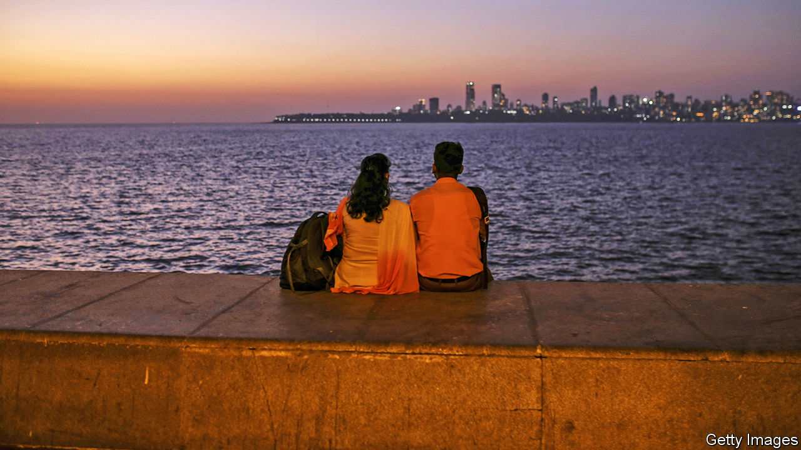

###### Can you foil the love tonight?

# India’s ruling party invents a Muslim plot against Hindu women 

##### The Bharatiya Janata Party is determined to stop a non-existent “love jihad” 

 

> Nov 19th 2020 

THE ORGANISER, an English-language weekly that is a mouthpiece for the Rashtriya Swayamsevak Sangh, the century-old flagship of India’s swelling armada of Hindu nationalist groups, is in no doubt about the dangers of “love jihad”. The luring of good Hindu girls into marriage and conversion is only the first phase of a broader Muslim plot, asserts a recent article. The second stage is rape jihad, “a more unequivocal operation in which non-Muslim girls or women are raped and subsequently killed in many cases”. The third and final stage? Mass rape and ethnic cleansing.

Such ravings are not confined to the fringes of politics. Yogi Adityanath, a Hindu priest whose day job is running Uttar Pradesh, India’s most populous state, proclaimed in October that those who practise “love jihad” should mend their ways or plan their funerals. So far five Indian states, all ruled by the Bharatiya Janata Party (BJP), have enacted or are considering laws against love jihad. On November 17th, for instance, the government of Madhya Pradesh announced a “Freedom of Religion” bill. This would punish any form of matrimonial trickery for the purpose of conversion to Islam with five years in prison.


The spectre of “our” innocent womanhood being preyed upon by “their” boys is not new. Hindu nationalists depict the long period of Muslim rule as a prolonged violation of “Mother India”. During national elections in 2014, the head of the BJP in Uttar Pradesh repeatedly asserted, entirely falsely, that Muslims, who make up 19% of the state’s 225m people, were responsible for 99% of rapes. The Election Commission chastised another BJP leader, Amit Shah, for describing the vote as a chance for Hindus to avenge violations of their women. He is now India’s home minister.

Replying to a parliamentary question in February, one of Mr Shah’s deputies admitted that there were no known cases of “love jihad” in the state of Kerala, at least. Journalists with NDTV, a news channel, found that even in Uttar Pradesh, a police team created in August to crack down on “love jihad” had already dropped seven of the 14 cases it had opened, for lack of evidence. Yet Tanishq, a fancy jewellery brand owned by the Tata group, one of India’s biggest firms, recently felt obliged to withdraw a television commercial portraying a happy interfaith marriage.

Indians rarely marry outside their caste, let alone their religion. The law that allows interfaith marriages is hedged with clauses that permit parents, bureaucrats and other outsiders to interfere. Courts have often seemed keener to uphold patriarchal ideas than to apply secular laws or give women freedom to choose. For India’s 200m Muslims, it is another affront. As one lamented on Twitter: “You can’t criticise, you’re anti-national…You can’t protest, you’re terrorists. You can’t fall in love, it’s ‘Jihad’.”

