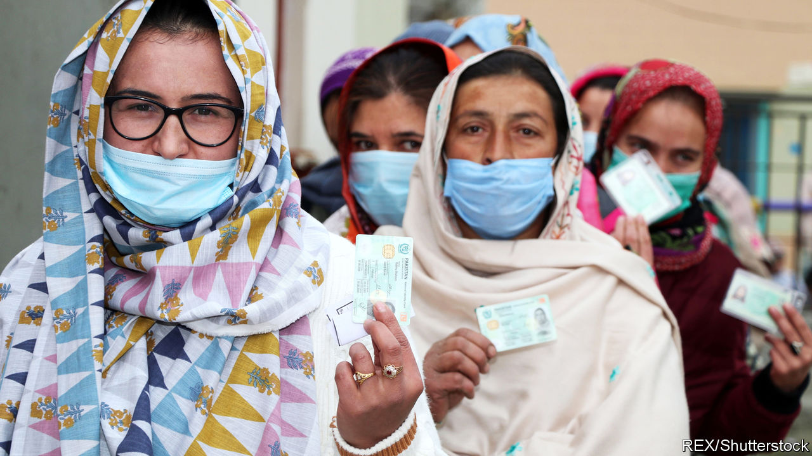

###### A mountain to climb

# Pakistan’s opposition takes on both the government and the army 

##### But a new alliance does not seem to be landing many punches 

 

> Nov 21st 2020 

ELECTIONS AMID the craggy splendour of Gilgit-Baltistan are usually of interest only to its residents—if them. The region at the northern tip of Pakistan is home to five of the 14 mountains in the world that exceed 8,000 metres, but contains only 1% of Pakistan’s population. The pragmatic locals tend to vote for the party that runs the national government. Moreover, the local assembly has limited powers, since the region is not a province, but merely a territory, being part of Kashmir, which India and Pakistan both claim and which they divided by war in 1947.

It was odd, therefore, to see Pakistan’s political elite campaigning furiously in Gilgit-Baltistan ahead of elections to the assembly on November 15th. A new opposition alliance was hoping that the vote would prove its mettle. The prime minister, Imran Khan, was eager to show that his Pakistan Tehreek-e-Insaf party (PTI) retained public support.


To curry favour with the locals, Mr Khan announced at a campaign rally in the town of Gilgit on November 1st that his government would confer provincial status on the region. Maryam Nawaz, daughter of Mr Khan’s predecessor, Nawaz Sharif, spent a week in the region trying to drum up support for his party, the Pakistan Muslim League (Nawaz) (PML-N). While there, she met her fellow dynast and leader of the Pakistan Peoples Party (PPP), Bilawal Bhutto-Zardari. So fierce was the scrum of national grandees, in fact, that a local court ordered many of them out of the region, saying they were breaking a rule against electioneering by senior officials.

The PML-N and the PPP are the mainstays of the new opposition alliance, the Pakistan Democratic Movement (PDM). Its goals include curbing the army’s meddling in politics and sending Mr Khan packing. The two ambitions are related in the eyes of the PDM, since it accuses the army of helping to rig national elections in Mr Khan’s favour in 2018.

Mr Sharif, who is in exile in London, has been giving incendiary speeches, accusing the army of operating as a “state above the state”. Although this is true, Pakistani politicians tend not to say it, for fear that the army will arrange their downfall. Within Pakistan the PDM has held a series of rallies to demonstrate its support.

Widespread public anger at the rising cost of such staples as flour, sugar and tomatoes has given the PDM ammunition. At a rally in Gujranwala in the province of Punjab last month, it was this that seemed to exercise participants most, rather than the army’s assertiveness. “We are here to send Imran Khan home!” shouted one of them, Muhammad Rafique, above the din of the protest. “It’s the price rises. Everyone is fed up.”

The vigour of these events appears to have rattled Mr Khan and the army. After a gathering in Karachi, Ms Nawaz’s husband was arrested at the insistence of military officials. The local police chief was allegedly kidnapped by soldiers to force him to sign the warrant. The brazen nature of the army’s intervention caused a public outcry. The army blamed “overzealous” officers.

But the PDM’s leading lights make unlikely champions of democracy. Both the PML-N and the PPP have happily cosied up to the top brass to secure power in the past. Moreover, the army is unlikely to wilt in the face of a few rallies. “Ultimately if there is a change, the momentum is not going to come so much from opposition pressure, as from a reassessment of the situation from within the military-security establishment,” predicts Farzana Shaikh of Chatham House, a British think-tank.

As results rolled in from Gilgit-Baltistan’s valleys, the PTI appeared to have won the most seats. The other parties allege vote-rigging. The PDM has promised more rallies, culminating in a march across the country in January to call for the ousting of Mr Khan. It has yet to say whether there will be any stops in Gilgit-Baltistan. ■

