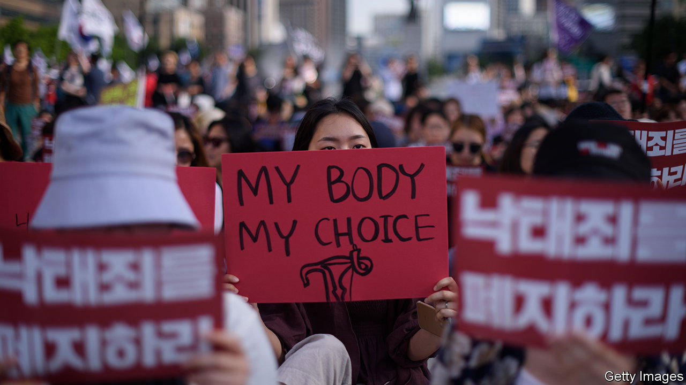

###### Pleasing no one

# South Korea’s government is making it easier to get an abortion 

##### Feminists do not think its proposal goes far enough. Opponents of abortion are also up in arms 

 

> Nov 21st 2020 

THE WORST thing about it was the shame. “I worried about how other people would judge me for doing something illegal, what my parents and my friends would say if they found out,” says Kim Min-kyoung, a 24-year-old student from Seoul who decided to terminate a pregnancy last year. The second-worst thing was paying: how to find $1,000 without prompting awkward questions.

Both these problems should soon be slightly less severe for women in South Korea. If a bill under consideration by the National Assembly becomes law, a woman will be able to obtain an abortion up to 14 weeks into a pregnancy with ease. From 15 to 24 weeks in, she will still be able to do so provided she attends a counselling session and waits 24 hours before making a final decision. Her reason for ending the pregnancy must also fall into one of a series of approved categories. This regime would greatly expand access to abortion and thus put an end to expensive illicit procedures. It has prompted an unsurprising backlash from anti-abortion activists, but feminists are not entirely happy either.


A new law became necessary last year after the constitutional court struck down the existing one, which allows abortion only in exceptional circumstances, such as for pregnancies resulting from rape or incest. Otherwise it stipulates prison terms or hefty fines for women seeking abortions and for doctors providing them. That is out of step with public opinion. Ten years ago more than half of South Koreans wanted to keep the old law. Nowadays nearly 60% of the population and more than three-quarters of women under the age of 45 want to scrap it. The authorities have hardly enforced it for years.

The court set a deadline of the end of this year for new legislation. But the bill is under attack from two sides. Feminists think it does not go far enough in its affirmation of women’s rights. Opponents of abortion, meanwhile, claim it “promotes” the termination of pregnancies.

Kwon In-sook, a prominent feminist and lawmaker for the ruling Minjoo party, thinks the law falls short because it would continue to treat abortion as a criminal matter, retaining too much of the spirit of its predecessor. “The old law was centred around the idea that abortion is a shameful, sinful thing,” she says. “The point of the new law is to put women’s reproductive rights at the centre and treat abortion as the medical procedure that it is.” She worries that the “socio-economic reasons” for which abortions are permitted after 14 weeks are too vaguely defined, and that the counselling requirement, the 24 hours of “thinking time” and doctors’ right to refuse to perform the procedure if they have personal qualms will provide scope for opponents of abortion to restrict access.

That is precisely what they are trying to do. “The point is to balance the woman’s right to choose with the fetus’s right to live and to create an environment where women will feel safe in their choice to have the baby rather than an abortion,” says Jeong Eun-yi, a 27-year-old activist who says she took up the cause after seeing a plastic model of a ten-week-old fetus. She would prefer to retain the old law, but says the bill has some potentially helpful features. “The mandatory counselling session shouldn’t be neutral, but push women to have the baby,” she says, for instance by making women listen to the fetus’s heartbeat or making them watch videos of abortions.

To feminists, the fact that such measures may be possible suggests that the government is pandering to conservatives. “They have to focus more on the right to choose,” says Kim Ye-eun, a 25-year-old student and activist. “Keeping all these ancient provisions is a bad sign that they’re not taking women’s rights seriously.”

Ms Kwon, for her part, is concerned by the conservative backlash the bill has prompted. She worries that it may revive the authorities’ appetite to enforce whatever restrictions remain in law. But she is glad that the debate has at least made women less ashamed to discuss their experience with abortion. ■

