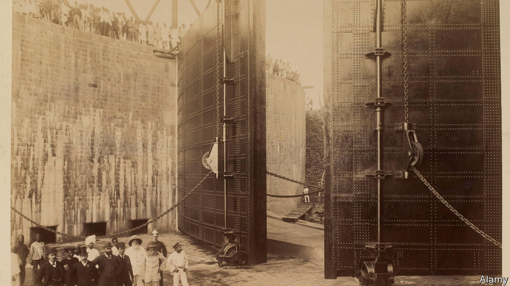

###### Ports in a storm

# A history of globalisation in the steam age 

##### The great port cities were the keys that opened up the world 

 

> Nov 21st 2020 

Unlocking the World. By John Darwin. Allen Lane; 496 pages; £25.

IN LIVERPOOL, A French observer marvelled in 1907, “one feels one is in contact with America, Australia, west Africa, the Far East, at the same time as with Germany and France. There one is at the commercial centre of the world.”


This remark neatly captures the subject of John Darwin’s new book. He tracks a century of what he calls “steam globalisation”, when steamships and railways drove a dramatic acceleration in the exchange of goods, people, ideas and money across the world. Faster and cheaper transport seemed to shrink the globe; the volume of world trade and foreign investment soared. Mr Darwin shows how major port cities were both products of these transformations and agents of change. In the great opening up of the world that is his subject, the port cities were the hinges.

The current era of globalisation, the author notes, is not unique but the latest in a series that have built on each other in a cumulative, though not neatly linear, fashion. In the mercantile system that sprang up in the wake of the voyages of Ibn Battuta, Christopher Columbus and Vasco da Gama, Asia was the world’s workshop and Europe relatively peripheral.

Then coal, readily available in Europe, fuelled what historians have called the “Great Divergence” of the 18th century, whereby Europe (and later North America) came to dominate. By describing the evolution and sometimes decline of a number of major port cities, most compellingly London, Bombay, Singapore and New York, Mr Darwin shows how this process worked.

Singapore, for instance, grew exponentially, and played a central role in the industrialisation of tin and rubber production in its maritime hinterland of Malaysia. New Orleans rose in importance with the Mississippi riverboat steamer, only to decline as railway connections to Baltimore and New York changed the dynamics of American trade once more. Trieste enjoyed a brief heyday as the Austro-Hungarian Empire’s main seaport, before collapsing abruptly into romantic obscurity after 1918.

Mr Darwin takes globalisation to mean primarily “economic connectedness between different parts of the world”. That is a reasonable but limited definition, missing the ascent in the 19th century of ideologies such as nationalism and socialism that purported to explain social relations around the world. Rising sciences such as geology and palaeontology had a similarly broad scope. “Unlocking” the world, meanwhile, is a vivid metaphor, but it implies a smooth, even inevitable process. In reality the world’s doors were not just unlocked, but often kicked down. Mr Darwin knows this, and stresses the influence of geopolitics and imperialism, not just free trade as an abstract concept. But he might have depicted the bootprints more graphically.

Still, his book is an enjoyable synthesis of a large body of scholarship. He closes by remarking that today’s globalisation is not simply a bigger, faster version of what happened in the steam age. As in the early-modern period, Asia is once again the workshop of the world. He wonders if there is another parallel, however. In 1914 the European-dominated global economic system seemed irresistible. Then war intervened. Will a systemic crisis break the current cycle of globalisation, too? ■

