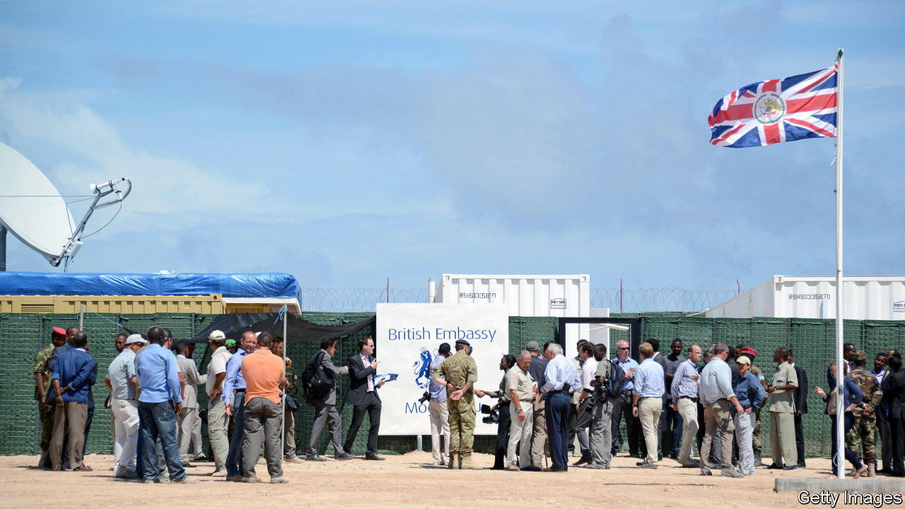

###### A figure no longer sacrosanct

# A contest between populism, diplomacy and aid is looming in Britain 

##### The government is contemplating spending less on poor countries 

 

> Nov 19th 2020 

WHEN BORIS JOHNSON told Parliament in June that he planned to merge Britain’s Department for International Development (DFID) with the Foreign and Commonwealth Office (FCO), he mocked it as a “giant cashpoint in the sky”. Its do-gooders, now under the auspices of the clunkily-named Foreign, Commonwealth and Development Office (FCDO), may soon have rather less cash to dispense. According to whispers whooshing around Whitehall, the government is thinking of breaking its promise to keep spending 0.7% of GDP every year on foreign aid.

Such a move would come as no surprise to watchers of the wrestling match under way at the FCDO between hard-nosed diplomats and bleeding hearts. The 0.7% figure was enshrined in law in 2015 as a sign of the Conservatives’ determination to shed their “nasty party” tag. Last year DFID was responsible for dishing out most of the £15bn earmarked by Britain for the poorest of the world.


On the whole, the cash has been well spent, but it has sometimes been tricky to dish it all out. Even last year’s weak GDP growth meant an extra £600m had to be divvied up. In an era of covid-imposed recession and looming mass unemployment at home, a populist government was likely to start balking at such generosity to foreigners, however deserving.

The figure has become totemic. But dropping it to, say, 0.6% would still leave Britain as one of the world’s biggest donors. As the anti-aid lobby points out, Britain is the sole country in the G7 group of big economies to meet the 0.7% figure, which is promoted by the UN. (Only four other countries are as worthy: Denmark, Luxembourg, Norway and Sweden. France spends 0.4%, Italy and Spain around 0.2%, and America less than 0.2%.) And it was already being whittled away, as the government began to define aid more elastically. The Ministry of Defence, the Department of International Trade and other ministries now often mark down spending abroad as aid.

The bigger concern is the merger, which officially occurred on September 1st. Whether or not spending is cut as a proportion of GDP, the FCDO is likely to slice up the cash less effectively. “It’s not a merger, it’s the demolition of DFID,” laments Andrew Mitchell, once the Conservatives’ most dynamic boss of DFID.

It is not difficult to work out why mandarins generally favour it. In the past two decades the diplomatic service has been hollowed out by drastic budget cuts, sorely weakening its hand in traditional diplomacy. Britain’s representation shrank to only one or two diplomats in nearly half of the countries in sub-Saharan Africa, invariably outnumbered by staff working for DFID. In at least 14 African countries Britain has no embassies at all (Turkey now has half a dozen more than the UK). In some places the head of the DFID office, by virtue of dispensing vast dollops of aid, carried more weight than the ambassador. Under the merger, the resident ambassador will oversee aid as well as diplomacy. And the number of diplomats is being bumped up.

Even before Tony Blair created DFID as a separate ministry when he came to power in 1997, the aid-and-development arm of the FCO was fairly autonomous, with a minister of its own. Now there will be no specific aid minister. DFID’s top civil servant has been shunted off as a “special envoy” for famine prevention. The rejigging of the new department is being overseen mainly by FCO types, not aid specialists. “The idea is to break DFID up into little pieces and scatter it,” says Nicholas Westcott, a former diplomat who runs the Royal African Society. “They want to make it hard to separate it out again.” ■

