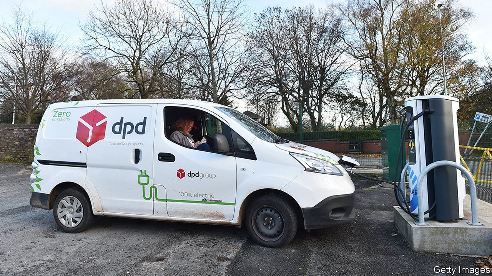
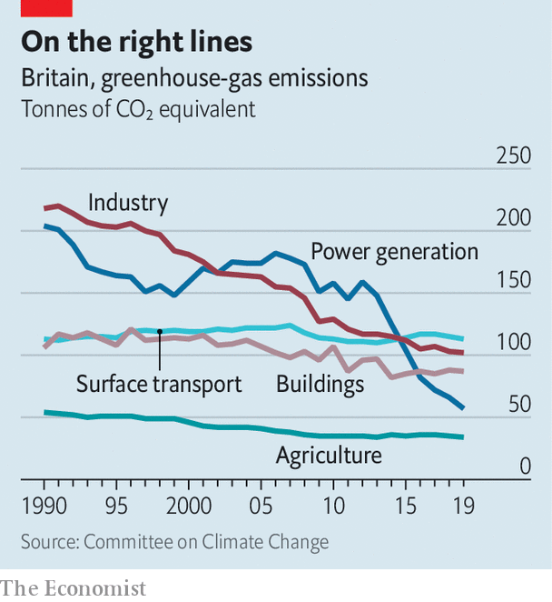

###### Environmentalism

# Boris Johnson’s ten-point green plan 

##### It will do him more good than the planet 

 

> Nov 21st 2020 

FIFTEEN YEARS ago a newly elected Conservative leader, David Cameron, set out to revive his party. He pushed social liberalism, environmentalism and a modest state, and chided the Tories for “banging on about Europe”. These days the Conservative Party is queasy about social liberalism and is all for state intervention and banging on about Europe. Of Mr Cameron’s modernising project only the greenery remains. And even that has been given a Johnsonian makeover.

On November 18th Boris Johnson unfurled a ten-point plan to make Britain greener. He promised more wind turbines, to be built offshore where they do not offend voters, and more money for research into nuclear power and carbon capture and storage. By 2030 an entire town will be heated using hydrogen and new petrol- and diesel-driven vehicles will be banned.


It is probably not enough to get Britain to net zero greenhouse-gas emissions by 2050—a target that became law last year. The Climate Change Committee, an independent body, told MPs in the summer that the country was off-track. Electricity, industry and farming have become much greener since the 1990s, but buildings and vehicles have not (see chart).

 


Mr Johnson’s plan to get Britons into electric vehicles is bold. Other countries will ban sales of new fossil-fuelled cars beginning in 2035 or 2040; only Norway has an earlier target than Britain. But boldness is not enough. To avoid a backlash and an embarrassing retreat, it helps to have a plan. At the moment just 6.6% of new cars sold in Britain are battery-powered and another 5.5% are plug-in hybrids—a technology that will be allowed until 2035.

The reason electric cars are unpopular is not that they are hard to charge. Nearly three-quarters of British households with cars park on their property or in a garage, so could charge them at home. Public chargers are becoming more common. Adrian Keen, the boss of Instavolt, a firm with more than 500 chargers, says that the average car now plugs in when it has 30% of a full charge remaining. Three years ago the figure was 44%. That suggests drivers are more confident that they will be able to charge when they need to.

The problem is that electric cars are much more expensive than petrol or diesel-powered ones. Even after a government grant of up to £3,000 ($4,000) per vehicle, a new electric Vauxhall Corsa costs about £26,000, compared with £16,000 for a petrol-powered one. Norway, the world leader in electric cars, has almost eradicated the price gap by levying enormous taxes and fees on fossil-fuelled cars. Last month 61% of all new cars sold there were fully electric and another 28% were hybrids. Britain’s government is highly unlikely to do the same. It cannot even bring itself to raise fuel duty, which has been stuck at the present level since 2011.

The same combination of bold ambition and modest detail runs through Mr Johnson’s other green plans. His pledge to quadruple power production from offshore wind leaves unanswered the question of how energy markets will cope with a surge in intermittent supply. He favours exciting industrial ventures such as battery gigafactories, zero-emission aeroplanes and carbon capture and storage (a technology that has promised much and delivered little so far) but has provided little money for dull, useful things like grants for home insulation. He mentioned a carbon tax, but provided no details.

If his ten-point plan is unlikely to save the planet, it could help revive his fortunes. Environmentalism usefully unites the Conservative tribes. Old-fashioned shire Tories who fancy themselves stewards of the land like it; so do centrist “one-nation” types who want to court younger voters. And Mr Johnson larded his plan with appeals to the working-class Midlands and northern English voters who pushed him to victory last year.

“There will be electric vehicle technicians in the Midlands, construction and installation workers in the north-east and Wales, specialists in advanced fuels in the north-west,” he wrote in the Financial Times. He promised jobs for Grangemouth, the Humber, Merseyside, Port Talbot and Teesside. It is hard to recall that the Conservative Party once prized market-based solutions to problems. Or that, as recently as Mr Cameron’s tenure, it argued for a shy, retiring state. ■

For more coverage of climate change, register for The Climate Issue, our fortnightly , or visit our 

