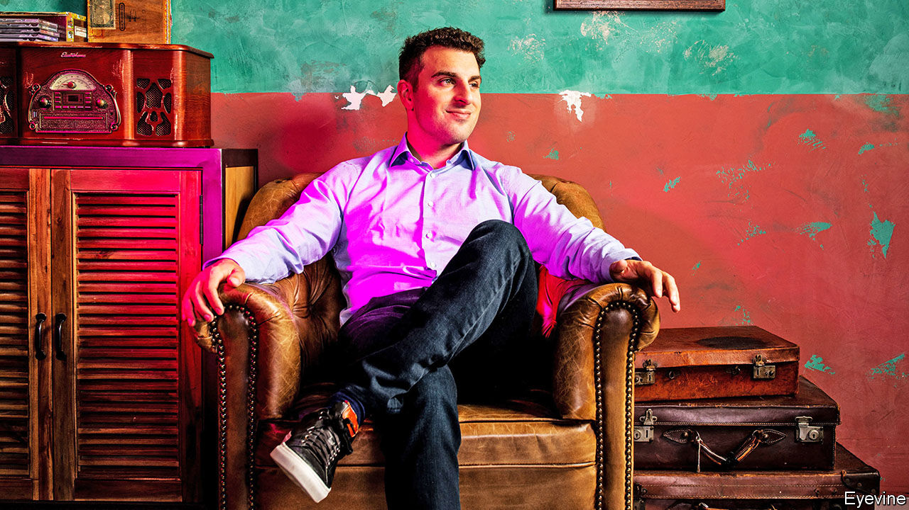

###### Public holidays

# Airbnb’s stockmarket debut will be a hit 

##### Never mind its murky long-term prospects 

 

> Nov 21st 2020 

TALK ABOUT terrible timing. When the pandemic hit in March, Brian Chesky had just put the finishing touches on the paperwork for Airbnb’s much-awaited public listing. Instead of travelling to New York to ring the opening bell at the Nasdaq stock exchange, he found himself spending days (and nights) on Zoom in his home office in San Francisco, fighting to keep his online holiday-rental marketplace alive. “It was like you are going 100 miles an hour and suddenly have to hit the brakes,” Airbnb’s boss recalls.

This time around Mr Chesky might be luckier. On November 16th Airbnb unveiled its prospectus, putting it on track for an initial public offering (IPO) next month, just as the first doses of the covid-19 vaccine may become available. The IPO could value Airbnb at more than $30bn. The firm’s longer-term prospects are harder to divine.


The vaccine is not the only thing that makes this an opportune time for Airbnb to go public. The window for tech IPOs has not been open this wide since the dotcom bubble 20 years ago. More than 50 tech startups have floated this year, raising a total of $26bn, according to Dealogic, a data provider. Many of Airbnb’s employees want to cash in on the shares they have been awarded before their right to do so expires. And the firm needs money, on top of the $2bn it raised earlier this year to tide it over—hence its decision to scrap earlier plans to list shares directly without drumming up fresh capital.

Mr Chesky has a good recovery story to tell, too. In the painful second quarter the number of nights booked on Airbnb fell to 28m, from 84m a year before. Gross bookings collapsed by two-thirds, to $3.2bn. In the next three months, though, the numbers rebounded, to 62m and $8bn, mainly thanks to what Mr Chesky calls “travel redistribution”. Guests eschewed virus-hit foreign cities, formerly Airbnb’s stronghold, for domestic and rural destinations. Stays less than 500 miles (800km) from home rose by more than 50% this summer.

Mr Chesky has also made Airbnb leaner. Before the pandemic the firm had sunk money into new businesses, including flights and a television studio, to pad revenues ahead of the listing. Since then his motto has been “back to the roots”. He has fired around 1,800 employees, a quarter of the workforce, shut down most of the new activities and radically cut online advertising (more than 90% of guests now book directly on Airbnb’s site). As a result, though the firm lost $916m in the first six months of the year, it turned a net profit of $219m in the third quarter.

Can Airbnb keep this up? Even before the pandemic growth had begun to slow. Once things are back to normal, room for further expansion may be limited, at least in the company’s core market. Bernstein, a research firm, expects annual growth in private rentals to slow to 7-8%, from around 20% in the past few years. And Airbnb’s operating margins lag behind those of its closest rivals, Booking.com and Expedia (which operates VRBO, a site that lists mostly holiday homes).

Airbnb’s future also depends on its ability to police its service and meet a growing list of legal requirements across many jurisdictions where it operates. As with other big online firms, renters have found ways to abuse the platform, for instance by using rental properties for parties; in July police in New Jersey broke up a rowdy event with 700 people. As for regulations, the firm says in its prospectus that by October 2019, 70% of its top 200 cities by revenue had imposed restrictions, such as limits on how many days a year residential properties can be rented out.

Mr Chesky’s biggest task, however, will be to work out what Airbnb, now entering its teens, should be when it grows up. He has said he would like to see it evolve like Apple or Disney—firms that have adapted over time and outlived their founders. The pandemic has been a setback for its new lines of business. “Either we keep doing new things as the world changes,” he says, “or we stop doing new things—and we won’t exist in the future.” Even if, occasionally, doing new things means sticking to the old ones. ■

Editor’s note: Some of our covid-19 coverage is free for readers of The Economist Today, our daily . For more stories and our pandemic tracker, see our 

