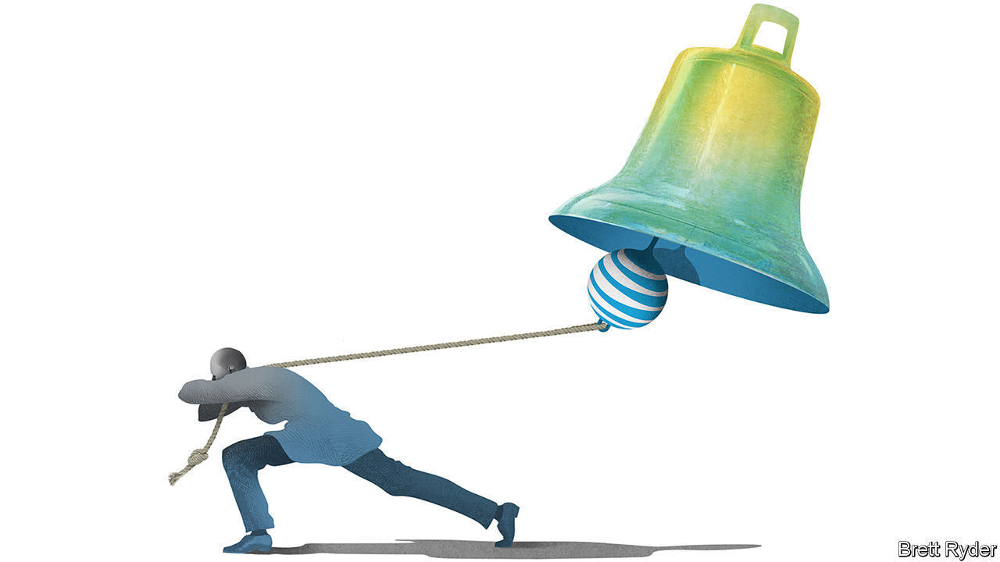

###### Schumpeter

# Can one of the architects of AT&T’s woes turn it around? 

##### Getting off the dividend treadmill 

 

> Nov 21st 2020 

JOHN STANKEY is an American chief executive from central casting. The 58-year-old has a square jaw, a lanky frame and, as one friend put it, “the world’s deepest voice”. During his 35 years as a telecoms executive, he has been a voracious dealmaker. He helped set Southwestern Bell Corp, one of the Baby Bells spawned by the break-up in 1984 of American Telephone &amp; Telegraph (AT&amp;T), on an M&amp;A blitzkrieg that eventually consumed the original Ma Bell herself. He then helped orchestrate its $176bn push into entertainment, buying DirecTV, America’s largest cable provider, in 2015, and Time Warner, a media colossus, three years later. In July he took over as AT&amp;T’s boss. A self-confessed “Bell-head”, he doesn’t flinch when confronting media moguls. Yet before one constituency he practically cowers: widows, orphans and other investors that depend on AT&amp;T as the world’s second-biggest dividend-payer after Microsoft.

That is a problem not because AT&amp;T cannot afford this year’s anticipated $15bn payout. Despite the travails of covid-19, it easily can. The rub is that it has become a treadmill. This year is the 36th since AT&amp;T was broken up in which it has increased the dividend. Such a legacy may not be strange for a stolid telecoms firm. But with a flighty media business on the side, it is a foolish promise. Moreover, AT&amp;T’s acquisition spree has saddled it with almost $150bn of net debt, even as its two core businesses, mobile telecoms and entertainment, are in the throes of upheaval that requires immense financial flexibility. Instead of revitalising each of them, AT&amp;T has so far done what many “dividend aristocrats” do—try to sell the family silver to make ends meet.


Yet there are indications that Mr Stankey may be prepared to challenge the old ways of thinking. He ought to—even for the sake of those widows and orphans.

He started the job with the odds stacked against him. Not only has the covid-19 pandemic clobbered WarnerMedia, the renamed Time Warner, by disrupting film releases, accelerating the decline of cable TV and reducing advertising spending. He also had to overcome doubts about his leadership abilities first aired last year by Elliott Management, an activist hedge fund, when it took a stake in AT&amp;T. When his former boss, Randall Stephenson, announced his retirement in the midst of the pandemic, it was hard to imagine that an outsider could run a company with a market value of $200bn and a phone book’s worth of problems by Zoom. So Mr Stankey won the contest, despite his role as Mr Stephenson’s lieutenant during years of value destruction. Since then, he has soothed some nerves, taking further acquisitions off the table, promising to repair the balance-sheet and lengthening debt maturities. Yet the share price languishes, as investors wonder if he can sustain the dividend while competing against two fierce rivals, T-Mobile in telecoms and Disney in entertainment.

One big test of his mettle will be an auction next month of wireless spectrum. Mobile, after all, is AT&amp;T’s mainstay, generating as much core earnings, or EBITDA, in a week in the third quarter as WarnerMedia did in a month. Yet T-Mobile, once a distant third in wireless subscriptions, is now running neck-and-neck with AT&amp;T and has its sights on Verizon, the leader. After its merger with Sprint, T-Mobile has also surged ahead of both rivals in the coverage and speed of its fifth-generation (5G) network, adding to its appeal. In order to catch up, AT&amp;T and Verizon will take part in an auction of mid-band 5G spectrum starting on December 8th. Verizon’s balance-sheet is robust enough to bid what some expect to be at least $15bn. AT&amp;T may feel more constrained. Yet those who keep a careful eye on its credit rating think it should splurge, both on spectrum and the fibre networks it lays across America. Davis Hebert of CreditSights, a research firm, calls them the “core tenets” of its business. (How quickly it can sell long-in-the-tooth assets like DirecTV to ease the financial strain is another matter.)

On November 18th Mr Stankey may have shown promising signs of audacity, though, when WarnerMedia announced an unexpected move in support of HBO Max, AT&amp;T’s streaming platform that competes with Disney+, not to mention Netflix. It said it would release “Wonder Woman 1984”, a potential Christmas blockbuster, simultaneously on HBO Max and in American cinemas on December 25th (it will hit cinemas in other countries earlier). That will break a long tradition of releasing films in theatres first to recoup production costs at the box-office, and to support the cinema business. It shows the company may be prepared to cannibalise revenues in one part of the firm—Warner Bros, the film studio—for the greater goal of driving subscribers to its streaming service, which is potentially a bigger long-term source of value. If going all-in on streaming attracts hordes of subscribers, it could reward Mr Stankey’s dogged faith in the marriage of phone and film.

From Wonder Woman to Superman

It is time for more of such hard choices. Yet the risk is that Mr Stankey feels he has time on his side. He now appears to enjoy Elliott’s support (reports that the asset manager had sold its equity stake do not mean it has thrown in the towel; it may still have a large derivatives position). The rating agencies are patient. Neil Begley of Moody’s says that because of coronavirus and other reasons, it has put big investment-grade firms like AT&amp;T on a “longer leash”. Many remain convinced the dividend is a sacred cow.

That breeds complacency, however. The payout saps AT&amp;T’s financial flexibility just when it needs all the leeway it can find. It encourages defensiveness, when T-Mobile and Disney are, as Roger Entner, a telecoms analyst, puts it, “surrounding it like wolves”. Come what may, one day it will have to cut the dividend—preferably to be complemented with more flexible share buy-backs. If Mr Stankey does that to make the company more nimble, he might emerge a corporate superhero. If it is forced upon him by weak earnings, it will be kryptonite that could cost him his job. ■

