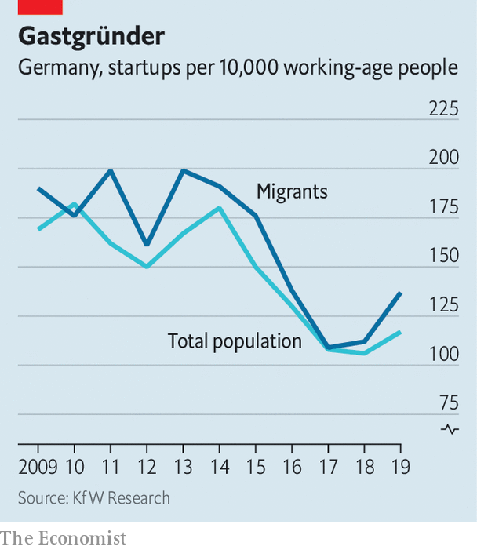

###### Pride and prejudice

# How Germany’s guest workers become guest entrepreneurs 

##### Migrants are likelier than other Germans to start businesses 

 

> Nov 19th 2020 

TO THE CONSTERNATION of Ugur Sahin and Özlem Türeci, much of the couple’s coverage in the German press focused on their Turkish roots. “Our world can be saved. From Mainz. By children of migrants,” was a headline in Bild, Germany’s best-selling tabloid. Their story certainly defies the cliché of owners of doner-kebab stands and fruit-and-vegetable shops—even if Mr Sahin and Ms Türeci, chief executive and chief medical officer, respectively, of BioNTech, would have preferred to read about the details of their firm’s discovery, in partnership with Pfizer, an American drugmaker, of a highly effective vaccine against covid-19.

“There are other BioNTechs,” says Rosemarie Kay of the IfM, a think-tank in Bonn. Migrants are much likelier than the average German to start a business (see chart). According to a recent survey by KfW, a state-owned development bank, one in four of the 605,000 founders of firms last year had foreign origins. They are not limited to groceries and gastronomy. Spotted, established by Nik Myftari, a refugee from Kosovo, is a dating website. Novum, created in 1988 by Nader Etmenan, who fled Iran, has become one of Germany’s biggest chains of hotels.

 


Immigrants to Germany (like Mr Sahin) or those with at least one parent who was born abroad (like Ms Türeci) number 19.6m, representing 24% of the population. A study from the Bertelsmann Foundation, another think-tank, found that members of this group own 773,000 businesses. Of these, 469,000 are sole traders. The rest are employers, mostly in construction, retail and services. Their numbers are growing. By comparison, the number of other Germans who own businesses declined by 275,000 in the period, to 3.2m.

“Germans are averse to self-employment,” says Armando Garcia-Schmidt of the Bertelsmann Foundation. Many graduates prefer a safe civil-service career to the vicissitudes of starting a business. The booming labour market of the past decade helped skilled and unskilled youngsters land a decent job without trying.

Options for migrants tend to be more limited. Some come from countries with strong entrepreneurial traditions and tend to pick successful entrepreneurs as role models. Various studies show that explicit or implicit discrimination makes the labour market, even in good times, much tougher for migrants. And many have qualifications from their country of origin that are not recognised in Germany, so creating a business is their only chance to earn more than the wage from a menial job.

Mr Garcia-Schmidt expects the labour market to become more difficult for everyone once the pandemic has abated and Germany’s generous furlough schemes expire. Covid-19 has made 2020 a terrible year for founders of all stripes. As the country emerges from the coronavirus recession, more native Germans may opt for self-employment as an alternative to joblessness. They can learn a thing or two from their migrant neighbours. ■

