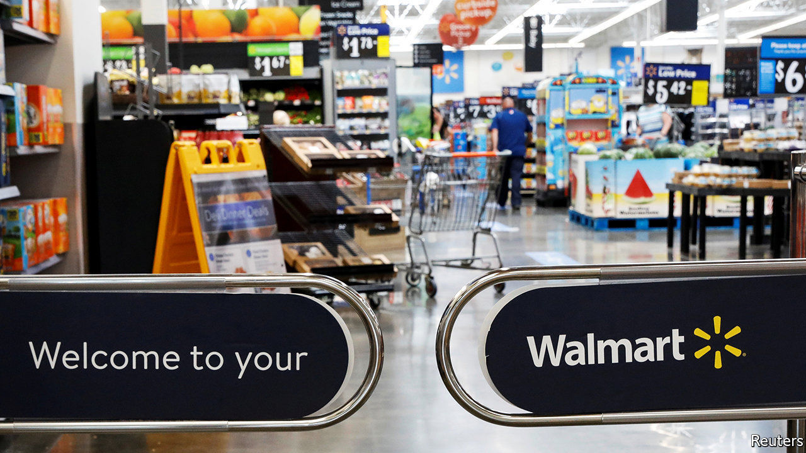
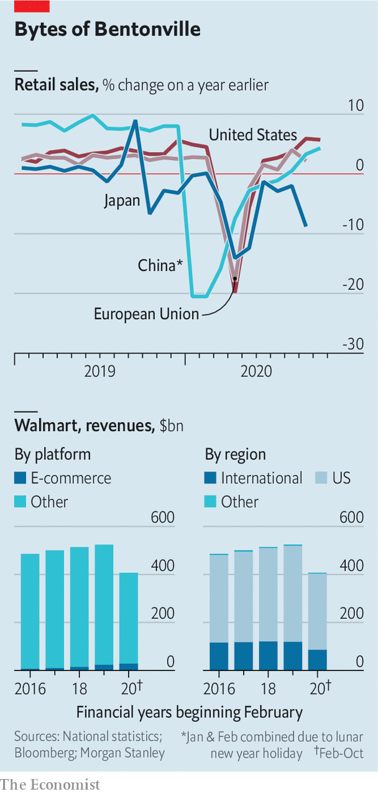

###### Beastly earnings

# Walmart has another stellar quarter 

##### The pandemic is producing clear winners and losers among America’s retailers 

 

> Nov 21st 2020 

HOW HAVE America’s retailers coped with covid-19? “We’re still learning,” declared John Furner, who runs Walmart’s vast American operations, on November 17th, as the supermarket giant reported third-quarter results. He is being too modest. Walmart, as well as a handful of other big firms such as Target, its smaller rival, and Home Depot, a DIY Goliath benefiting from housebound home-improvers staring at dingy walls and outdated kitchens, are thriving.

Paul Lejuez of Citigroup, a bank, described the three months to October as “another stellar quarter” for Walmart. Total global revenues increased by 5.2%, year on year, to $135bn. If anything, international sales, which grew by just 1.3%, dragged down strong performance in America, which accounts for the bulk of revenues; Walmart has said it will sell most of its flagging Japanese supermarkets. By contrast, domestic comparable-store sales, a standard industry metric, rose by 6.4%. Home Depot’s quarterly revenues shot up by 23% compared with a year ago, to $33.5bn, keeping up the previous quarter’s pace. Target’s operating profit nearly doubled to $1.9bn.


Shining retail stars mask darkness elsewhere in the industry. American shoppers rebounded faster than elsewhere in the rich world (see chart). But retail sales grew by just 0.3% last month, compared with the one before, the slowest in half a year. They softened in most of the 13 categories tracked. As investors swooned over Walmart and Home Depot, Kohl’s, a middling retail chain, reported falling revenues. “The distinction between the haves and the have-nots has gotten even sharper,” says Simeon Gutman of Morgan Stanley, an investment bank.

 


Mr Gutman points to the successful firms’ superior management of diverse, global supply chains. This allows shoppers to satisfy most of their retail needs in one store—particularly important in a pandemic, when people are keen to limit their outings. Walmart’s customers make fewer trips to the store but spend more whenever they do, he notes.

The star retailers’ biggest edge, though, comes from e-commerce. Walmart in particular upped its e-game just in time to benefit from a pandemic surge in online shopping. A survey of American shoppers by McKinsey, a consultancy, found that kerbside pick-up has nearly doubled from pre-covid levels, and in-store “click and collect” sales have shot up by nearly 50% from last year. Walmart’s digital sales leapt by nearly 80% in the latest quarter, year on year, to $10bn. That is still less than 8% of revenues—but more than in the whole of 2016, according to Morgan Stanley. The fast-approaching holiday shopping season is likely to bring even more online sales than usual, says Mr Gutman.

By doubling down on digital, Walmart is taking on Amazon’s e-emporium. The tech giant is not taking this lying down. On November 17th it launched its long-awaited digital pharmacy. This threatens not just chemists such as Walgreens and CVS but also Walmart, which sells prescription drugs in over 4,000 of its big-box stores. When it comes to e-commerce, Mr Furner’s humility is fully justified. ■

