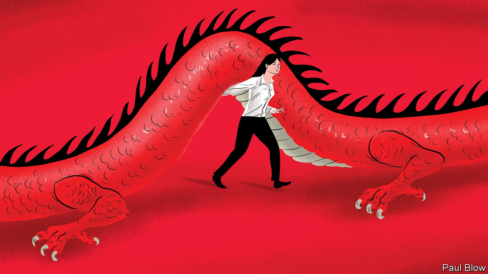
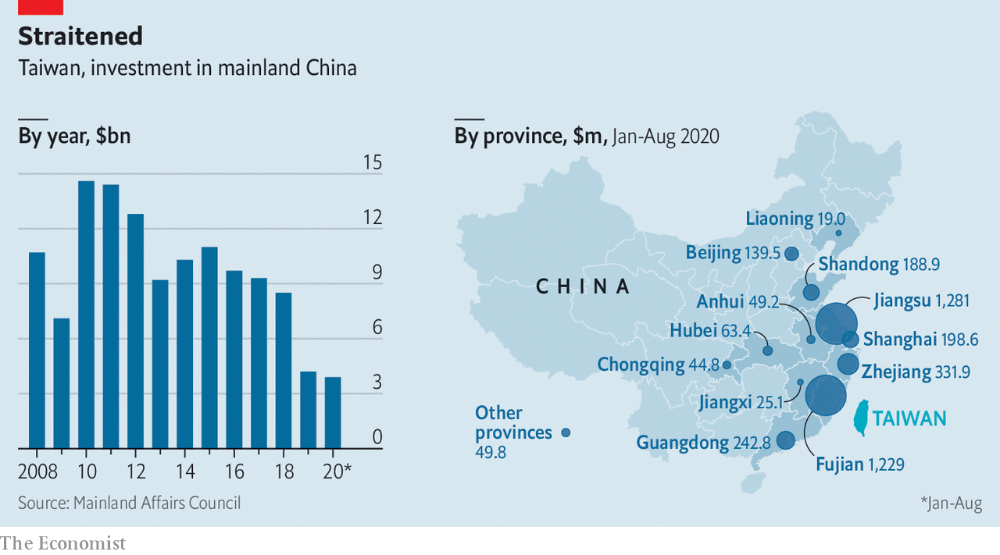

###### Scaling back

# Why commercial ties between Taiwan and China are beginning to fray 

##### The relationship that helped build China’s economy faces new challenges 

 

> Nov 19th 2020 

HUNDREDS OF JOBSEEKERS lined up outside a factory gate on a recent autumn morning. Uni-Royal, a Taiwanese maker of electronic components for such brands as Samsung and Toshiba, was looking for extra help at its plant in Kunshan, an hour’s drive west of Shanghai. New factory hands could earn 4,000 yuan ($610) a month, double the local minimum wage. Kunshan is dotted with hundreds of Taiwanese manufacturers like Uni-Royal. More than 100,000 Taiwanese call Kunshan home.

“Little Taipei”, as Kunshan is known, illustrates a broader phenomenon. Exact estimates vary, but as many as 1.2m Taiwanese, or 5% of Taiwan’s population, are reckoned to live in China—many of them business folk. Taiwan Inc has not let fraught political relations with China, which views the island as part of its territory, get in the way of business. Taiwanese companies have invested $190bn in Chinese operations over the past three decades. Foxconn, a giant Taiwanese contract manufacturer of electronics for Apple and other gadget-makers, employs 1m workers in China, more than any other private enterprise in the country.


As the West grows increasingly suspicious of communist China’s rise—a trend that America’s next president, Joe Biden, may slow but not reverse—Beijing seems keener than ever to bolster cross-strait commercial bonds. It sees Taiwanese firms as a source of investment and critical technologies such as computer chips, the export of which to China Washington has tried to curtail. At the same time, corporate Taiwan is cooling on its giant neighbour. Geopolitics is not the only reason.

When China opened up to foreign investment in the 1980s, entrepreneurs from Taiwan were the first foreigners to open their wallets. Enticed by cheap labour and land across the strait, they quickly set up shop in the coastal provinces closest to Taiwan. To this day Jiangsu (which includes Kunshan), Zhejiang, Fujian and Guangdong attract most Taiwanese money (see map). A common language and shared culture helped reduce transaction costs. Foxconn built its first Chinese factory in Shenzhen in 1988. By 2008 around a sixth of China’s stock of inward investment came from Taiwan, making it the biggest foreign investor in China.

 


Today three of China’s 12 most popular consumer-goods brands by revenue are Taiwanese. Chinese gobble up Master Kong instant noodles, Want Want rice crackers and Uni-President juices. Apple’s three biggest China-based suppliers—Foxconn, Pegatron and Wistron—are all Taiwanese. 

Now China is going out of its way to recruit more businesses from Taiwan. Between 2018 and 2019 the government unveiled no fewer than 25 policies aimed at luring them. Measures include tax credits and, more striking, a special right to bid on lucrative government contracts, from railway construction to “Made in China 2025”, an innovation scheme centred on advanced manufacturing. In May the Chinese authorities released an official directive, signed by five ministries, permitting Taiwanese-owned firms in China to “receive the same treatment as mainland enterprises”. It applies even to sensitive areas like 5G mobile networks, artificial intelligence and the hyperconnected “Internet of Things”. No other foreign firms enjoy similar treatment. 

These efforts by Beijing have so far had limited success. Annual investment flows from Taiwan have fallen by more than half since 2015 (see chart). This growing reticence on the part of corporate Taiwan can be explained by three considerations. The first is geopolitical.

China’s goal of discouraging formal independence by strengthening business ties is increasingly transparent to many Taiwanese. Beijing’s special treatment of Taiwanese firms, which are designated as domestic ones in its drive for “indigenous innovation”, only stokes more suspicions. It may have helped Taiwan’s independence-leaning president win re-election in January. Chinese firms, which have been able to invest in Taiwan since 2009, are coming under fire from the island’s regulators, which suspect them of being a fifth column for the Chinese Communist Party. Last month Taobao Taiwan, the local version of Alibaba’s Chinese e-commerce platform, said that it would cease operations. 

Trading partners

Geopolitical tussles beyond the Taiwan strait also play a role. Tariffs imposed by America on a long list of Chinese exports have prompted many Taiwanese producers to shift operations out of China. A recent survey by the National Federation of Industries, a trade body in Taiwan, found that four in ten Taiwanese bosses with factories in China said they already have or will “transfer capacity” elsewhere, mainly to South-East Asia. Taiwan’s Giant, the world’s biggest producer of bicycles, has identified Hungary as an alternative production base.

Making life even more difficult for some Taiwanese firms is America’s blacklisting of certain Chinese tech titans. Huawei, a Chinese telecoms champion that is a particular target of American ire, last year accounted for 15% of the revenues of Taiwan Semiconductor Manufacturing Company (TSMC), a huge chipmaker. This month TSMC confirmed it has set aside $3.5bn for a new plant in Arizona. 

A second challenge for Taiwanese firms concerns competition. Zhang Yingde, a Taiwanese small-business owner in Shanghai, talks of a “red supply chain” which, Beijing’s directives notwithstanding, continues to favour Chinese bidders. Mr Zhang says he can only hope to get in on the action as a subcontractor. Jerry Huang, the head of Ningbo’s Taiwan Business Association, which represents some 300 Taiwanese manufacturers in the eastern Chinese city, says that none has won a big government contract to date.

Mr Huang does not blame discrimination against Taiwanese firms. He points instead to the capabilities of homegrown Chinese rivals, which are becoming more competitive and innovative. This month Wistron, a Taiwanese assembler for Apple, agreed to sell its factory in Kunshan to Luxshare, a low-cost Chinese competitor. The fact that Wistron was prepared to cede operations to a Chinese rival suggests that technical know-how in electronics assembly is no longer a barrier to entry that Taiwanese outfits feel compelled to guard. 

Now that their dominance in manufacturing is fading, Taiwanese firms which want to succeed in China may need to ride on “Taiwan’s soft power”, says Keng Shu of Zhejiang University. This will be easier in services, he reckons, given Taiwan’s global reputation for warm customer service. But unlike manufacturing, where Taiwan enjoyed a first-mover advantage, China’s services industry has no shortage of established players, foreign and domestic.

The third reason for Taiwan Inc’s diminished zeal for China has to do with generational change. Uni-Royal in Kunshan is a case in point. Taiwanese expatriates who dominate its management are nearing retirement. Young Taiwanese are reluctant to take on the often thankless task of running Chinese factories. A common refrain heard from Taiwanese owners across China is that the impending “leadership vacuum” has made them cautious about big outlays.

To attract stripling Taiwanese entrepreneurs, China’s central government has in the past year opened dozens of “cross-strait entrepreneurship incubators” in big cities. These offer perks like free office space, introductions to potential Chinese clients, posh flats at discount rents and a chance to apply for up to 500,000 yuan in seed capital from the government. Weak pitches such as insufficiently differentiated mobile apps need not apply, says Zhu Yan, who operates an incubator in Jiaxing, in Zhejiang province. Still, the bar is lower than Chinese venture-capital firms typically set.

Mr Zhu’s incubator has lured ten Taiwanese startups. But schemes like it will not be enough to allay Taiwanese bosses’ concerns about pricier labour and stiffer competition—let alone about the new great-power rivalry. More likely than not, the golden era of Taiwanese business in China is over. ■

