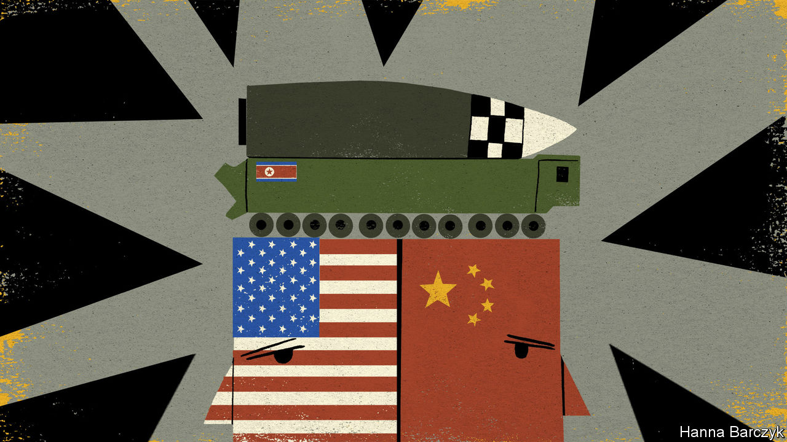

###### Chaguan

# China’s ties with America could be tested by North Korea 

##### The results of a crisis created by Kim Jong Un will not be cheering 

 

> Nov 19th 2020 

OPTIMISTS ABOUT American relations with China should consider the following scenario. At some point in early 2021, perhaps as President Joe Biden is sworn into office, hand on Bible, North Korea sees an incentive in testing a potent new weapon. In a worst case, that may mean launching one of the monstrous intercontinental ballistic missiles (ICBMs) that it unveiled at a parade in Pyongyang in October. Each may be able to carry enough nuclear warheads to overwhelm anti-missile defence systems.

The military implications of an ICBM test would be bad. The political fallout would be worse. With its first breath China, North Korea’s indispensable patron and protector, may condemn the regime in Pyongyang for a reckless act, carried out in defiance of resolutions by the UN Security Council. China may note that it is obliged to enforce UN sanctions, hinting at a clampdown on (currently rampant) Chinese smuggling of oil into North Korea, and sanctions-busting by North Korea with its exports of coal and the sale of fishing rights. Alas, in its next breath China would probably opine that—if North Korea feels a need to test advanced weapons, or simply to attract the world’s attention—America has itself to blame. For it was America, China would insist, that churlishly rejected peace offers made by North Korea’s leader, Kim Jong Un, during his meetings with Donald Trump in 2018 and 2019. Worse, should Mr Biden urge China’s president, Xi Jinping, to join America in imposing crippling new sanctions on North Korea unless it abandons nuclear weapons, the near-consensus among Chinese scholars and foreign diplomats in Beijing is that Mr Xi will refuse.


China and America disagree about so much, nowadays, that divergent views of North Korea may seem an afterthought. But seen from Beijing, this gulf in understanding over Korea is unusually revealing, and troubling. In essence, Mr Kim’s nuclear ambitions are a nuisance for China. But in the risk-calculations of Chinese leaders, the collapse of the grim, impoverished North Korean regime is a far more alarming prospect. It could lead to a rapid, chaotic reunification with South Korea, an advanced democracy and treaty ally of America which keeps more than 20,000 troops there. Still more cynically, as an Asian diplomat puts it, China does not think that it is the target of North Korea’s nukes.

Chinese officials stress the generosity of North Korea’s moves to reduce tensions since the crisis of late 2017 and early 2018. That flare-up involved repeated missile tests and nuclear blasts by the Kim regime, prompting Mr Trump first to threaten to rain “fire and fury” on North Korea, and then to pivot abruptly to an approach based on personal diplomacy with Mr Kim. China notes that North Korea returned the remains of long-lost American servicemen, destroyed some nuclear test facilities and that it has refrained from testing long-range missiles and nuclear devices since 2018.

No matter that American officials call North Korea’s offers inadequate. China blames America for a diplomatic stalemate since the Trump-Kim summit in Hanoi ended without a deal in February 2019. This is more than a talking point, insists Li Nan, a researcher at the Chinese Academy of Social Sciences, a government research institute. Chinese leaders “really believe that because of cold-war thinking, the US never trusted North Korea to give up its nuclear weapons,” so never dropped any sanctions in response to North Korean concessions, he says. Before fears of covid-19 prompted North Korea to seal its borders, Mr Li was a frequent, well-connected visitor to Pyongyang. He is pessimistic about substantive Sino-American co-operation during any fresh Korean crisis. “America can’t make concessions to North Korea, and China can’t put more pressure on North Korea,” is his blunt assessment.

Hardline Chinese nationalists see a conspiracy in America’s rejection of North Korean demands. These include dropping sanctions and ending American military exercises with South Korea that Mr Trump calls expensive and provocative, and has suspended. Some Chinese scholars write that their country must face the reality of a nuclear-armed North Korea and balance its geopolitical interests accordingly, says Zhao Tong, a disarmament expert at the Carnegie-Tsinghua Centre for Global Policy in Beijing. To such scholars, progress towards peace is blocked by America’s refusal to offer North Korea economic and security incentives. Their explanation is that America does not want to leave the peninsula “because the long-term US goal is to contain China,” reports Mr Zhao.

American experts on Korea are just as sceptical about China’s motives. Jung Pak is a former CIA analyst in Mr Biden’s transition team. Expressing her own views rather than the next administration’s, she writes in a forthcoming paper for the East Asia Institute, a Seoul-based think-tank, that China sees chances to advance its goal of regional dominance in deadlocked American talks with North Korea. It sees similar potential gains from America’s disputes with the South (Mr Trump told it to pay five times more towards the cost of American garrisons). China’s assertiveness may “embolden, not rein in, Kim Jong Un”, worries Ms Pak.

Pausing tests: useful but not the same as denuclearisation

Until June this year, Markus Garlauskas was America’s national intelligence officer for North Korea. “We have reached a natural limit in terms of what we can get out of China on North Korea,” says Mr Garlauskas, now with the Atlantic Council, a think-tank. Pressing North Korea to stop testing its most dangerous weapons is probably the most that China will do, he suggests by telephone from Washington. A moratorium on tests is not nothing: a new model of ICBM is not credible until it has flown. But pausing tests alone is a thin basis for co-operation with China.

North Korea will provoke America’s next president, triggering domestic headaches for Mr Biden as Republicans call him weak on China and North Korea, which they surely will (forgetting Mr Trump’s talk of love letters from Mr Kim). That crisis will in turn test America’s ties with China. The results will not be cheering.■

