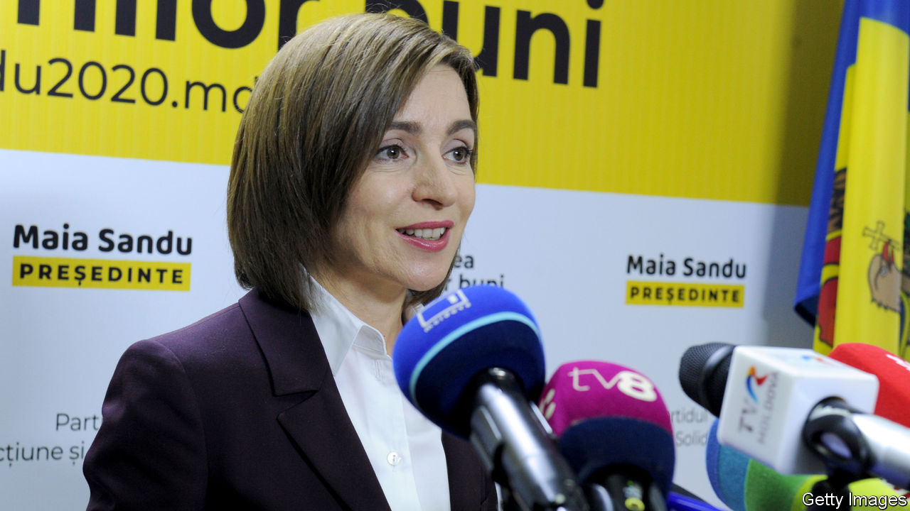

###### A Moldovan surprise

# Maia Sandu, a reformist ex-prime minister, becomes president 

##### Moscow’s man is out 

 

> Nov 19th 2020 

WHEN THEIR 5,000 ballot papers ran out, the angry crowd in the scruffy London suburb of Beckton began chanting: “We want to vote!” There were similar scenes in Paris and Frankfurt. The numbers of diaspora Moldovans clamouring to cast their ballots were huge, and the country’s electoral commission had failed to anticipate how many slips they would need. In the diaspora 93% plumped for Maia Sandu as president. On November 15th she defeated Igor Dodon, the Socialist incumbent, winning 58% of the overall vote.

Moldova is often characterised as a country split between those who want closer ties with the West and those who want them with Russia. But geopolitics is not what motivated most Moldovan voters when they unseated Mr Dodon, though he is reported to have visited Moscow more than 20 times in the past four years. For Ms Sandu, who was briefly prime minister last year, the single most important issue has long been corruption.


Prey to rapacious oligarchs and unscrupulous politicians, Moldova is the poorest country in Europe, with a GDP per head of just $4,500. Thirty years ago it had 4.4m citizens. So many have left that fewer than 3m may have stayed behind. But, as the Beckton voters show, the leavers still care. If less money had been stolen at home, fewer of them would be toiling abroad.

Covid-19 has been a game-changer, says Vadim Pistrinciuc, a former deputy minister. Unemployment has soared, small and family businesses have been devastated and, unlike those elsewhere in Europe, have had little help from the government “because there is nothing to help them with. People have made the connection between our weak state and corruption.”

Ms Sandu used to come across as rather chilly. In socially conservative Moldova her enemies have emphasised her childlessness and accused her of being a lesbian, which she denies. In the campaign she talked of her family and widened her appeal. Expectations will be high, but the president’s powers are limited. She will seek a snap parliamentary election. The Socialist-led government is expected to cling on for the moment, though its legitimacy has clearly been dented by Mr Dodon’s defeat. President Sandu will hope to capitalise on her current popularity and build the momentum her party needs to take full control of the government.■

