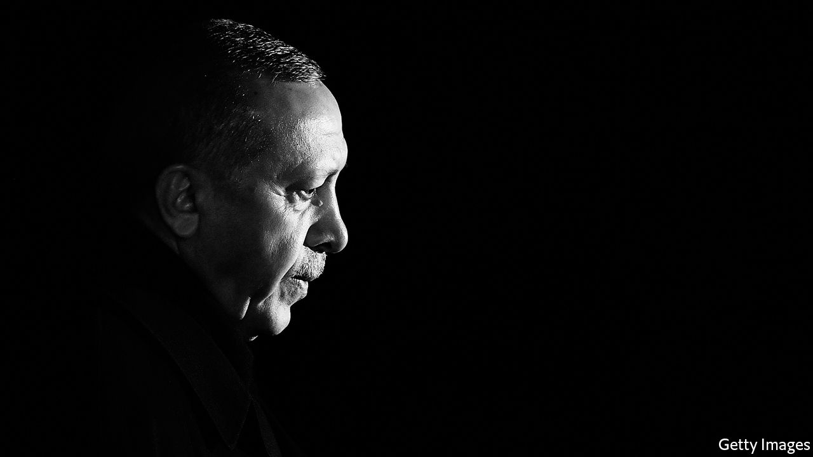
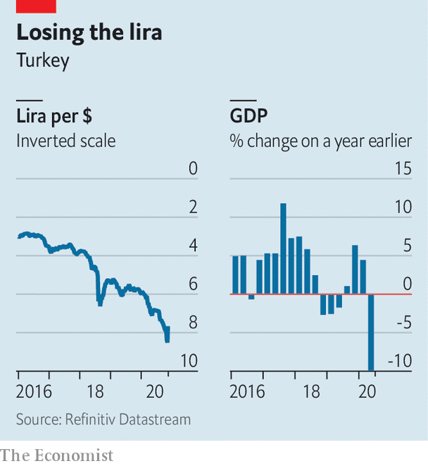

###### On the edge

# Recep Tayyip Erdogan faces up to economic facts 

##### Turkey’s president will also miss his friend in the White House 

 

> Nov 21st 2020 

WHAT A DIFFERENCE a family row makes. Only a few weeks ago, the Turkish lira was plummeting from one record low to another as the central bank sat on its hands, foreigners were dumping Turkish stocks and the country’s finance minister, Berat Albayrak, was arguing that exchange rates did not matter. Today the currency is enjoying a big rebound, the stockmarket is soaring, and officials are talking about the need to reform the courts and keep inflation in check.

For more than two years, Turkey’s autocratic president, Recep Tayyip Erdogan, had relied on Mr Albayrak, his son-in-law, to run the economy. Mr Albayrak nearly ran it into the ground. With banks dishing out credit at rates below inflation to revive growth, the lira sank by over 40% against the dollar, burning a hole through the savings of millions of Turks. The central bank and state banks wasted at least $100bn in precious foreign reserves in an abortive attempt to salvage the currency.


Mr Erdogan finally slammed on the brakes. On November 7th he sacked the central-bank governor and replaced him with one of Mr Albayrak’s rivals. A day later, an indignant Mr Albayrak, once touted as his father-in-law’s prospective successor, stepped down. Since then the lira has responded with its best weekly performance (a 10% rally) for two decades.

 


The change in tone has been remarkable. The new central-bank governor, Naci Agbal, and the new finance minister, Lutfi Elvan, are making all the right noises about stabilising the currency and bringing inflation down to single digits. The justice minister, who has presided over a sweeping crackdown against government opponents since 2017, has discovered a passion for the rule of law, asking judges to comply with constitutional-court rulings and help improve the climate for foreign investors. Those investors are needed: reeling from the pandemic, the economy shrank by nearly 10% in the second quarter.

Even Mr Erdogan, a sworn enemy of high interest rates, now says Turkey may have to swallow “a bitter pill”, meaning a dose of austerity. On November 19th, the central bank duly imposed a spectacular rate rise of 475 basis points.

Mr Erdogan had to surrender to market pressure and sack Mr Albayrak. “There was a real chance that the thing would have snowballed and you would have a full-blown currency crash” unless Turkey’s leader had changed course, says Paul McNamara of GAM Investments. Another option would have been to seek help from the IMF, something Mr Erdogan had previously ruled out. The president would also have had to pay a political price. A group of 30 to 40 ruling-party parliamentarians is said to have threatened to defect to the opposition unless Mr Albayrak resigned. The overhaul of Mr Erdogan’s economic team has at least bought him some breathing space, says Ugur Gurses, a Turkish economist.

It may also help Turkey’s leader to cope with the loss of a good friend in Washington. For the past four years Mr Erdogan has been able to count on Donald Trump to look away while Turkey evicted American troops from parts of north-eastern Syria, clashed with European allies in the Mediterranean, deployed Syrian mercenaries to Libya and Azerbaijan, and locked up thousands of people on terror charges thinner than baklava dough. Mr Trump also shielded Turkey from sanctions over its purchase of an S-400 air-defence system from Russia. He may have tried to hold up an investigation into a Turkish state bank accused of laundering Iranian money.

Under Joe Biden, who earlier this year referred to Mr Erdogan as an “autocrat” who “needs to pay a price”, things will get tougher. America will draw red lines and enforce them more credibly, says Lisel Hintz of Johns Hopkins University. Mr Erdogan will have less room to cut deals with the White House. Sanctions over the S-400 will be harder to sidestep, especially after Turkey tested the system in October. “Ankara will no longer have the kind of protection provided by Trump and has to get its house in order, politically and economically,” says Asli Aydintasbas of the European Council on Foreign Relations, a think-tank. “There may be no direct causality, but there’s no doubt Albayrak’s resignation has to do with Turkey being more prepared for the challenges ahead.”

With friends like these

Yet there is a limit to how far Mr Erdogan is willing to go to save the lira and placate the new American administration. For all the recent talk of reforms, he is not about to loosen his grip on national institutions, give up on growth or stop tormenting opponents. His prosecutors recently opened an investigation into Ekrem Imamoglu, the opposition mayor of Istanbul, for criticising one of the president’s pet projects, a canal between the Black and Marmara Seas. Whether the central bank makes the right call still depends less on its governor than on the president. Mr Albayrak may be a useful scapegoat, but he is not the true problem in Turkey.

Even if Mr Erdogan were sincere about democratic reforms and the need to patch things up with his Western partners, the coalition he has sealed with his country’s ultranationalists, who support him in parliament and in the security forces, will make it difficult for him to take the right steps. “He has locked himself into this path,” says Ozgur Unluhisarcikli of the German Marshall Fund, another think-tank. “I can’t see how he can make substantial changes without destroying the alliance structure he has set up.”

Mr Erdogan must hope the beginning of the Biden presidency is better than the end of the Trump one. On November 16th Mr Trump’s secretary of state, Mike Pompeo, told a French newspaper that America and Europe needed to deal with Turkey’s “aggressive actions” over the past few months. A day later Mr Pompeo arrived in Istanbul, where he paid a visit to the Ecumenical Patriarch to discuss religious freedoms in Turkey (and probably bemoaned Mr Erdogan’s conversion of the Hagia Sophia, an ancient Christian basilica, into a mosque). He did not meet a single Turkish official. ■

