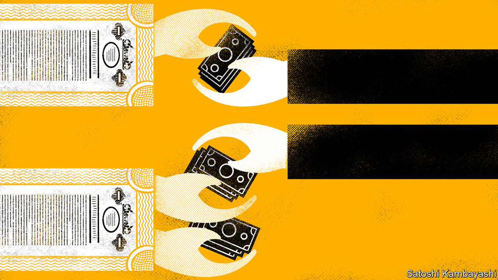

###### Cum-ex redux

# A tax-evasion scandal draws in Hamburg’s elites 

##### Four bankers with M.M. Warburg are accused of grave tax evasion through “cum-ex” transactions 

 

> Nov 19th 2020 

AT THE VERY last minute, the lawyers of Christian S tried to stop his trial, arguing that the 77-year-old former bigwig with M.M. Warburg, one of Germany’s oldest private banks, was too frail to attend court in a pandemic. But on the evening of November 16th Germany’s constitutional court ruled that the trial could go ahead the next day. With judges, lawyers and the accused wearing contraptions that looked like oversized diving masks, each shielded by a perspex partition, a prosecutor read out the charge sheet. It took so long that the judge ordered a break halfway through.

Mr S, who cannot be fully named due to reporting restrictions in Germany, is one of four Warburg bankers accused of grave tax evasion through so-called “cum-ex” transactions in 13 cases between 2006 and 2013 that cost the German taxman more than €325m ($386m). (The other three will be tried separately.) Cum-ex trades are share transactions done at high speed on or just before the day dividend payments are recorded. Before payment, shares come with (cum) dividends, which are reflected in their prices; after, they come without (ex). A flurry of deals may allow two or more investors to reclaim tax on a given dividend, even though it has been paid just once.


The defendant said very little. He was a confidant of Christian Olearius, the patrician co-owner of the Hamburg-based bank who was head of its supervisory board until he resigned last year, because of his alleged involvement. (Mr Olearius denies any wrongdoing.) Last month the effects of the scandal rippled out to the political sphere, seeming to draw in Olaf Scholz, Germany’s finance minister and a former mayor of Hamburg. The city’s parliament launched an investigation into why Hamburg under Mr Scholz let €47m of tax payments owed by the bank lapse under a statute of limitations. As mayor in 2016, Mr Scholz twice met Mr Olearius, a donor to, and fund-raiser for, the city’s cultural venues; he says such meetings with bankers and businessmen were customary, and that he cannot remember what was discussed. Warburg says the investigation is purely political, as Mr Scholz is the Social Democratic Party’s candidate for the chancellorship.

This is the second cum-ex trial. In March the same court found two former British bankers guilty of tax evasion. They received a suspended sentence as they had co-operated with prosecutors. Warburg came up frequently during the trial because of its role in the trades made by the British duo. It was ordered to pay around €176m as part of the March ruling. It says it has not breached any laws and is appealing.

The lawyers for Mr S maintained a similar line. The trial, which is due to conclude in January, seems likely to be more confrontational than the first—and perhaps more embarrassing for Germany’s political and financial classes. Many expect Mr Olearius to be indicted soon.

Whatever happens, Warburg’s standing may have already suffered. “It might have gambled away the trust of clients,” says Christopher Kopper of Bielefeld University. Its future depends on how much it will have to pay out when all the fines are totted up—and whether customers abandon the grand old bank. ■

