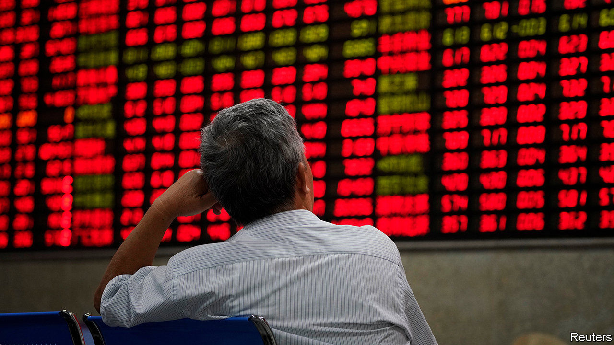
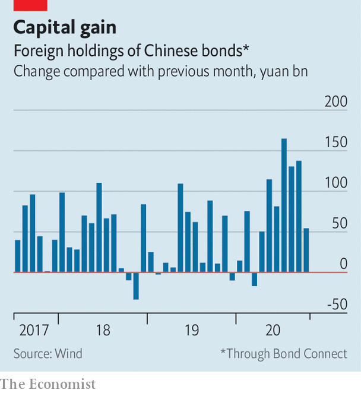

###### No guarantees

# China’s bond market is jolted by some surprising defaults 

##### The defaults throw out the old rules of thumb on state bailouts 

 

> Nov 19th 2020 

CHINA’S CREDIT-RATING agencies do not disguise their love for the state. Yongcheng Coal and Electricity’s state pedigree was at the top of a list of merits in a recent credit appraisal by CCXI, one such agency, which expressed its confidence in the group on October 10th with a top-notch AAA rating on a 1bn-yuan ($152m) bond.

Yongcheng’s default a month later on a different 1bn-yuan bond has sent a shockwave through China’s $14trn bond market. The company paid overdue interest three days later, but not before investors dumped state-backed debt with links to Henan province, the region in central China where it is based. The jarring news that a state group with a recent AAA-rating had defaulted halted at least 20bn-yuan-worth of planned debt issuance over the following week, as yields on state debt surged.


The concern was so great that a large state-owned company in neighbouring Shanxi province was forced to issue a rare statement to investors on November 14th pledging that the companies it controls would not default. “The particular thing about this case was that it was completely unexpected,” said Charles Chang of S&amp;P, another rating agency.

Investor panic has focused on Yongcheng, but there are signs of wider tumult. Huachen Automotive, a carmaker owned by a provincial northern government, said on November 16th that it had sought restructuring after defaulting on a bond in October. Tsinghua Unigroup, a technology firm controlled by Tsinghua University, failed to repay a 1.3bn-yuan bond on the same day. The companies had enjoyed AAA and AA ratings, respectively.

 


That state firms can default is no surprise. Yongcheng is one of ten to have done so this year. Regulators have realised they can no longer afford to bail out inefficient, loss-making companies. A small but steady stream of weak state firms have been allowed to default since 2015, part of a government plan to impose discipline on the market. Defaults also make it possible to price in risk better, something foreign investors have struggled to do. As defaults have risen over the past three years, foreign investors have ploughed record sums into China’s bond market.

But Yongcheng’s default has alarmed investors because it throws out the old rule-book that helped determine which groups would receive state support and which would be allowed to go bust. Parent companies have been the strongest guiding light to date. Yongcheng’s parent, for example, is one of Henan’s largest state-owned groups and is wholly owned by the province’s asset administrator, making Yongcheng state royalty in the region. Huachen Automotive is owned by a similar entity. Such proximity to powerful asset administrators used to give investors confidence that the state would swoop to the rescue at the first sign of distress. Not any more.

Scale also used to be important. Large state groups have been valuable to cities and provinces because they give secure employment to tens of thousands of people. Huachen Automotive alone has more than 40,000 employees. Restructuring them would threaten jobs and social stability, but these are risks the government appears increasingly willing to take. “Parent company, size—these are the reasons people argue you should buy,” says Edmund Goh of Aberdeen Standard Investments, an asset manager. “This is starting to change, and people are going to be reading more of the details.”

Investors and rating agencies will have to study state firms’ fundamentals, instead of relying on perceived government backing. S&amp;P expects more defaults among large state groups that were once considered untouchable. Zhu Ning, a professor at the Shanghai Advanced Institute of Finance, said that regulators may even launch “a crackdown on the rating agencies for better-informed ratings”. The shift will prove awkward for local agencies, such as CCXI, which are under pressure from state groups to hand out as many sparkling AAA ratings as possible. ■

