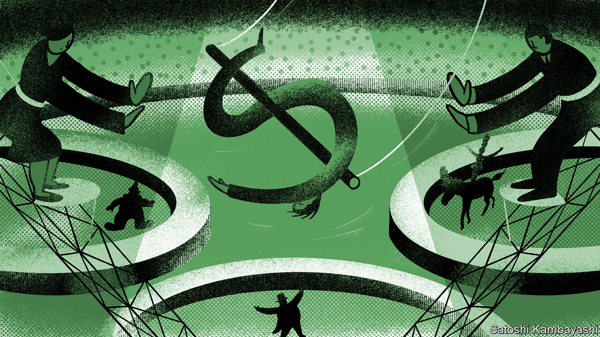
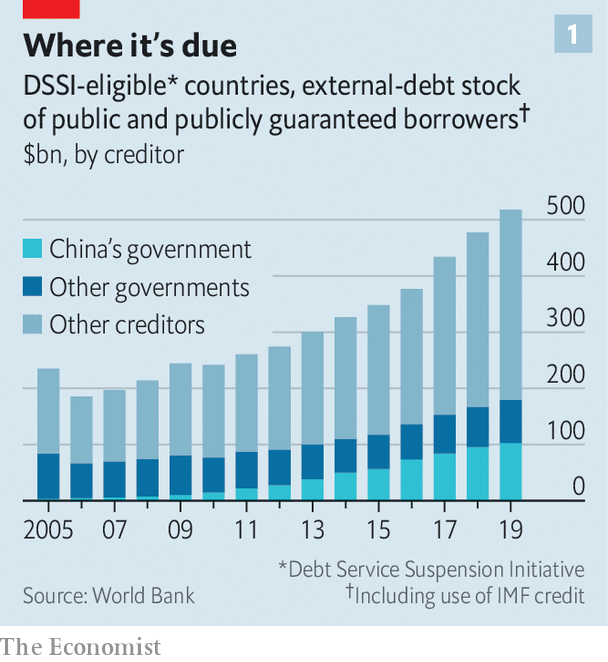
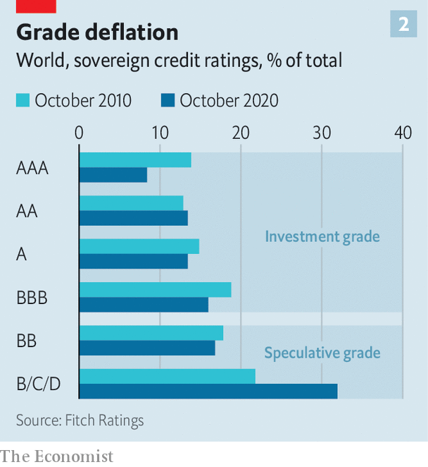

###### Roll up, roll up and write down

# How can governments recover faster from insolvency? 

##### Proposals from the G20 and the IMF may ease the pain for both borrowers and lenders 

 

> Nov 19th 2020 

“THE PROCEDURES for resolving an international debt crisis”, wrote Alexis Rieffel, a former American Treasury official, in 1985, “resemble a three-ring circus”. In the first ring, the bankrupt country negotiates with the IMF, which must decide how much the country can repay and what belt-tightening it must endure. In the second ring, the country asks for leniency from other governments to whom it owes money. And in the third, it seeks a “comparable” deal from private lenders.

The circus sometimes, however, struggles to hold it all together. After Argentina defaulted in May, for example, the IMF failed to play its customary role in the first ring. It could not provide new supervision and finance, because the country was still reeling from the failure of its previous IMF bail-out. The second ring has also suffered from some absent performers. In the past decade China has become a far bigger lender to poor countries than other governments combined (see chart 1). But it is not a member of the Paris Club, which has tended to oversee debt renegotiations between countries and their official creditors. As for the third ring, when the Latin American debt crisis struck in the early 1980s, it took commercial lenders (and their governments) almost seven years to find a lasting solution. The juggling went on and on.

 


Many fear another series of defaults is looming. Government revenues and export receipts have plunged in many poor countries (though efforts by America’s Federal Reserve to calm financial panic have lowered their cost of borrowing). On November 13th Zambia became the sixth country this year to default on its bonds. Eight spend over 30% of their fiscal revenues on interest payments, reckons Fitch, a rating agency, more than in the early 2000s when Bono and other debt-relief campaigners were at their clamorous best. Fitch gives 38 sovereigns a rating of B+ or worse, where B denotes a “material” risk of default (see chart 2). According to its projections, governments with a junk rating—BB+ or worse—may soon outnumber those classed as investment-grade.

 


Will the circus handle any new crisis better than it did in the 1980s? In some ways its task is even harder now. Poor countries owe a wider variety of liabilities to a broader range of creditors. For many emerging economies, bonds have eclipsed bank loans. And loans themselves are far from uniform. Some are secured against state assets, such as a stake in a public enterprise, or oil revenues; the creditor might prefer to seize the collateral rather than write off the debt. Others are syndicated, or parcelled out among many banks, which means that no single creditor can forgive the loan at its own discretion.

This gnarly mix of instruments is matched by an equally tangled bunch of creditors: public, private and everything in between. In April, for example, the G20 group of big economies called on member governments to provide a repayment holiday on loans to the world’s poorest countries. China was unhappy that private creditors did not share in the effort. Others complained that China Development Bank, which is owned and directed by the state but not synonymous with China’s government, did not take part.

There has, however, also been progress. On November 21st-22nd, G20 leaders will sign off on a “common framework” for renegotiating debts with the world’s poorest countries. The framework, in effect, extends the principles of the Paris Club to those G20 members who are not already in it, widening the second ring of the circus. It applies only to countries with unsustainable debts, and any borrower that receives relief from the G20 must seek a similar deal from other creditors. Because all lenders must do their bit, little hangs on whether they are classified as official or private. That is perhaps why the framework has met little opposition from China.

There has been progress in contracts as well as clubs. After Argentina defaulted in 2001, it offered to exchange its unpayable bonds for new securities with easier terms. Some bondholders rejected the deal, seeking full payment in New York’s courts instead. That made life harder for both Argentina and its other creditors. Since 2003, most bonds issued under New York law have contained “collective-action clauses”, which compel all bondholders to go along with any deal accepted by the majority. Such clauses helped Ecuador resolve its default this year with “hardly any real grumbling”, notes Clay Lowery of the Institute of International Finance, a bankers’ association. They also helped Argentina reach a deal with its main bondholders in August (albeit with “a fair amount of grumbling”).

A review of the “architecture” for resolving sovereign debt, published by the IMF in September, pondered other contractual innovations that might ease future restructurings. Lenders might insist on wider use of “negative-pledge clauses” that prevent a borrower pawning vital assets as collateral to other creditors. Syndicated loans might add “yank the bank” provisions that allow a lender to be kicked out of the syndicate if it blocks a deal. The fund is also paying renewed attention to “contingent” debt instruments that are more sensitive to the ups and downs that befall poor countries. Barbados, for example, has issued bonds that repay less in the event of an earthquake or tropical cyclone.

One idea, proposed by Ben Heller and Pijus Virketis of HBK Capital Management, an investment fund, is “bendy bonds”. In most cases, these would behave like ordinary bonds. But in a crisis the issuer could extend the maturity and defer interest for a couple of years in return for paying additional interest at the end of the bond’s life. The issuer could benefit from the kind of payment holiday envisaged in the G20’s April initiative without any help from the great powers. As the long history of debt restructurings attests, “fixed” income liabilities are often anything but. Solemn commitments to pay in full and on time cannot always be kept. Lenders and borrowers alike might therefore welcome instruments that specify up front when and how fixed income will become more flexible. ■

