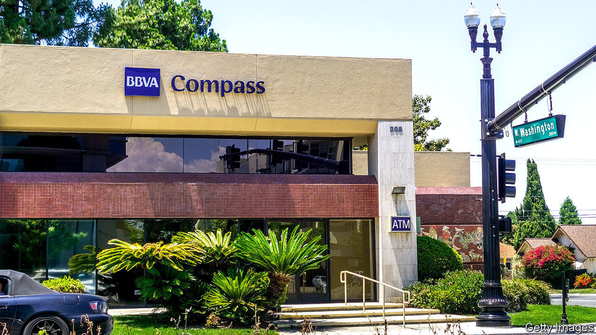
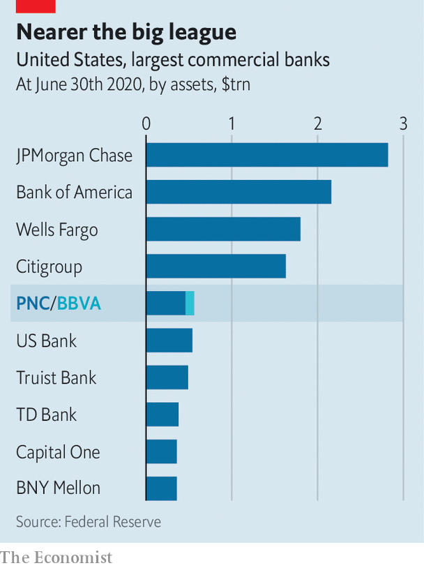

###### Bye Bye America

# PNC’s takeover of BBVA’s American arm may start a trend 

##### The deal could spark consolidation on both sides of the Atlantic 

 

> Nov 16th 2020 

IN MAY PNC, America’s seventh-largest retail bank by assets, sold a stake in BlackRock, an asset manager, for $17bn. Bill Demchak, PNC’s boss, said at the time that worries about the economy had prompted it to divest, in order to “bullet-proof” its balance-sheet. On November 16th he broke cover. PNC said it would buy the American arm of BBVA, Spain’s second-largest bank, for $11.6bn. The deal could set off a scramble for scale on both sides of the Atlantic. Indeed, BBVA in turn said on the same day that it was in merger talks with Sabadell, another Spanish lender.

Scale has become increasingly important for retail banking in America. It is dominated by four giants—JPMorgan Chase, Bank of America, Wells Fargo and Citigroup—that have amassed branches while lavishing spending on marketing and technology. The investment in digital banking has paid off during the pandemic, as flashy apps have attracted a growing share of deposits. At the same time, the Federal Reserve’s low interest rates are squeezing lending margins. That hurts regional banks most: they rely more on interest income from loans than their Wall Street rivals, which also earn fees on trading and investment-banking activities.

 


PNC’s acquisition of BBVA USA Bancshares is the largest banking deal in America since BB&amp;T bought SunTrust for $28bn last year. It will create the country’s fifth-largest retail bank (see chart). The combined entity will be a coast-to-coast franchise operating in 29 of the country’s 30 largest markets: half of BBVA’s branches are in Texas, and the rest span southern states, where PNC’s presence is limited. Still, PNC may seek to expand further. It has excess capital to deploy, in part because regulators have capped dividends and banned share buybacks. And America’s field of mid-size banks remains crowded. At least 30 lenders have assets of around $50bn-250bn.


The price tag on BBVA’s American franchise amounts to about 30 times its projected earnings in 2021, according to analysts at UBS, a bank. That is a lot for a unit that has long underperformed, posting returns on equity of around 6-7% (BBVA’s Mexican arm, which is comparable in terms of risk-weighted assets, routinely produces returns of 20% or more). But PNC has demonstrated a knack for turning round ailing ventures, notably the American arm of RBC, a Canadian bank, which it snapped up in 2012. Investors seem confident PNC can repeat the trick: the bank’s share price rose by 3% on the day the deal was announced.

BBVA’s investors were even more enthusiastic. Its share price jumped by 20% on the day. Britta Schmidt of Autonomous, a research firm, estimates the net value gained at about €8bn ($9.5bn), or 40% of the bank’s market capitalisation. The sale will shore up its core-capital ratio by nearly three percentage points, to 14.5%, well above the level demanded by regulators.

A chunk of the bounty may go towards acquisitions closer to home, fuelling a long-awaited wave of consolidation in Europe’s overbanked markets. BBVA’s American exit makes its portfolio disproportionately exposed to emerging markets, giving it a reason to invest at home. It may also help that, since July, the European Central Bank has encouraged banks to recognise an accounting gain, known as negative goodwill, which they generate when they buy a rival at a lower price than the book value of its assets. Such “badwill”, in turn, can be used to offset restructuring charges. Investors seem to believe that BBVA’s talks with Sabadell will succeed: Sabadell’s share price jumped by 16% on the PNC news, and a further 9% after PNC and BBVA said that due diligence had begun.

Transatlantic divestitures, meanwhile, will probably continue. European banks operating in America should either go big or give up, says Adrian Cighi of Credit Suisse, a bank. Analysts expect HSBC, Europe’s largest bank by assets, to signal a partial exit when it releases its results in February. Santander and BNP Paribas, the other European banks with a big American presence, say they do not want to sell. The PNC deal, however, may make shareholders think focus is not such a bad idea. ■

