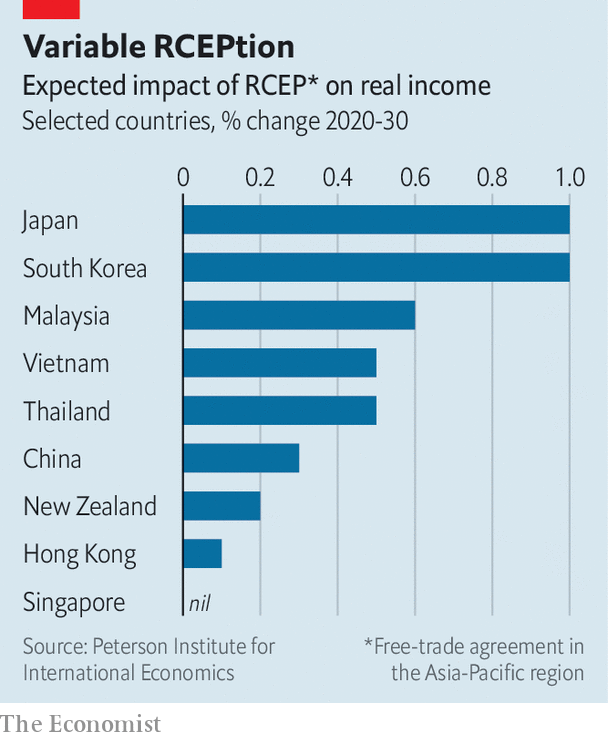

###### Big deal

# Who gains from RCEP, Asia’s new trade pact? 

##### Critics claim it will be dominated by China; but that is only part of the story 

 

> Nov 21st 2020 

IT TOOK EIGHT years of gruelling negotiations to agree on the Regional Comprehensive Economic Partnership (RCEP), which was signed by 15 countries in Asia and the Pacific on November 15th. The world’s newest and biggest regional trade deal is not the deepest. It eliminates fewer tariffs than normal, and some only after two decades. Its coverage of services is patchy, as is that of agricultural goods. India is not a member. Still, when leaders met virtually to sign on the dotted line, they hailed the pact as a triumph.

RCEP began as a tidying-up exercise, joining together in one overarching compact the various trade agreements in place between the Association of South-East Asian Nations (ASEAN) and Australia, China, Japan, New Zealand and South Korea. That limits how much trade will be newly affected. Of the $2.3trn in goods flowing between signatories in 2019, 83% passed between those that already had a trade deal.


Some trade will be newly affected, though. China had no existing deal with Japan, for instance; nor did South Korea. So RCEP’s economic impact will be more than a rounding error. Peter Petri of the Peterson Institute for International Economics, a think-tank in Washington, and Michael Plummer of Johns Hopkins University estimate that Japan and South Korea will gain the most. By 2030 their real incomes are expected to be 1% higher than they would have otherwise been.

 


Perhaps the biggest benefits will come from RCEP’s rules of origin, which set out how much regional content a product must have for it to enjoy lower tariffs. ASEAN has trade deals in place with China, South Korea and Japan, but a coffee cup exported by a member may face three different sets of rules depending on the destination.RCEP helps by offering companies one set of rules (and paperwork). Rules on content are relatively liberal: many products will need just 40% of their value to be added within the region in order to take advantage of lower tariffs.

The fastest way to annoy Asian diplomats would be to claim that the pact is “China-led”—in fact, ASEAN started the talks. Still, the deal serves China’s interests. It had once warily watched its neighbours sign up to the Trans-Pacific Partnership, which reined in state-owned firms and included rules on labour and environmental standards. Now RCEP could strengthen China-centric supply chains—with none of those constraints.

Members may hope that RCEP ensures the resilience of supply chains by supporting new, competitive production bases that can withstand the sudden imposition of trade restrictions. The region’s vulnerability to such actions became clear this year, when many in the G20 group of countries applied restrictions during the pandemic. These tended to hurt ASEAN members most often, according to analysis by Global Trade Alert, a monitoring group.

Curmudgeons complain that RCEP will promote regional trade and supply chains at the expense of those that involve non-members, however. Stronger rules covering competition, state-owned firms or product standards might have allayed those fears. But it seems that agreeing on those was too difficult, partly because RCEP’s members are at vastly different levels of economic development.

For any of these predictions to come true, signatories must first ratify the agreement. Deborah Elms of the Asian Trade Centre, an advisory firm, reckons that could happen by January 2022. Some hope India will join after that, but the chances seem slim. (It withdrew from negotiations because of worries its industry would be swamped by imports from China.) Others hope RCEP will revive American interest in the region. Domestic politics will make bold trade initiatives hard for a Biden administration. But it will be watching. ■

