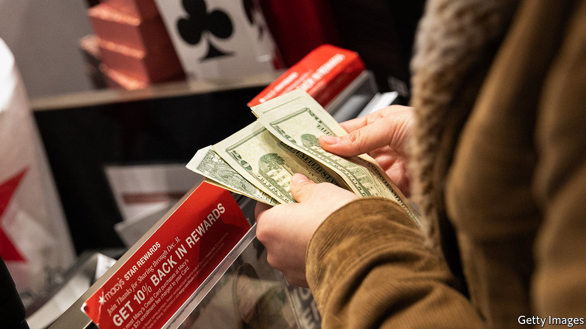
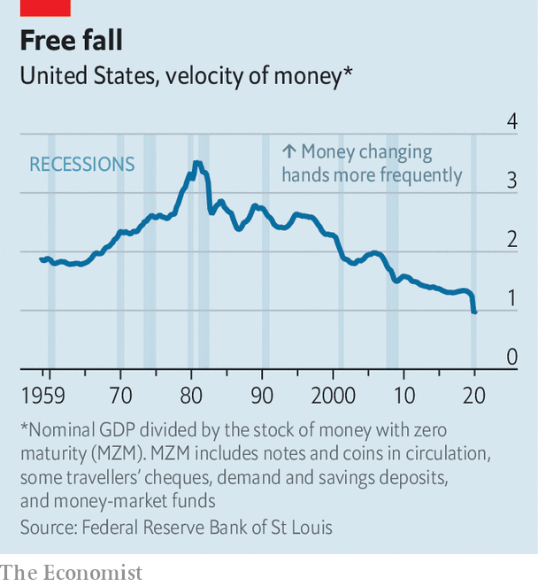

###### Changing down

# Why money is changing hands much less frequently 

##### Economic uncertainty and government handouts explain why the velocity of money has plummeted 

 

> Nov 21st 2020 

INFORMING A CUSTOMER “I’m sorry, I can’t give you your money” is the stuff of bankers’ nightmares. But in June the Federal Reserve had to tell commercial banks just that: it was running out of spare change. As parts of the economy shut down, the flow of coins from wallets to deposits gummed up, leading retailers and banks to demand more. The Fed was forced to ration the supplies of pennies, nickels, dimes and quarters based on banks’ previous orders.

The speed with which money, both physical and digital, moves is an important indicator of economic activity. Money’s “velocity” is calculated by dividing a country’s quarterly GDP by its money stock that quarter. The Fed tracks velocity for several definitions of money. The measure that is most popular with economists is “money of zero maturity” (MZM), which includes assets redeemable on demand at face value—such as bank deposits and money-market funds. The bigger GDP is relative to the money supply, the higher the velocity.

 


Velocity has plummeted this year (see chart). In the second quarter, the velocity of MZM dipped below one for the first time on record, meaning that the average dollar was exchanged less than once between April and June. The decline stemmed from both economic shutdowns and heightened uncertainty early on in the pandemic, as well as a money supply dramatically increased by stimulus efforts.


Recessions tend to dampen the velocity of money by increasing its attractiveness as a store of value relative to alternatives. Uncertainty pushes up demand for money, explains David Andolfatto of the St Louis Fed. In a weakening economy, consumers prefer to save rather than shop; investors cling to the safe assets that make up MZM.

Both the Depression and the Great Recession began with sharp declines in velocity. Where it recovered its pre-Depression levels by the mid-1930s, though, velocity continued to fall after the 2007-09 crisis. Some economists attribute that to the Dodd-Frank act, which took effect in 2010 and put regulatory pressure on shadow-banking activities, increasing demand to hold money in the formal banking system.

As covid-19 spread earlier in the year, anxiety about the economy sent velocity tumbling further. In April personal savings shot up to a record 33.6% of disposable income, not only because of worries about the future but also because shutdowns limited the ability to spend. October’s rate of 14.3% was still higher than in all pre-pandemic months since 1975.

Meanwhile, stimulus measures have pushed up the money supply, in order to prevent the economy, and inflation, falling off a cliff. Households were sent cheques for $1,200, unemployment benefits were made more generous and the Fed bought government debt with new money. The stock of MZM shot up by more than 20% between March and June.

The glut of dollars could create a new set of difficulties once the pandemic ends. Households, flush with cash, could go on a spending spree. As consumer demand recovers, more money will start to change hands and inflation will start to rise. Though shoring up prices is partly why the Fed is buying assets in the first place, some economists worry that the situation could quickly spiral out of its control, if households all try to spend their money at once. Michael Bordo of Rutgers University predicts “a greater risk of inflation getting out of control than the Fed is willing even to contemplate”. If the velocity of money rebounds post-pandemic, placing a speed limit on it may prove to be as troublesome as jump-starting it. ■

