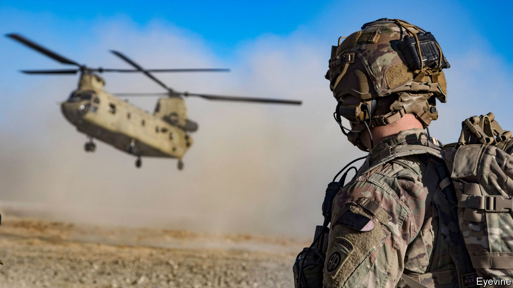

###### Endgame in Afghanistan

# Donald Trump risks handing Afghanistan to the Taliban 

##### Withdraw in haste, repent at leisure 

 

> Nov 21st 2020 

BACK IN FEBRUARY President Donald Trump achieved what ought to be one of his enduring foreign-policy successes. In Doha, the capital of Qatar, bearded Taliban, some of whom had never previously allowed themselves to be photographed, accepted a peace deal with American envoys. America would withdraw its troops. In exchange, the Taliban agreed to cease attacks on foreign troops and to renounce terrorism. They also agreed to take part in further talks in Doha with the internationally recognised government in Kabul. For the first time in four decades, the deal held out the prospect of peace for Afghanistan.

Since then, America has kept its side of the bargain. The number of troops in Afghanistan has fallen from almost 10,000 to less than half that now. The Taliban have been less consistent. They have ceased attacks on American troops, but on the battlefield they continue to press their advantage. October was the bloodiest month in over a year for civilians, partly because of a Taliban attempt to take control of Lashkar Gah, the capital of Helmand province. That was repelled by American air strikes. In the past few weeks the militants have seized several more rural districts. They seem to see the talks in Doha as a chance for the government in Kabul to surrender, rather than as a serious negotiation.


Mr Trump was right—and brave—to talk to the Taliban. Though they do not hold a single city, they are unchallenged in the countryside and have a grip on the roads, on which they raise taxes rather efficiently (see ). The government in Kabul, by contrast, is riddled with corruption and infighting. The militants will not be defeated, so they will have to be negotiated with. The deal struck by America’s envoy, Zalmay Khalilzad, was a necessary step towards ending the war.

Yet in his actions now, Mr Trump risks giving the militants far more than they would otherwise be able to claim. In the run-up to the American election, the president promised to bring all American troops home “by Christmas”. On November 9th, after losing the election, he followed up by dismissing Mark Esper, his defence secretary, as well as several other Pentagon officials. The acting defence secretary, Christopher Miller, seems keener to satisfy his boss’s demands. On November 17th he announced plans to reduce troop levels from 4,500 to 2,500 by mid-January.

That will let Mr Trump say he has kept his promise, but it signals to the Taliban that America is leaving no matter what. It undermines the talks in Doha and heightens the risk that the Afghan army will collapse. Already deprived of much American air support, its forces are deeply demoralised. In the attack on Lashkar Gah hundreds fled without firing a shot. More defeats could lead to much of America’s expensive gear falling into the hands of the enemy, who would use it to press on farther. Plenty already has: the Taliban show off Humvees in videos shared on social media. Instead of making peace, America would have surrendered. Afghanistan might once again become a rogue state and, one day, a terrorist haven.

Joe Biden, the president-elect, will inherit this poisoned chalice. He has never been an enthusiast for intervention in Afghanistan. He, too, promises an end to “forever wars”. As vice-president he opposed Barack Obama’s “surge”, which increased the number of troops in the country to over 100,000. But that does not mean he needs to hand victory to the Taliban.

On taking office he should announce that he will uphold the deal with the Taliban—as long as they do. It calls for American troops to leave by June of next year. Mr Biden should tell the Taliban that this is conditional on their reducing violence and taking the talks seriously. If they do not, American troops should stay. Mr Biden should also make it clear to the government in Kabul that it must negotiate in earnest.

Jens Stoltenberg, NATO’s secretary-general, warns that the price of leaving Afghanistan too soon “could be very high”. By contrast, the cost of staying is low. No American soldier has been killed in combat in Afghanistan since February. A few thousand personnel is a tiny force. And yet it allows other allied countries, such as Britain and Germany, to stay and train the Afghan army. As long as some troops—and planes—remain, the Taliban’s chance of seizing cities is limited. That gives the Afghan government the opportunity to negotiate a genuine peace. America should not allow the war to drag on for ever, but neither should it jeopardise all that it has fought so hard to achieve. ■

