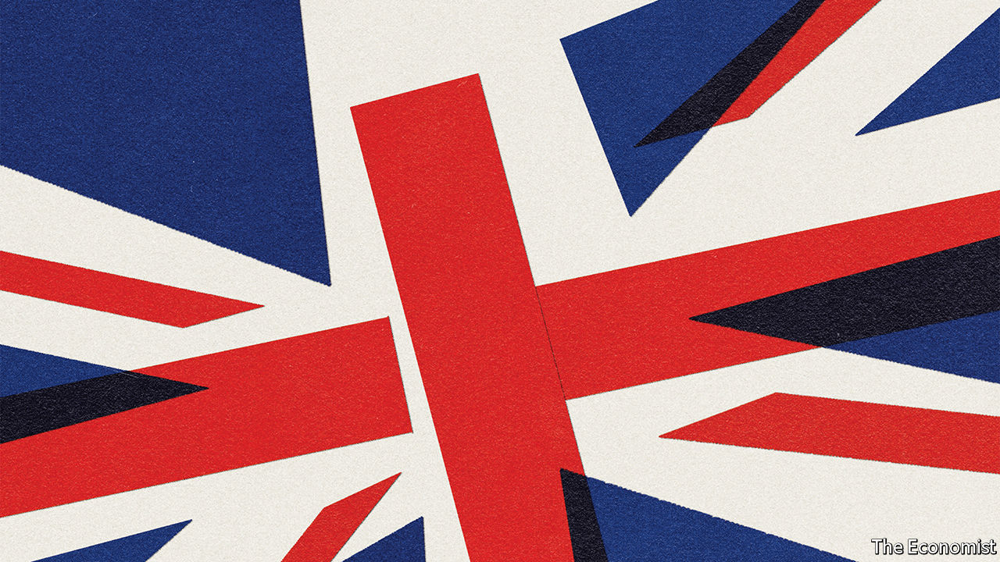

###### A misguided counter-revolution

# Remaking the British state 

##### Britain’s government isn’t working well. But the Tories have got the wrong ideas for how to fix it 

 

> Nov 19th 2020 

THE YEAR was 1976 and revolution was in the air. Punk was destroying orthodoxies in the music business. Concorde was breaking the sound barrier. The economy was going down the tubes. And Lord Hailsham, a former Conservative Lord Chancellor and old boy of Eton, Oxford and the Rifle Brigade, urged the overthrow of what he called Britain’s “elective dictatorship”—the overweening executive, whose power, in Britain’s parliamentary model, was untrammelled by the checks and balances of the courts and legislature that restrict it in most democracies.

Since then, the executive—made up of ministers and the people who do things on their behalf—has been constrained in many ways. The European Union’s powers have grown, and in the 1990s Tony Blair weakened the executive by strengthening other parts of government, creating a Supreme Court, starting a reform of the House of Lords, devolving power from Westminster and granting independence to the Bank of England.


Now a Conservative counter-revolution is under way, driven by radicals in and around Number 10. They believe that the executive is the expression of the will of the British people, so to limit its power is to muzzle democracy. And they complain that government is far too slow. Frustration over the difficulty of getting Brexit done has fused with an enthusiasm for Silicon Valley’s mantra—move fast and break things—into a determination to speed government up.

Accordingly, they are pursuing a programme of radical reform to the British state. Brexit is the boldest step, but it is only the first. The Tory plan is to unchain the executive by limiting judicial power, pushing back against devolution and reforming the civil service. Dominic Cummings, Boris Johnson’s recently defenestrated chief adviser, was one of the architects of this transformation, but it will continue without him (see ).

Plenty about Britain needs to change, but the reformers’ argument and direction of travel are both wrong. First, weakening devolution will not make the union stronger, it will only undermine it. The parliaments in the union’s smaller nations were created in response to a real demand for a government with which their people could identify better than they can with Westminster. Second, liberal democracy is not majoritarianism. It includes checks and balances on executive power designed both to protect the rights of individuals and minorities, and to promote good governance. None of the reformers, it is worth noting, advocates removing the Bank of England’s independence. That’s because of the wealth of evidence showing that constraining politicians’ power over monetary policy leads to better economic management.

If evidence were needed against the unshackling of the executive, covid-19 has provided it. At the beginning of the pandemic, the government arrogated to itself vast powers, unthinkable in normal times. In some areas, that has worked. Most of what the Treasury has done has been accomplished efficiently and effectively. In others, money has been wasted and chums have bagged top jobs and fat contracts. Yet the government has failed to get the job done. Look abroad, meanwhile, for evidence of the efficacy of devolution: powerful, well-resourced local authorities have been central to the effort in Germany and South Korea, two of the countries that have managed the pandemic best.

Brexit is indeed a good moment for a reset. The reformers are right to argue that the civil service needs more expertise, less churn and a powerful cohort of techies to digitise the operations of government. But their actions to undermine the political independence that gives career civil servants the confidence to say “No, minister” would make governance worse, not better.

The main impediment to getting things done is not the constraints on the executive but the people running it. Mr Blair was a highly effective prime minister even as he constrained the executive’s power. That was because he was focused and energetic, and surrounded himself with a team of clever, hard-working ministers. Mr Johnson needs to emulate him in both of these ways, and should start by replacing incompetent ideologues with some of the talented, experienced MPs who have been excluded from the cabinet just because they are not Brexiteers.

The Tories are also right to advocate constitutional reform, but their proposals would take the country in precisely the wrong direction. The biggest issue which Mr Johnson will confront next year is Scottish independence. Instead of alienating Scots—on November 16th he described devolution as a “disaster”—he should focus on making the relationship work better. The pandemic has shown that the four parts of the United Kingdom struggle to co-operate on common problems. That job is supposed to fall to the joint ministerial committee of the four nations. It needs the power and status to act more like a real federation.

Britain should have more devolution, not less. City mayors have had a good pandemic: their popular standing ought to be matched by resources and responsibility. The balance of power between the branches of government needs to shift away from the executive, not towards it. The legislature should have a second chamber with more credibility; that means replacing a selection process for the House of Lords that combines feudalism and cronyism with an elective one. Turning the Lords into a senate of the devolved nations and the regions would give it a useful dual role. The judges’ power to prevent ministers from acting unlawfully ought to be bolstered, not constrained. Regulators with the independence to insulate business from ministerial whim need to be set up to wield some of the powers that are returning from Brussels.

L’état, c’est eux

These changes to the way the executive and the constitution work would both strengthen British democracy and improve government’s ability to get things done. Restoring the elective dictatorship of half a century ago would not.

Concorde, the most memorable relic of 1976, was a thing of beauty, but it was also a commercial disaster that used up huge quantities of taxpayers’ money with virtually no oversight—just the thing for a prime minister with a taste for untrammelled power and grands projets. Mr Johnson would have loved it. ■

