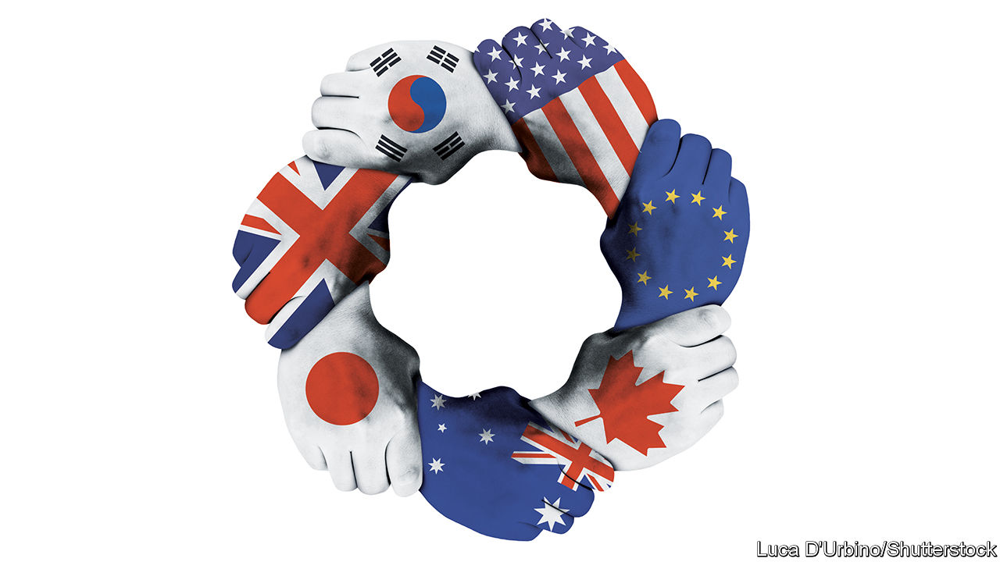

###### The second cold war

# The China strategy America needs 

##### President Joe Biden should aim to strike a grand bargain with America’s democratic allies 

 

> Nov 19th 2020 

THE ACHIEVEMENT of the Trump administration was to recognise the authoritarian threat from China. The task of the Biden administration will be to work out what to do about it.

Donald Trump’s instinct was for America to run this fight single-handed. Old allies were henchmen, not partners. As Joe Biden prepares his China strategy (see ), he should choose a different path. America needs to strike a grand bargain with like-minded countries to pool their efforts. The obstacles to such a new alliance are great, but the benefits would be greater.


To see why, consider how the cold war against China is different from the first one. The rivalry with the Soviet Union was focused on ideology and nuclear weapons. The new battlefield today is information technology: semiconductors, data, 5G mobile networks, internet standards, artificial intelligence (AI) and quantum computing. All those things will help determine whether America or China has not just the military edge (see ), but also the more dynamic economy. They could even give one of the rivals an advantage in scientific research.

The first cold war created separate looking-glass worlds. The protagonists in the second are interconnected. That is partly a result of China’s integration into the global economy, especially after it joined the World Trade Organisation (WTO) in 2001. But it also stems from the network efficiencies of many tech businesses, which reward size and spread. And it reflects how hard it is for any one country to master the full range of specialisms in the tech economy. In chips, say, American or British designs may be made in Taiwanese plants, using Japanese and Dutch equipment with German lenses before being assembled in Chinese factories. It is no accident that autarkic North Korea can build nukes but not advanced computers.

The Chinese Communist Party has understood that tech is the path to power. China is blessed with a vast market, ambition and plenty of hard-working talent. The party is supercharging the efforts of Chinese firms with subsidies and industrial espionage. Aware of how scale matters, China is touting its technologies by securing export contracts, promoting itself as a digital power using the Belt and Road Initiative and waging a campaign of pro-China standards-setting in global bodies.

Mr Trump’s abrasive solo response has had some successes. He has browbeaten some allies to stop buying gear for 5G networks from Huawei, a Chinese firm. And by threatening sanctions on chipmakers who supply Huawei, he has damaged it.

But in the long run this approach favours China. It has already accelerated China’s efforts to create its own world-class chip industry—though that could easily take a decade or more. More important, if a bullying America always focuses solely on its own narrow interests, it will drive away the very allies that can help it stay ahead in tech. Europe is increasingly unwilling to leave itself open to American pressure. The European Union’s highest court has twice restricted the transfer of data to America, where they may be picked over by the intelligence agencies. And European policymakers have announced plans to impose rules on the cloud, to impose digital taxes on American tech giants and to limit foreign takeovers—including, potentially, American ones.

A grand bargain would turn that conflict with Europe into collaboration (see ). Rather than be consumed by squabbles, the allies could share an approach to issues like taxation, takeover rules and supply chains. For example, Europe’s General Data Protection Regulation (GDPR) is on the way to becoming a de facto standard outside Europe. With closer collaboration in intelligence, the alliance could be more alert to security threats from Chinese hackers and tech firms. By co-ordinating their efforts on critical technologies, they could specialise rather than duplicate research. By diversifying supply chains and vetting each link they can protect themselves from accidental or malevolent disruptions. By working together on technical standards such as OpenRAN, which uses mostly off-the-shelf hardware for 5G networks, they can create a favourable environment for their own companies. Crucially, by collaborating on ethical norms over, say, facial recognition, they can protect their societies.

Instead of leaving America isolated, a grand bargain would help it keep ahead in the race for tech dominance by bringing it the gains of closer co-operation with like-minded countries. The whole alliance would be boosted by the tech industry’s formidable network effects. A bargain would also leave America more open to cross-border scientific collaboration and immigration, vital for a place that thrives on the contributions of foreign students, many of whom stay on to carry out research or work in tech. Such openness is a strength that China lacks.

Some people argue that co-operation of this sort needs a treaty, an institution like NATO or the WTO. But that would take a long time to set up. What it would possess in gravitas it would lack in flexibility. A grouping like an enlarged G7 would be more adaptable and less clumsy.

Either way, striking a grand bargain will be hard. For one thing, America would need to acknowledge that it is not as dominant as it was when it set up global governance after the second world war. It would have to be willing to make concessions to its allies right now—over privacy, taxation and some details of industrial policy, say—in order to protect its system of government in the long term. For the strategy to be credible abroad, there would need to be bipartisan consensus in Washington.

America’s allies would have to make concessions, too. They would have to trust a country which, under Mr Trump, has sometimes looked on the transatlantic alliance with contempt. Some Europeans would have to temper their dream of becoming a superpower that stands apart from both China and America.

Yet that European dream has always looked far-fetched. And if anything can overcome divisions in Washington, China can. Moreover, the sacrifices would be worth it. A grand bargain would help focus competition with China on tech, potentially enabling detente in areas where collaboration is essential, such as curbing global warming, health and, as with the Soviet Union, arms control. A grand bargain could make the world safer by making it more predictable. When superpowers are set on a collision course, that is something profoundly to be wished for. ■

