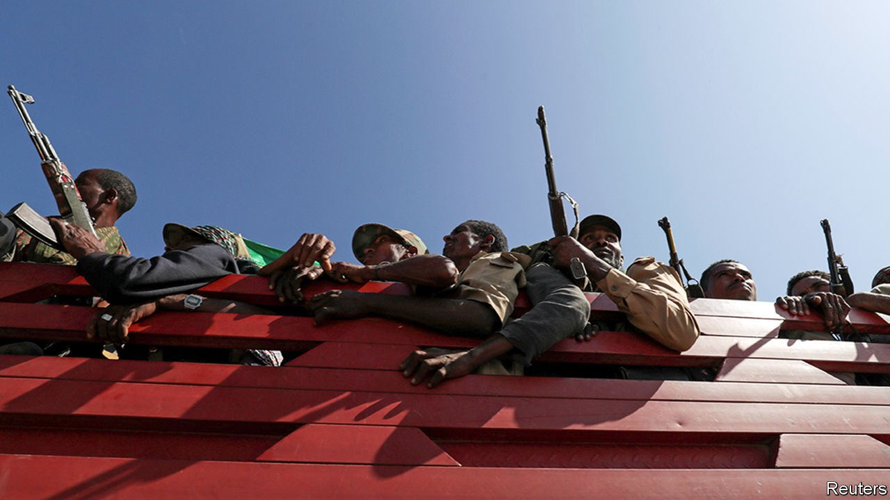
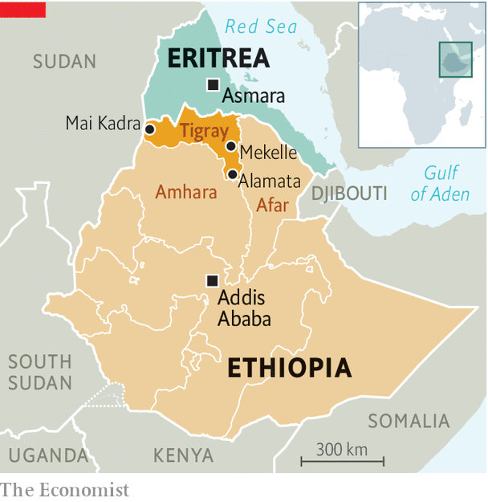

###### Tigray raises the stakes

# Ethiopia’s civil war is spreading outside its borders 

##### So are the atrocities within the country 

 

> Nov 16th 2020 

“I SAW THE dust clouds covering the sky,” says a young university lecturer, describing the bombing by a government warplane of a resort on the outskirts of Alamata, a small town in Ethiopia’s northern region of Tigray. In normal times Alamata is known for its beautiful green mountains. Now it is a battleground in Ethiopia’s civil war, which broke out on November 4th between the federal government and Tigray’s rulers, the Tigrayan People’s Liberation Front (TPLF).

As he fled towards Afar, a neighbouring state (see map), the lecturer saw lorries carrying federal soldiers driving the other way. By the time the convoy reached Alamata, the town was almost deserted. Most Tigrayan civilians had already left and Tigrayan armed forces were retreating into the mountains.


On November 16th the federal government announced that its forces had captured Alamata, which is on Tigray’s south-eastern border, about 120km from the regional capital of Mekelle. It also appears to have captured a town farther north, as well as key territory in western Tigray. This suggests the Ethiopian army has made some important gains since it was ordered into action by Ethiopia’s prime minister, Abiy Ahmed, to put down what he claimed was an armed revolt by the TPLF. On November 17th Abiy said the battle was entering its “final phase” and that his troops were making brisk progress towards Mekelle.

 


But it is far too soon to suggest that these early victories herald a short or easily contained war. On the contrary, as the TPLF has faced setbacks on its borders, it appears to have tried to widen the conflict, perhaps in a gamble that this will increase international pressure on the federal government to agree to peace talks, and that it will give the TPLF cards to play once the negotiations start. On November 14th it fired rockets over the border at Asmara, the capital of neighbouring Eritrea.

The attack threatens to drag Eritrea into a conflict in Ethiopia barely two years after the two countries made peace. “It was a legitimate target,” says Debretsion Gebremichael, Tigray’s president. He claims Ethiopian forces were using Asmara airport—which is probably true—and says Tigrayan forces are fending off 16 Eritrean divisions on several fronts.

The Eritrean government denies any involvement in Ethiopia’s conflict. But few doubt that its president, Issaias Afwerki, would like to see the Tigrayans routed. Between 1998 and 2000 the newly independent Eritrea fought a bitter border war against Ethiopia, then dominated by the TPLF, that cost perhaps 100,000 lives. Debretsion (as well as some eyewitnesses) claims that Eritrean soldiers in recent days have been involved in fighting near the border. At a minimum, retreating Ethiopian troops have been allowed to regroup on Eritrean soil before returning to battle.

The TPLF has also struck inside Ethiopia, firing rockets at two airports in Amhara, the second-most-populous of Ethiopia’s ten ethnically based regional states. Thousands of Amhara militiamen, mostly farmers with rusty Kalashnikovs, have marched towards Tigray. They are fighting alongside the federal army to push Tigrayan forces out of disputed towns near the state border. The involvement of these regional militias in a country as divided as Ethiopia is a recipe for ethnic bloodletting.

Possibly hundreds of civilians, many of them Amharas, were hacked to death with machetes and knives in Mai Kadra, according to Amnesty International. Some witnesses said that forces loyal to the TPLF were responsible for the killings, though Amnesty was unable to confirm this. Tigrayan refugees fleeing into Sudan told Reuters that they had been attacked by people from Amhara. As many as 36,000 people have sought refuge in Sudan.

Fears of an ethnic conflagration have been heightened by the harassment of Tigrayans in the national capital, Addis Ababa, and elsewhere. Many Tigrayans in the security services or civil service have been told not to come in to work. Possibly hundreds have been detained. Some 200-300 Tigrayan soldiers serving in Ethiopia’s peacekeeping force in Somalia have been disarmed. People boarding international flights leaving Addis Ababa are being asked to show local IDs, which typically reveal ethnicity. Tigrayans are turned back and told they may not leave.

Both sides to the conflict may have hoped it would be over quickly. After the TPLF ordered its troops to fire the first shots, it described the war as an act of “anticipatory self-defence”. Abiy’s government insists it is involved in a policing operation aimed at “enforcing the rule of law”. Although Ethiopian forces say they are marching on Mekelle, few think they will easily subdue Tigray, whose fighters may wage a guerrilla war from the hills.

Bad blood and a lack of trust between the two sides will hamper efforts to end the fighting through talks. The TPLF, which called the shots in the federal government for almost 30 years, has yet to come to terms with its dethroning in 2018 after massive protests brought Abiy to power. After his appointment, Abiy sidelined the TPLF and began removing Tigrayans from state institutions, in particular the army and intelligence agency.

Tensions worsened when the central government postponed elections earlier this year, citing covid-19. The TPLF accused Abiy of flouting the constitution in order to stay in power and went ahead with its own regional election in September. The federal government deemed it illegal and slashed federal funding to the region. The TPLF called this a “declaration of war”.

Two weeks into the actual war, the TPLF seems a little less keen on fighting it. Debretsion has called on the African Union and the UN to condemn the Ethiopian offensive and says he wants talks. But he also insists on Abiy’s head, saying: “We will not negotiate with this criminal tyrant.” Abiy is no less intransigent and says he will not talk until the TPLF has been defeated and disarmed. And so the fighting continues. ■

