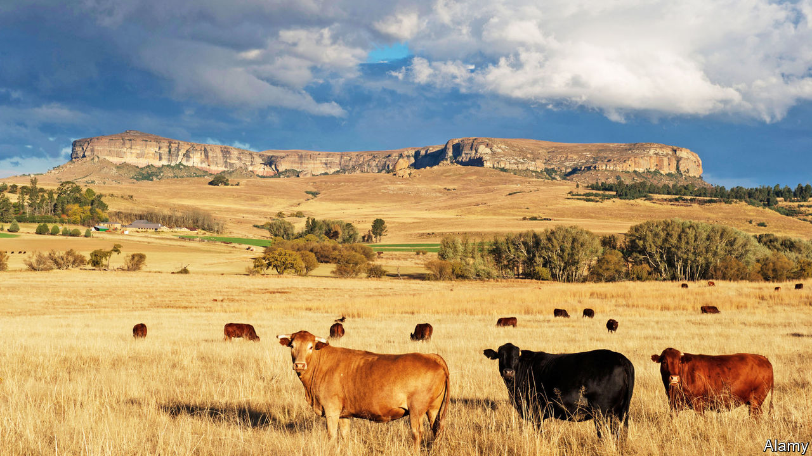

###### Where’s the beef?

# Livestock theft is becoming more common in South Africa 

##### And more sophisticated 

 

> Nov 21st 2020 

“LIVESTOCK THEFT has been around since Biblical times,” says Herkie Viljoen, a farmer on the outskirts of Bethlehem, a suitably named town in the Free State. But in recent years it has reached ungodly proportions. Standing next to a huge map of the province he points to small red circles with black dots that represent stolen animals. In some places it looks as if the farms are covered in poppy fields.

In South Africa 218,000 farm animals—cows, sheep or goats—were taken in the 12 months to March, up from 180,000 five years earlier. The total loss was worth about 900m rand ($60m) in each of the past two years, around twice as much as the annual black market value of poached rhino horn. Losses this year will probably be even higher, as the economic effects of the pandemic make it harder to earn a lawful living.


A few decades ago pilferage was “for the pot”. Today 87% of cases involve criminal syndicates, says Willie Clack of the University of South Africa. Gangs act differently in different places. In parts of the Free State and neighbouring KwaZulu Natal thieves often load cows onto lorries, then cross into Lesotho. Inside the mountain kingdom, which is encircled by South Africa, syndicates rebrand cattle before taking them back across the border, for sale at auction or to abattoirs. It is like laundering cars, but with cows instead of Porsches.

Livestock theft can be seen through a racial lens. The victims of the largest heists in the Free State are white Afrikaners who run big farms. Perhaps one-fifth of farm murders in the province—allegedly including the high-profile killing of Brendin Horner, a 21-year-old farm manager‚ on October 1st—are related to syndicates. Yet the victims in most cases of theft are black smallholders. As they own fewer animals, single incidents can ruin entire livelihoods.

Whites and blacks are both victims of a sclerotic criminal-justice system. There are dedicated Stock Theft Units within the police but they are siloed and poorly funded. A lack of arrests and prosecutions means there is “no deterrence”, argues Roy Jankielsohn, the leader of the opposition Democratic Alliance in the Free State. After the murder of Mr Horner, Bheki Cele, the national police minister, pledged that he would investigate livestock syndicates. “I’ve seen the stock-theft figures—it’s hell,” he said, adding that if police were found taking bribes they would have to swap their blue uniforms for orange jumpsuits.

In the meantime farmers are protecting themselves. For as is often the case in South Africa, people who can afford to do so are finding private solutions to public-sector problems. Mr Viljoen’s “command centre”, which is funded by 450 local farmers, uses 65,000 CCTV cameras to look for rustlers. Farmers are also deploying drones and GPS-tagging to find purloined stock.

Yet such measures can only go so far. After visiting the command centre your correspondent heads to the Caledon river, which marks the border with Lesotho, passing two empty chairs where soldiers are meant to keep watch. Donkeys and cows quench their thirst while children joyfully splash back and forth from one country to another. “You see!” a young boy cries out. “There’s no border!” ■

