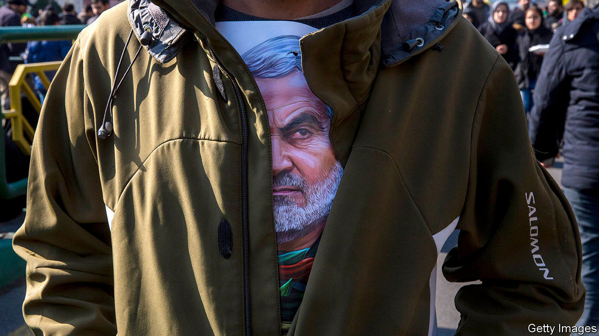

###### Looking for the next target

# The latest chatter about Iranian plots in Africa 

##### Cock-ups are giving way to more sophisticated networks 

 

> Nov 21st 2020 

“I’M NOT IN the business of making threats,” said Javad Zarif, Iran’s foreign minister, immediately before making one. When asked in September whether Iran was still considering retaliating for America’s assassination in January of General Qassem Suleimani, Iran’s most prominent military commander, Mr Zarif was clear: “The books are not closed.”

Ever since President Donald Trump ordered the drone strike that killed Suleimani, Western spies have been alert to clues as to where and how Iran might retaliate. Some think the blow may fall in Africa, where Iran has spent years building up covert networks and where it faces little scrutiny from local governments.


Iran has a history of plotting on the continent—and failing. In 2013 police in Nigeria arrested three Lebanese men and uncovered an arms dump in Kano, the biggest city in the north. All three reportedly admitted to being members of Hizbullah, the Lebanese militia-cum-political-party that acts as an Iranian proxy. They said they were planning to attack the Israeli embassy and other Western targets.

A year earlier the police in Kenya arrested two Iranians who had hidden a stash of explosives at a golf course in Mombasa, accusing them of planning to attack Western targets. They were sentenced to 15 years in jail. More amateurish still were the attempts to free them. In 2016 two Iranians were sent to Nairobi to prepare a legal appeal. But they were caught planning an attack on Israel’s embassy and expelled. Last year Kenyan police testified that Iran’s ambassador had been swindled by two men who told him they could get the convicts released. The ambassador denies this.

The original bit of bungling in Kenya is thought to have been the work of the Quds Force, the foreign wing of Iran’s Revolutionary Guard Corps. But the Quds Force may be refining its playbook in Africa and turning to locals for help.

A report to the UN Security Council from December accused Ismael Djidah, who was arrested in Chad in 2019, of having helped the Quds Force recruit and train terrorist cells in the Central African Republic (CAR), Chad and Sudan in order to attack Western, Saudi and Israeli targets. Among Mr Djidah’s contacts, according to the report, was Michel Djotodia, a rebel leader who was briefly president of the CAR, from 2013 to 2014. The report accuses Mr Djotodia of meeting Quds Force officials in Iran in 2016 and agreeing to set up a terrorist network in exchange for Iran helping him reclaim power. Mr Djotodia’s lawyer denies this.

A Western intelligence source says that police in Niger also recently arrested a man who admitted (under interrogation) to working for the Quds Force’s Unit 400, which specialises in covert operations. The suspect said he was recruited while on a pilgrimage to Iran and that he had travelled to the country several times for weapons training. He said he helped build networks, gather intelligence or bribe politicians in the CAR, Chad, Eritrea, Gambia, Sudan and South Sudan. Iran also told him to seek mining licences in the CAR and Niger to help offset the impact of American sanctions on Iran and to fund covert operations.

Other current and former counter-terrorism officials from the West confirm this general pattern of activity. “Iran is clearly trying to spread its wings as far as possible,” says one. “It makes sense for them to use locals who can work under the radar.” Are those locals working on a plot to retaliate for Suleimani? “They are looking to generate headlines,” says another intelligence source. “They have chosen Africa because it’s easy to operate there.” ■

